## 第一章

### 电子管

单道批处理

执行程序系统：通道，中断

### 集成电路时代

多道批处理

分时系统：多用户，系统分时，时间片轮转

实时系统：接口，规定时间内完成

提高并发性，系统资源利用率

### 大规模集成电路

个人系统：单用户，多任务，交互

网络系统：多任务，开放，互连

分布式：多机器完成大计算

嵌入式：小型系统

批处理：作业和用户无交互

### 常用操作系统：

unix

windows

linux

### 软件发行模式

商业软件

共享软件

自由软件

许可证：GPL，BSD，XFress86

开源不一定免费，只是代码公开

### Linux结构

### 3部分

内核

shell：相当于cmd

文件系统

### 界面

用户界面

shell

x window

系统调用：操作系统提供应用城西使用的广义指令，是一组C函数。

凡是涉及到系统资源的操作，必须通过系统调用完成

### linux版本

内核版本：作者linus维护的

发行版本：以linux内核为基础带有x window图形界面等软件的

## 第二章

### 几个命令

#### 命令行命令：

Ctrl u:删除整行命令

Ctrl a：移动光标到行首

Ctrl e：移动光标到行尾

Ctrl L: cls

Ctrl d：结束键盘输入

Ctrl s：暂停当前程序，暂停后按任意键恢复运行

Ctrl z：将当前的程序放到后台运行，使用fg指令恢复到前台

info:查看超文本说明

space 翻页下一页

b:上一页

/:查找字串串

n:寻找下一个字符串

#### man

man：用来获取某个命令的说明和使用方式

man手册被分册（分区段）处理，常分为8个区段

| 区段  | 说明                      |
| --- | ----------------------- |
| 1   | 一般命令                    |
| 2   | 系统调用                    |
| 3   | 库函数，涵盖了 C 标准函数库         |
| 4   | 特殊文件（通常是/dev 中的设备）和驱动程序 |
| 5   | 文件格式和约定                 |
| 6   | 游戏和屏保                   |
| 7   | 杂项                      |
| 8   | 系统管理命令和守护进程             |

eg：man 1 ls：查看ls的第一区段

NAME：（名称）

    该命令或函数的名称，接着是一行简介

SYNOPSIS：（概要）

    描述命令如何运行，需要什么命令行参数

    或描述函数所需参数，及哪个头文件包含该函数的定义

DESCRIPTION：（说明）

    命令或函数功能的文本描述

EXAMPLES：（示例）

    常见的一些示例

SEE ALSO：（参见）

    相关命令或函数列表

常见的例子还包括：OPTIONS（选项），EXIT STATUS（退出状态），ENVIRONMENT（环境），BUGS（程序漏洞），FILES（文件），AUTHOR（作者），REPORTING BUGS（已知漏洞），HISTORY（历史）和 COPYRIGHT（版权）。

### 文件操作

文件命名最大255个字符

通配符：

？：匹配任意单个字符

*:匹配0个或多个任意字符，‘.’除外

[]：匹配括号中的单个字符

列举：[abc],逐个列出abc

范围：[a-j]列出a-j

排除：！，[!a-c]列出除了a-c的

### linux文件类型

普通文件(-):文本文件，数据文件，可执行二进制文件

目录文件（d）：特殊的文件，至少包含'.'代表本身，‘..’代表上一级

设备文件：c：字符设备

  b：块设别

符号文件：l：快捷方式，链接

管道文件：p：在进程之间传递数据

### 文件用户：

文件属主user：文件所有者，建立文件的人

文件属组group：文件属主所在的组

其他others：除了文件属主和属组的其他

所有all：所有用户

### 权限

r：读

w：写

x：执行

-：无权限

-rwx rwx rwx

文件夹目录的x：能进入文件夹        r：能ls 

字符表示和数字表示：

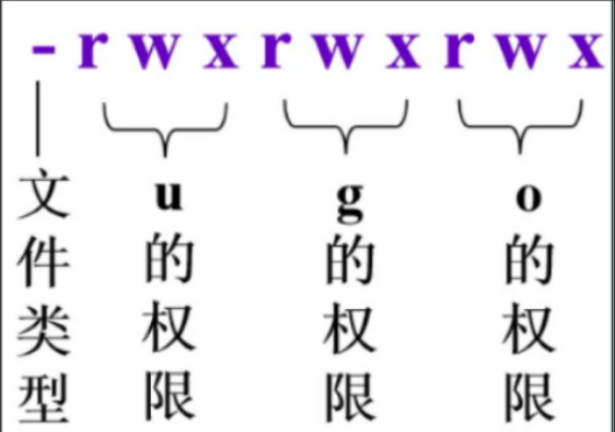

-rwx--x--x:711    三位二进制数的十进制表示

### 其他属性

时间标签：

mtime：修改时间，内容被修改

atime：访问

ctime：变更，属性被变更

连接数：硬链接的数目


~是root路径，主目录

### 当前工作目录和用户主目录

工作目录就是用户当前的目录，用"."表示

当前目录的父目录用".."表示

用户刚登陆到系统时所处的目录 是主目录，默认用户主目录是/home/user-id,用"~"表示

### 目录操作命令

 mkdir：创建目录

 rmdir：删除目录

pwd：查看当前工作目录

cd ：改变工作目录

ls：显示目录内容

#### PS

指令格式 后面的参数，有[]表示可选的，没有[]表示必须的

mkdir [选项]  目录

cd [目录]

#### cd

格式:cd [目录]

```bash
cd [dir]
```

需要对该目录有执行权限  x，没有指定目录dir时，进入用户主目录

#### ls

功能：显示当前目录，或指定目录的内容，默认按字母顺序列出所有非隐藏文件

格式：ls [选项] [文件或目录列表]

选项：

    -a:显示所有文件包括隐藏的，及"."，“..”

    -t:根据文件修改时间排序

    -R：递归显示下层子目录

    -d：显示目录名称，不显示内容

    -c：按文件变更时间排序

    -F：显示文件名，同时显示文件类型

           *:可执行文件

            /:目录

            @:链接文件

            |:管道  =socket

    -l：长格式显示文件详细信息

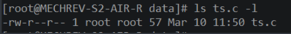

#### mkdir

格式：mkdir [选项]  目录

选项：

    -m：劝降值，指定目录的权限属性

    -p：递归创建目录，若创建的父目录不存在的话，一并创建父目录

    

#### rmdir

格式：rmdir [选项]  目录

选项：

    -p：递归删除目录，当子目录被删除后，若父目录为空，也一并删除

           如果目录非空，则不能删除

### 文件操作命令

文件显示：cat    more    less

文件复制、删除和移动：   cp    rm    mv

文件查找：find    grep

文件内容统计与排序：wc    sort

改变文件存储权限：chmod

改变文件时间标签：touch

#### cat

功能：显示文件内容

格式：cat    [选项]    [文件]

    -空:未指定文件时，读标准输入，并显示出来，按Ctrl  +  D结束输入

    -A：显示特殊符号

    -n：从1开始，添加行号

    -b：也是添加行号，但是空白行不编号

    -s：将连续的空白行压缩未一个空白行

#### more

功能：分屏显示文件内容

格式:more     [选项]    文件

ps：

    指令：   按Enter换行，按Space或z下一页，按b或Ctrl b 上一页，/查找，q退出

                =：显示行号    v：用Vi编辑器打开

选项：

    -p:不滚屏，清屏

    -s：将连续的空白行压缩

    +n：从第n行开始显示

    +/str：从含有str字符串的地方开始显示

#### less

功能：交互式浏览文件内容

格式：less    [选项]    文件

选项：和more类似

ps：

    Page up、Page down键上下翻页

    Home，End到文章首尾

    ↑，↓键上下滚动一行

    ←，→键左右滚动

#### cp

功能：复制文件

格式：cp    [选项]    源文件    目标文件

            cp    [选项]    源文件1    源文件2    ....    目标*目录*

选项：

    -f：目标文件存在时，直接覆盖

    -i：目标文件存在时，提示是否覆盖，按y确定，按n取消

    -r：递归复制，用来复制目录

    -b：生成覆盖文件的备份，就是复制一次，是普通的文件，再复制一次，不覆盖，生成备份文件

        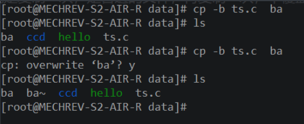

    -p:保持文件原有属性

#### rm

格式：rm    [选项]    文件

选项：

    -f：忽略不存在的文件，不提示，就是强制删除

    -i：提示删除，按y确认

    -r：递归删除

  

#### move

功能：移动，重命名文件

格式：mv    [选项]    源文件    目标文件

            mv    [选项]    源文件1    源文件2    ...    目标目录

选项：

    -i：提示是否覆盖

    -b：建立覆盖文件的备份

    -f：不提示，直接覆盖

    -v：显示移动信息

            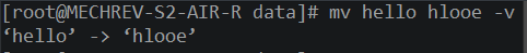

#### wc

功能：显示文件字节数、字数和行数

格式：wc    [选项]    [文件]

选项：

    -空文件:读标准输入

    -空选项：统计文件  行数，字数，字节数

    -c：统计字节数

    -l：统计行数

    -w：统计字数

#### sort

功能：对文件的内容按  行  排序并显示，按字母顺序

格式：sort    [选项]    [文件]

选项：

    -空文件：从标准输入读内容并按行排序显示

    -b：忽略开始的空白

    -f：忽略大小写

    -t:设置分隔符

    -kn：按第n列排序，由t设置好后

            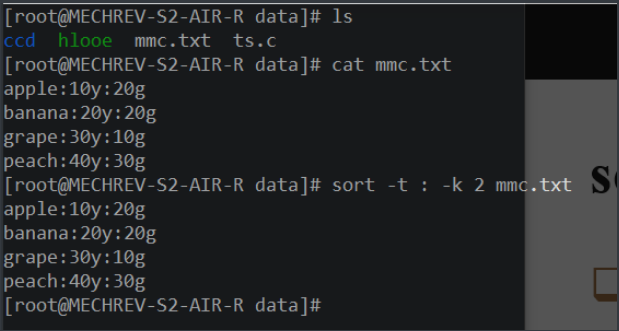

    -r：逆序排列

#### chmod

功能：修改文件或目录的存取权限

格式：chmod    [数字权限模式]    文件

            chmod    [权限范围]    [操作]    [权限字符]    文件

说明：

    -权限范围：u，g，o，a，用户，组，其他，所有

    -操作：+：增加权限    -：取消权限    =：赋权限

    -权限字符：r，w，x    读写执行

    -ps：只有文件的所有者和root有权限修改文件权限

eg：

1.修改mmc的权限为所有人可执行

```bash
chmod a+x mmc.txt
```


2.修改mmc的权限为属主可读可执行，组用户可执行，其他用户权限不变

```bash
chmod u=rx，g=x  mmc.txt
```

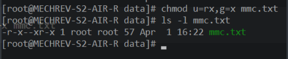

3.修改mmc权限为属主和组用户可读写，其他用户只读

```bash
chmod 664 mmc.txt
```

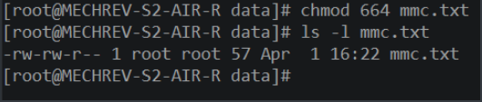

#### touch

功能：将文件的时间标签改为现在的时间，若文件不存在则创建新的空文件

格式:touch    [文件]    文件
选项：

    -a:仅改变文件的存取时间

    -m：仅改变文件的修改时间

    -c：不创建文件

    -t STAMP：使用STAMP指定时间标签，而不是系统的现在时间

#### stat

功能：显示文件具体的信息

格式：stat    文件

信息介绍：

    -File：文件名

    -Size：文件大小

    -Blocks：文件使用的数据块总数

    -IO Block：IO块大小

    -regular file：文件类型

    -Device：设备编号

    -Inode：Inode号

    -Links：链接数

    -Access：文件的权限

    -Gid，Uid：文件所有权的Gid和Uid

    -Access：文件访问时间

    -Modify：文件的修改时间

    -Change：文件的变更时间

#### find

功能：搜索满足条件的文件，并执行指定的操作

格式：find    [路径名]    [表达式]

    -空路径：递归显示当前目录及子目录的所有文件，包括隐藏文件

表达式：

    -空表达式：递归显示指定目录及子目录所有文件，包括隐藏文件

    -name：查找指定名称的文件，可以和统配符连用

    -user:查找指定用户拥有的文件

    -group：查找指定组拥有的文件

    -mtime n：查找在n天前修改的文件

                +n：表示超过n天被修改的文件

                -n：表示不超过n天被修改的文件

    -atime n：被访问的文件

    -ctime n：变更的文件

    -type x：查找文件类型为x的文件，x为文件类型，f为普通文件，d为目录，p管道文件，等

    -size n：查找文件大小为n的文件，+n 大于n的文件，-n小于n的文件，n为文件大小单位

    -print：显示找到的文件名

    -exec 命令 {} \;  :对匹配的文件执行指定的命令

    -ok 命令 {} \; ：执行命令的时候请求用户确认

#### 文件的大小单位

c    字节

w    2字节

b    512字节

k    1024字节

M    1024K字节

G    1024M字节

#### grep

功能：在文本文件中查找字符chuan

格式：grep    [选项]    [匹配模式]    文件

选项：

    -v：列出不包含匹配字符串的行

    -c：只列出匹配的行数

    -r：递归查询子目录

    -n：在每个匹配前加行号

    -i：不区分大小写

  

### 输入输出重定向

#### 命令的输入和输出

执行shell命令式，系统自动打开三个标准I/O文件

    -标准输入stdin:对应终端的键盘

   -标准输出stdout：对用终端的屏幕

    -标准错误输出stderr：对应终端的屏幕

Shell从stdin中得到输入的数据，将正常输出数据送到stdout，将错误信息送到stderr

缺省的情况下，命令输入输出的走向

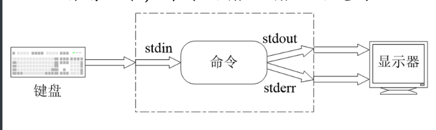

#### 输入输出重定向

**1.输入重定向：改变命令的输入来源**

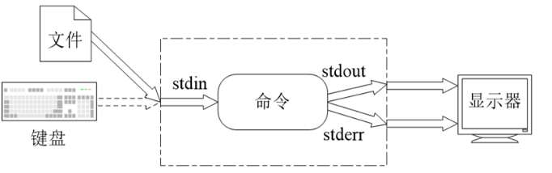

形式：命令<文件

将文件的内容当作命令的输入

eg：wc   <    tc.txt

         cat <   tc.txt

**2.输出重定向：改变命令的输出去向**

输出重定向式把程序或命令的输出结果或错误信息重定向到指定的文件上。

形式：

    -标准输出重定向：命令 > 文件

    -标准错误输出重定向: 命令 2 > 文件

    -合并输出重定向：命令 &> 文件

    -附加输出重定向：命令 >> 文件(追加，而>是覆盖) 

**3.管道：连接一个命令的输入到另一个命令的输出**

pipe管道，将一个程序或命令的输出作为另一个程序的或命令的输入

管道可以把一系列的命令连接起来，形成一个管道线pipe line

管道的形式：

    命令1 | 命令 2

    命令1 | tee文件 | 命令2

管道线

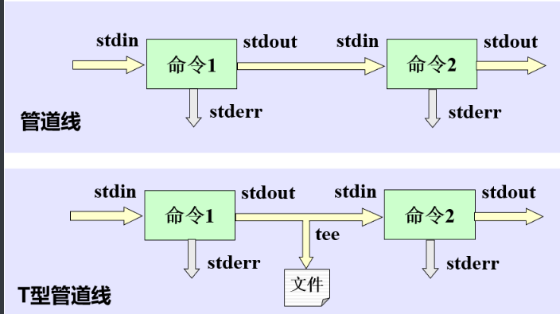

## 第三章

### Vi编辑器

#### vi的工作模式

    -命令模式：输入的字符都当作命令解释执行，不显示输入内容，若非法命令则响铃

    -输入模式：输入的任何字符都将作为文件内容被保存，并显示在屏幕上

    -末行模式：也称ex转义模式，在屏幕最末行接收命令输入，显示输入内容，按回车执行

#### vi模式转换

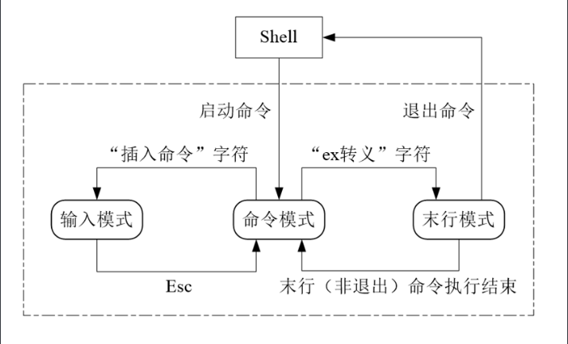

#### vi的启动

格式：vi    [文件名]

说明：进入vi的一个临时缓冲区，如果未指定文件名，则进入vi版本介绍，新建文本缓冲区。

如果指定文件名，但文件不存在，则建立文件。若文件存在，则将文件的内容拷贝到临时缓冲区，将光标定位在第一行第一列，此时工作方式为命令模式。

#### vi的退出

在命令模式下输入

    -q：未作修改，直接退出

    -wq：保存并退出

    -x：同wq

    -q！：放弃修改，强制退出

#### 命令模式的功能键

    -Home：移动光标到行首

    -End：移动光标到行尾

    -Page Down：向下翻一页

    -Page Up：向上翻一页

    -Delete：删除光标位置

    -Backspace：光标前移一个字符

    -Space：光标后移一个字符

    -Enter：光标下移一个字符

    -↑↓←→：移动光标

### Vi基本命令

#### 移动光标命令

    -h，j，k，l：光标向左，下，上，右

    -0或^:行首

    -$:行尾

    -[行号]G：移动指定行,无指定时移动到末行

    -[列号] |:移动到指定列或首列

    -b,w:移动到上一个，下一个词首

    -e：移到词尾

    -(、)：移动到句首，句尾

    -H,M,L:移到到  屏幕 首，中，尾行    行首

ps：若在命令前加上数字，可以连续移动

    eg：25l：向右移动两格

#### 插入命令

    -a：在   光标后  开始插入

    -A：在  行尾后  开始插入

    -i：在   光标上  开始插入

    -I：在  行首前    开始插入

    -o：在  光标后  的新行开始插入

    -O：在   光标前   的新行开始插入

#### 删除命令

    -x或X：删除光标处，光标前的字符

    -dd：删除光标所在行

    -D：删除光标右边的内容

    -d  +  光标移动命令：删除光标移动范围内的字符

        eg：d0、d$:删除光标左右的内容

                dG：删除光标所在行到末行的文本

                dw：删除光标所在 词 

ps：在命令前加数字也可以连续删除

    eg：3dd：删除3行

#### 修改指令

修改：先删除再插入

    -cc：修改光标所在行，ncc尾修改n行

    -C：修改光标到行尾的文本

    -c+光标移动指令：修改光标移动范围的文本

#### 替换指令

    -r：用输入的字符替换光标处的字符

    -R：用输入的文本逐个替换从光标开始的字符，直到按下Esc结束

    -s：用输入的文本替换光标处的字符，用Esc键结束输入

    -S：用输入的文本替换光标所在行，用Esc结束

ps：在指令前加数字替换n倍

#### 拷贝与粘贴指令

    -yw：拷贝光标处的词 到缓冲区

    -yy：拷贝光标所在的行到缓冲区

    -p：把缓冲区的文字复制到光标处

#### 撤销与重做指令

    -u：撤销前一个指令

    -U：撤销对一行的更改

    -  .   :重复前一个命令

### vi末行命令

在命令模式下，输入 “ : ”或" / " 或" ? ",进入末行模式

#### 字符串搜索命令

    /pattern:从光标处向下搜索pattern指定模式

    ？pattern：从光标处向上搜索pattern

        搜索后，按n查找下一个，按N查找上一个

#### 全局替换命令

    :s/p1/p2  ：将当前行中的第一个p1用p2替换

    :s/p1/p2/g ：将当前行中的所有p1用p2替换

    :s/p1/p2/gc  :替换前提示确认

    :n1,n2s/p1/p2/g  :将第n1行到n2行 中所有的p1用p2替换

    :g/p1/p2/g ：将文件中所有的p1用p2替换

ps：最后加上/c，提示是否替换

        加上/p,显示发生替换的位置

#### 文件操作命令

    :w [文件名] :保存到当前文件 或 另存为

    :q :未修改文件，不用保存，直接退出

    :wq或x :保存并退出

    :q!  :放弃修改，不保存，退出

    :e！:放弃修改，撤销掉之前的所哟修改

    :e   文件名：打开指定的文件

    :r    文件名：读入指定的文件，复制文件内容并粘贴

#### 其他命令

    :n  :跳转到第n行

    :n1,n2 co n3:将第n1行到n2的内容拷贝到第n3行下

    :n1,n2 m n3: 将第n1行到n2行的内容移到到第n3行

    :n1,n2 d：将n1到n2行的内容删除

    :!command:执行command指令

    :set nu,  set nonu:设定，取消行号显示

    :set ai ,set noai:设定，取消自动缩进

## 第四章

### 开发工具

编辑器：vi/vim

编译器:gcc

自动制作工具:make

### gcc

gcc是linux上的标准编译器集

特点：

    遵照GPL许可发行，完全免费

    功能强大，可以编译C，C++等代码

    性能优越

### 编译过程

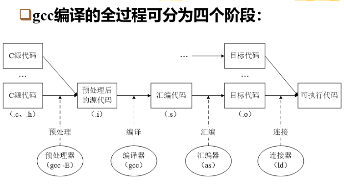

预处理的工作：处理源码中的预处理语句，执行文件包含、宏替换、条件编译等预处理工作。

编译的工作：进行词法、语法和语义分析，生成汇编代码。

汇编的工作：将汇编代码转换为机器语言的目标代码。

连接的工作：解析目标代码的外部引用，将多个目标代码文件连接为一个可执行文件。

### gcc指令

格式：gcc  [选项]  文件

选项：

    -E：预编译，输出预编译过的源代码，.c文件  ->  .i文件

    -S：编译，产生汇编文件，不汇编，.i文件 ->.s  文件

    -c：编译或汇编，产生目标文件，不连接，  .s文件  ->  .o文件

    -o  文件名：指定生成的可执行文件名。如果没有指定文件名，则默认生成a.out文件    .o文件到指定文件或a.out


## 第五章

定义：程序以进程的形式占用cpu运行

进程管理的功能：追踪和控制所有进程的活动，为它们分配和调度cpu，协调进程的运行步调

进程管理的目标：有效调度cpu，最大限度发挥cpu的处理能力，提高进程的活动，提高进程的运行效率

#### 程序的顺序与并发执行

程序的各操作间是依序执行的，程序和程序之间的串行执行的，这种执行程序的方式称为程序的顺序执行

顺序执行程序的特点

    顺序性：程序在cpu上是顺序执行的

    封闭性：只有在程序本身才能改变程序的运行环境

    可再现性：程序执行的速度和最后的结果无关

#### 程序的顺序执行的过程

设有n个程序，每个程序由I(输入)，C（计算），P（输出）三个程序段组成。仅当一个程序全部执行完后，另一个程序才可以开始执行，eg：

    **顺序执行程序时，系统资源利用率低**

#### 程序的并发执行

若干程序或程序段同时在系统中运行，它们的执行在时间上时重迭的，这种执行程序的方式称为并发执行。

程序并发执行的特点：

    程序运行受外界的影响，没有封闭性

    程序运行的结果往往不可再现

    并发程序之间相互制约，导致程序运行过程的间断性

#### 并发程序的执行举例

#### 进程的概念

进程是一个可并发执行的程序在某数据集上的一次运行

进程是操作系统进行资源分配的单位

#### 进程与程序

程序是进程的一个组成部分，是进程的执行文本

程序是静态的指令集合，进程是动态的，动态产生和消亡

一个程序可以对应多个进程，一个进程可以顺序执行多个程序

#### 程序的特性

    动态性：进程由创建而产生，由撤销而消亡，由调度而运行，由等待而停顿。

    并发性：同一时间内多个进程在系统中活动。他们在宏观上是并发执行的

    独立性：进程是可以独立运行的基本单位，是资源分配调度的基本单位

    异步性：每个进程按照各自独立的，不可预知的速度向前推进

#### 进程的基本状态

    运行状态：进程正在占用cpu

    就绪状态：除了cpu之外，其他资源都已满足

    等待状态：进程因某种资源不能满足，或希望的某事未发生而暂停运行

#### 进程的组成

进程由程序，数据，进程控制块（PCB）三部分组成

进程控制块（PCB）：是系统为管理进程设置的一个数据结构，用于记录进程的特性和变化的过程。PCB是系统进程调度和进程控制的依据。当系统创建进程时，为其生成PCB，进程完成后，撤销它的PCB

#### Linux进程的PCB

系统使用PCB记录进程的相关信息，系统创建进程时，为它生成PCB，进程完成后，撤销它的PCB。Linux系统的PCB用一个称为task-struct的结构体来描述。内容主要包括：

    描述信息：进程号PID，用户标识UID，组标识GID，以及描述家族关系的链接信息

    调度信息：进程的当前状态，优先级，时间片，调度策略，以及记时信息

    资源信息：该进程使用的存储器，文件系统以及打开的文件等信息

    现场信息：包括cpu的内部寄存器和系统堆栈等

#### Linux进程的状态

#### Linux进程状态的划分

    运行态：运行态实际包含上述基本状态的 执行 和就绪两种状态，处于运行态的进程或正在运行或准备运行

    睡眠态：也称等待态，进程在等待某个事件或某个资源。睡眠态由可以分可中断的和不可中断的。 可中断睡眠态的进程可以被信号唤醒而进入就绪状态，不可中断睡眠态的进程不能被信号唤醒，必须等到所等待的硬件资源可用后被唤醒

    僵死态：由于某些原因，进程被终止，这时进程已经释放了除了PCB以外的所有资源，这种占有PCB但已经无法运行的进程就处于僵死状态

    暂停态：处于暂停状态的进程一般都是由运行状态转换而来的，等待某种特殊处理，比如处于调试跟踪的程序，每执行到一个断点，就转入暂停状态，等待新的信号输入

#### PS命令

功能：查看正在运行的进程的信息

格式：ps    [选项]

选项：

    -空：查看当前shell会话的相关进程

    -e：查看所有进程

    -f：以全格式显示

    -r：只显示正在运行的进程

    -a：显示终端上的所有进程

    -u：以面向用户的格式显示

    -x：显示所有不控制终端的进程

### 进程的运行模式

cpu的执行模式具有不同的特权级别，各个级别可执行的指令集不同。

x86cpu有4中执行级别，linux用到两个

    核心态：最高特权级模式，cpu能执行所有指令，访问全部的内存地址。内核代码运行在核心上

    用户态：最低特权级模式，cpu只能执行一般的非特权指令，访问受限的地址空间。用户进程代码运行在用户态

#### Linux系统内核

Linux系统可大致分为3个层次：

    用户层：分为系统程序和用户程序两类，运行在核心层上，通过系统调用使用内核的功能

    核心层：运行程序和管理基本硬件设备的核心程序，通过系统调用界面为用户程序提供运行和使用系统资源的环境

    硬件层：系统硬件

从进程的角度看，内核的功能有两个：一是支持进程的运行，包括为进程分配资源，控制和调度进程的运行。二是为进程提供服务，也就是提供一些内核函数（系统调用）供进程调用，由于进程运行在用户态，不能访问系统资源，因此当需要使用某些系统资源 时，例如向显示屏输出一些文字，都需要通过内核的服务来完成

#### 内核的组成

内核是运行程序和管理基本硬件设备的核心程序，常驻内存

Linux内核的主要组成：

    系统调用：提供进程与内核的接口

    进程控制子系统：负责控制进程的运行，包括进程调度，进程间通信，内存管理

    文件子系统：为进程提供I/O环境，控制对文件和设备的访问，包括文件系统，网络接口，设别驱动

    硬件控制：处理终端及与硬件通信

#### 中断

现代系统中，cpu与各种这杯并发工作，设备通过中断的方式向cpu报告某事发生，要求cpu干预处理

cpu响应中断后，暂停正在执行的程序，转去执行专门的中断处理程序，然后再返回原来的程序继续执行

系统中所有异步发生的事件都是通过中断机制来处理的，包括设别硬件中断和软件中断两类

#### 系统调用

系统调用是内核提供的一组特殊函数，用户进程通过系统调用来调用内核程序，访问系统资源

系统调用时借助中断机制实现的一种特殊中断，当进程执行到一个系统调用时，就会产生一个系统调用中断，cpu将响应此中断调用内核中相应的处理函数，执行该系统调用对应的功能

#### 进程的运行模式

在进行通常的计算和处理时，进程运行在用户态，执行系统调用或中断处理程序时进入核心态，执行内核代码。调用返回后，回到用户态继续运行

用户态和核心态是两个地址空间

### Linux进程的描述

#### 进程运行所需的资源

**地址空间**：分为内核空间和用户空间，包括

    代码区：存放代码

    数据区：存放数据

    栈：存放运行数据

文件与设备：进程打开的文件与设备

信号：进程收到的信号

#### 进程的描述结构包括

进程描述符：PCB

内核栈：保存运行数据及部分现场信息

资源描述符：地址空间，文件/设备，信号等

#### Linux进程的组织

进程链表：链接系统中的所有进程

PID散列表：用于加速查找PCB，hash

进程树链表：构成进程的家族关系

可执行队列：所有处于可执行状态的PCB组织成的一个可执行队列

等待队列：每类特定事件对应一个等待队列

### 进程控制

进程控制操作：创建进程，撤销进程，阻塞进程，唤醒进程

#### 进程的创建和撤销

**创建进程**：就是建立进程PCB。

    操作过程：建立进程的PCB，为其分配资源，然后将PCB链入进程链表和可执行队列中，等待运行

**撤销进程**：将进程的PCB从进程队列及链表中摘出，释放进程所占资源，随后销去它的PCB

#### 进程的阻塞与唤醒

**阻塞进程**：中断进程的执行，为其保存CPU的现场，然后将进程的状态置为等待态，将其PCB插入到相应的等待队列中

**唤醒进程**：在等待队列中找到该进程，置进程当前的状态未就绪，然后将它从等待队列中撤出并插入到可执行队列中

#### 进程的创建

系统启动时执行初始化程序，启动进程号为1的init核心进程。系统中所有的其他进程都是由init进程衍生而来的。

一个进程通过系统调用fork()和clone()来创建新的进程，新创建的进程称为子进程，创建子进程的进程称为父进程

创建进程时，建立子进程的PCB，为子进程分配一个pid，并将父进程的代码及资源赋值给子进程，状态置为可执行

子进程和父进程是并非执行的

#### 进程树

Linux系统中所有进程都是相互联系的，除了init进程外，所有进程都有一个父进程，如在shell执行命令启动的进程是shell进程的子进程，子进程可以再启动自己的子进程，这样形成了一颗进程树，用进程树链表示。树根是init进程

使用pstree命令查看进程树

fork()返回后子进程，等待进程调度，此后父子进程并发执行，它们执行的是同一个代码映像，使用的是同样的资源。不过，两进程各自拥有自己的执行环境，所以彼此独立。

#### fork()

功能：创建一个新的进程

调用格式：int fork()

返回值：向子进程返回0，向父进程返回子进程的ID，若创建失败，则返回-1

#### fork的程序结构

#### 进程映象的更换

fork()是将父进程的执行代码映像复制给子进程。子进程与父进程执行的是相同的程序代码

exec()系统调用函数的功能是把一个新的程序装入内存，覆盖原来进程的执行代码。从而形成一个新的进程。

成功执行exec()后子进程就变成了不同于父进程的新进程

#### exec的程序结构

#### exec指令

功能：改变进程的映像，使其执行另外的程序

调用格式：

```bash
int  execl (char *path, char *arg0,  char *arg1, ... 
char *argn, 0);
```

参数说明：path为路径名，atg0-n是程序的名称及运行参数

eg：

   execl("/bin/ls", "ls", "-l" ,0);

返回值:调用成功后，不返回。调用失败，返回-1

#### 进程的终止

当运行中的进程运行结束时，通过系统调用exit() ，实现进程的主动终止。这样可以及时通知父进程回收进程所占用的资源。**在main()函数中调用return()，最终也是调用exit()函数。**

exit()完成以下操作：**放弃除PCB和内核栈外的所有资源，向PCB写入进程结束状态和记帐等信息，置进程状态为“僵死态”,等待父进程处理。**

#### exit()

功能：使进程主动终止

格式：void exit( int status)

参数：status是返回给父进程的一个整数，向父进程通报进程运行结果状态。0表示进程正常终止。非零表示进程运行有错，异常终止

#### 进程的等待

为了控制父进程与子进程的同步，在父进程中调用wait()系统调用，使自己被阻塞，等待子进程结束。当子进程结束时，会向父进程发出“子进程终止”信号。

wait()作以下处理：**若找到一个“僵死态”的子进程，则收集子进程的信息，并释放子进程的PCB；若未找到“僵死态”的子进程，则继续睡眠，等待其子进程发来终止信号时被唤醒，处理完成后返回**

#### wait()

功能：阻塞进程，等待子进程结束

格式：int wait(int *statloc)

说明：statloc用于收集子进程的一些状态，若不关心子进程是如何终止的，则用wait(NULL)

返回值:

    大于0:子进程的pid

    -1:调用失败

    0：其他

#### wait的程序结构

#### kill()命令

功能：终止一个进程的运行

格式：kill [选项] pid

选项：    

    -s：向进程发s信号，使其终止运行。常用的信号15(sigterm)正常停止进程，

2(sigint)中断进程，1(sighup)重新加载进程，9(sigkill)杀死进程

## 第八章

挂载mount

卸载unmount

## 第十章

### Shell语言概述

1.Shell是一种交互式命令解释程序，它解释用户输入的命令，创建进程来运行命令，并将结果返回给用户

2.Shell本身也是一种可编程的程序设计语言，Shell程序可以使用各种变量、参数和控制结构来组织命令流程完成复杂工作

3.Linux系统中广泛应用Shell程序实现系统初启动，配置和系统管理维护等工作

#### Shell语言的特点

    Shell是解释性的，Shell脚本不需要编译，直接运行，因此容易编写和调试，但运行速度稍低

    Shell是基于字符串处理的语言，处理对象只是字符串，不支持复杂的数据结构和运算

    Shell是命令级语言，命令组合能力强。用简单的编程就可以完成复杂的处理能力

#### Shell程序

    Shell程序，也称Shell脚本，是由一系列Linux系统命令为基本元素构成的文本文件，简单的Shell程序可以只是一个命令序列，高级的Shell程序还可以包含复杂的命令组合，定义各种变量，以及使用条件命令，控制结构和其他高级特性

#### Shell程序示例

shell脚本没有后缀，只有设置成可执行即可，一般为了便于区分，给它设置后缀名为.sh

使用vi编辑器，编写

```bash
#This is a shell script to say hello,daddy
echo Hello，daddy！
echo -n "Today is"
date "+%Y%B%d%A"
```

执行Shell脚本4中方式

    先将脚本文件设置为可执行

```bash
chmod a+x hello    
```

    -相对路径

```bash
./hello     
```

    -绝对路径

```bash
`pwd`/hello          
```

    -bash执行

```bash
bash hello
bash <hello
sh hello
```

    -将hello添加到环境变量

```bash
.hello
```

### Shell特殊字符

Shell定义了一些特殊的字符，称为元字符，包括：

    文件名通配符，引号，输入输出重定向符，管道线符，注释符，后台执行符，逻辑符，命令组合符，转义符等

#### 通配符

    *:匹配任何字符串，包括空字符串

    ?:匹配任何单个字符

    [...]:匹配方括号里的列出的某个单个字符，字符间用逗号隔开

            - :指定的字符范围，eg：a-z

            ！：不匹配的字符，eg：[!z]

ps：隐藏文件名的 " ." 前缀不与任何通配符匹配，必须显式指定

几个例子：

    [a-d,x,y]:匹配a,b,c,d,x,y

    z*:匹配以z开头的字符串

    x？y：匹配以x开头，以y结尾的字符串

    [!Z]匹配不是Z的单个字符

    [a-f]* :匹配以a-f开头的字符串

    rc?.d:匹配以rc开头，以.d结尾的字符串

    *[!o]:匹配所有不以o结尾的字符串

ps：使用通配符可以一次创建多个文件

eg：touch  ac{1..19}.txt

#### 输入输出重定向

    <:标准输入重定向

    >:标准输出重定向

    2>:标准错误重定向

    &>:标准输出和标准错误输出合并重定向

    2>&1:将标准错误输出归并到标准输出流中

    1>&2:将标准输出归并到标准错误输出中

    >>:标准附加输出重定向

    <<:here文档重定向

    |：管道

#### 命令执行控制符

    -顺序执行：“ ； ” ：命令1;命令2;命令3;....    依次执行多个命令

    -逻辑与执行： “ && ”：命令1&&命令2，若命令1执行成功则执行命令2；否则不执行命令2

    -逻辑或执行：“ || ”：命令1||命令2，若命令1执行成功，则不执行命令2，否则继续执行命令2

    -后台执行：“ & ”：命令&：在后台执行命令

#### 命令组合符

将多个命令组合在一起，用一个子shell进程来执行。组合的目的是对这些命令统一进行某种操作

组合形式：(命令；命令；。。。。)

eg：(sleep 300;echo tea is ready)&：在后台顺序执行两条命令

        (echo Report;cat file)>mydoc:将两条命令的输出送到mydoc

#### 命令替换符

当一个字符串被括在反撇号“ ` ”,该字符串将被shell作为命令解释执行，用命令的执行结果替换   字符串

```bash
echo Today is `date`
输出：Today  is  Thu Apr  7 10:55:58 CST 2022
```

eg

```bash
echo Here is `pwd`
输出：Here is /root/data
```

#### 其他元字符

    -#：注释符，本行位于其后的内容被忽略

            脚本的第一行开头的#！Shell 路径名 表示所使用的shell

    -$:变量引用符

    -空格：分隔符

#### #！/bin/sh

直接 #  是注释本行

但#！是用来指定执行的命令的

    #! /bin/sh -指定该脚本使用bin目录下的sh来执行，sh，bash是执行bash的命令

        默认就是bash

    #! /bin/more:使用bin下more执行命令

eg:

```bash
#test.sh
#! /bin/more
This is a good thing.
echo Good


输出：
This is a good thing.
echo Good
```

可以看出，echo不再被当作命令，而是直接文本输出了

#### 元字符的引用

当需要引用元字符的原始含义，就需要对它转义，常用的方法有三种：转义符，单引号，双引号

\ :消除单个字符的特殊含义

“ ” ：消除双引号中大部分元字符的特殊含义，除了：$ , ` , " ,\

' ':消除单引号中所有元字符的特殊含义，除了：' '

### Shell变量

Shell变量是基于字符串的程序设计语言。shell变量只能存储字符串，因此只有字符串和字符串数组两个类型的变量

#### 变量的定义与赋值

    -用赋值命令：格式：变量名=字符串

        ps：= 两边不能有空格

    -用read命令接收键盘，赋给变量，格式：read  变量名1  [变量2...]

    -在for命令中定义循环控制变量

#### 变量的引用

-引用变量就是求出变量的值(字符串),替换在发生引用的位置

-引用变量的格式：$变量名 

                              或${变量名}

    ps：引用未定义的变量将得到一个空的字符串。若变量后紧跟着字母，数字或下划线，则应将变量名用{}括起来

-用echo可以显示变量的内容

eg：

```bash
dir=/home/bin
echo $dir


输出:/home/bin
```

变量可以直接在终端中定义赋值和引用

#### 变量的作用域

    -本地变量：仅在定义它的shell中才能引用

    -导出变量：可以被任何shell引用

导出变量：使用export命令将本地定义的变量变为导出变量，格式：export 变量名

子shell可以引用父shell的所有导出变量，但不能改变导出变量的值，若在子shell中改变导出变量的值，实际上是对导出变量的副本进行改变

#### 变量的分类

Shellbl可以分为：

    -用户变量：用户自己定义的变量

    -环境变量：由系统预定义的变量，为shell提供有关运行环境的信息

    -特殊变量：由shell自定义的变量，用于记录shell当前的运行状态的信息

#### 常用的环境变量

    -LOGNAME/User:用户登录名

    -HOSTNAME:主机名

    -MAIL：用户邮箱

    -HOME：用户的主目录

    -PATH：命令的搜索路径

    -PS1：主命令提示符，默认为S

    -TERM：使用的终端类型

    -DISPLAY：显示使用的屏幕

    -PWD：当前工作路径

    -LANG：使用的语言

eg：

```bash
#！/bin/sh
echo $LOGNAME
echo $HOSTNAME
echo $MAIL
echo $HOME
echo $PATH
echo $PS1
echo $TERM
echo $DISPLAY
echo $PWD
echo $LANG
```

输出

```bash
/var/spool/mail/root
/root
/usr/local/sbin:/usr/local/bin:/usr/sbin:/usr/bin:/sbin:/bin:/usr/games:/usr/local/games:/mnt/c/Program Files (x86)/NVIDIA Corporation/PhysX/Common:/mnt/c/Program Files/Common Files/Oracle/Java/javapath:/mnt/c/Windows/system32:/mnt/c/Windows:/mnt/c/Windows/System32/Wbem:/mnt/c/Windows/System32/WindowsPowerShell/v1.0/:/mnt/c/Windows/System32/OpenSSH/:/mnt/c/environment/Git/cmd:/mnt/c/environment/Git/bin:/mnt/c/environment/jdk8/bin:/mnt/c/environment/mingw64/bin:/mnt/c/environment/mingw64/include:/mnt/c/environment/mingw64/lib:/mnt/c/environment/apache-tomcat8.5/bin:/mnt/c/environment/apache-tomcat8.5/lib:/mnt/c/environment/apache-maven-3.8.2/bin:/mnt/c/environment/mysql-5.7.35-winx64/bin:/mnt/c/Program Files (x86)/Tencent/微信web开发者工具/dll:/mnt/c/Users/admin/AppData/Local/Microsoft/WindowsApps:/mnt/c/Users/admin/AppData/Local/Programs/Microsoft VS Code/bin:/root/bin

xterm-256color

/root/data
en_US.UTF-8
```

#### 特殊变量

Shell有一组特殊的变量，只有shell自己可以修改，用户只能引用

    -$0:获取当前执行脚本的变量名

    -$!:获取上一个在后台工作的进程的pid

    -$#:命令行中参数的个数

    -$*:命令行中所有参数组成的字符串

    -$@:命令行中各个参数组成的组成的字符串

    -$i:位置变量

    -$?:命令的退出状态

    -$$:当前进程的进程号

#### 参数变量

```bash
$#,$*,$@,$i称为参数变量，用于记录有关命令参数的信息
```

eg：设命令为 myprog -s "how are you feeling today" joe jean

则一下参数变量的值为：

$#:5

$*:myprog -s how are you feeling today joe jean

$@:myprog -s how are you feeling today joe jean

"$*": "myprog -s how are you feeling today joe jean"

"$@":"myprog"  "-s" "how are you feeling today" "joe" "jean"

区别：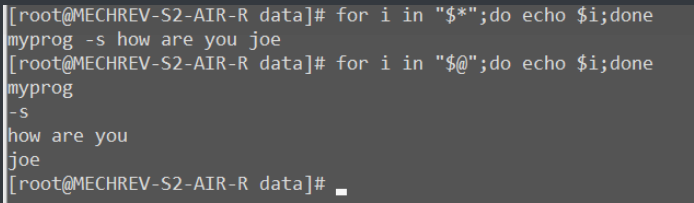

#### 位置变量

位置变量是按位置描述命令参数的一组变量


eg：

```bash
echo $0 $1 $3 $4
ouput:myprog -s joe jean
```

eg:

```bash
#cc.sh
#!/bin/sh
a=$1
b=$2
echo $1和$2 
```

./cc.sh  12  45

输出: 12和45

运行时直接在后面加变量./cc.sh 是$0

#### set命令

set命令可以对参数变量强制赋值

格式：set string1 string2 string3 。。。

参数：string i为赋给位置变量i的值，不能对$0赋值，不带参数时显示全部的变量值

#### shift命令

shift命令用来将位置变量与命令行参数的对应关系右移一位或指定的位数

格式：shift 位移量


#### 其他特殊变量

$?:最近一次命令执行后的退出状态。执行成功返回0，否则为1

$$:当前进程的进程号

### Shell表达式

**shell语言支持两类表达式计算，一是用于数值计算的算术表达式，结果为数值。另一种为用于进行条件测试或判断的逻辑表达式，其结果是真假值**

#### 数字运算表达式

shell利用expr命令进行数字表达式计算

expr格式：expr  数值1  运算符  数值2

expr支持以下运算符：

    -数字运算：+，-，*，/,%

    -逻辑运算:&,|

    -比较运算：=，==，！=，>,<,>=,<=

    ps:运算符和数字或变量之间要有空格，+,-,/可以直接运算，其他的要用转义字符\转义。括号的实现用\``

    eg:

```bash
a=13
expr "$a" -4 + 2 :11
expr 4 \* 5      :20
expr `expr 5 + 7` /3   :(5+7)/3=4 
```

使用$(expr )可以引用计算的值,eg实现a+=20

```bash
a=$(expr $a + 20)
```

#### 逻辑测试表达式

test命令可以对字符串，整数及文件进行各类的测试

test命令的两种等价格式：

    -test expression

    -test [expression]

其中expression是测试的表达式

test测试的结果只有真假两个值，用退出状态表示，0表示成功，1表示失败

#### 测试表达式

测试表达式由测试对象和测试操作符组成。

测试操作符有：

    -字符串比较类：=，！=，-n(nonzero)，-z(zero)

    -数字比较：-eq(equals)，-ge(greater or equals)，-le，-ne(not equals)，-gt，-lt

    -逻辑比较：！，-a(all)，-o(both)

            eg:

```bash
a=12
b=300
test $a -eq 12 -a $b -le 100
echo $?
output:1
```

    -文件操作：-d（目录），-f（文件），-r（read），-s(size greater than zero)，-w(write)，-x(excute)，-nt(newer than,修改时间)，-ot(older than) 

### Shell控制结构

    -分支结构：if，case

    -循环结构：while，until，for

    -循环控制：break，continue

    -结束：exit

#### 命令返回值与条件

在shell中，控制结构依赖的条件是所执行的命令的退出状态。命令执行成功返回0，否则返回1.

此外，shell还提供了三个内部命令" : "     " ; "   ，true和false

true和:返回0

false和；返回1

#### if命令

格式：

```bash
if [ 条件1 ];then 
    命令表1        
elif [ 条件2 ];then
    命令表2
else
    命令表3    
fi                     结束
```

ps:直接可以在命令行输入if，之后变为>模式，直到输入fi结束

if后的[]是test的简写形式，符合test语法格式，但中间的语句要和[ ]有空格

#### case命令

用case命令进行多路条件测试

格式：

```bash
case 变量 in
    x1) 表达式1;;
    x2|x3|x4....) 表达式2;;
    ...
    *)    表达式;;
esac
```

*)相当于default

linux的case有三种break。普通的break是；；

无条件continue继续   ;&

有条件continue   ;;&

只要继续了就会执行default

#### for命令

for循环遍历常跟一个seq 

几个例子：

```bash
    for i in `seq 1 9` //1-9
    for i in *.c  //文件
    for i in "$@"  //参数
    for i in {1..5}  //1-5
    for((i=1;i<10;i++))   //1 两个括号
```

eg:

```bash
set I want to fly in the sky
for i in "$@"
do 
    echo $i
done

output:
I
want
to
fly
in
the
sky
```

eg:

```bash
for i in *.c
do
rm -f $i
done
```

#### linux生成序列

**1.seq**

seq 两个参数时，seq 1 9输出1-9

seq 三个参数时，seq 1 2 9，每隔2输出一次，1-9

**2.{}**

生成1-9，{1..9}，两个点

{}的步数在第三个，1-9，每隔2生成一个,{1..9..2}

**3.ls**

ls列出的文件名是一个序列

ls ./test/返回的是一个文件序列

**4.直接列出**

for i in 1 2 4 18 22 89

#### linux 符号

**1.$和\${}**

$和\${}都是用来引用变量的，{}用来指定变量界限

```bash
echo $aa        //变量aa
echo ${a}a      //变量a和字母a
```

**2.[]**

[]和test是等价的

test  \$a  == "linux"等价于[ $a == "linux" ]

],[,符号和变量之间都有空格

**3.\$()和``**

这两个命令用来替换指令结果

```bash
echo $(date)
echo `pwd`
```

**4.\$[]和\$(())**

来用进行数学运算

**5.[[]]**

[[]]是[]的增强版，返回值也是0或1，在[[]]中不用转义

if [ $a \\\> 5 ]等价与if [[ \$ > 5 ]]

**6.（（））**

1.数学运算$（（））

2.在for循环控制循环for((i=0;i<10;i++)

3.改变变量值，不需要$引用,((i=i+1))

#### while和until命令

while和util命令用于有条件的循环控制

```bash
i=0
while [ $i -le 10 ]
do
echo "this is $i"
((i++))
done


until [ $i -le 0]

do
echo :this is $i:
((i--))
done
```

#### break和continue命令

break跳出本层循环，continue跳出本次循环

#### exit命令

格式：exit  [退出码]

### shell程序示例

#### 1.处理一批文件的程序

对一批文件，进行逐个编辑，浏览，删除操作

```bash
#!/bin/bash
#usage : procfile files
for i in *
do
        while true
do
        echo -n "$i:Edit,View,Remove,Next,Quit?\[e|v|r|n|q]"
        read choice
        case $choice in
                e*) vi $i;;
                v*) cat $i;;
                r*) rm $i;;
                n*) break;;
                q*) exit 0;;
                *) echo Illegal Option;;
        esac
done
done
```

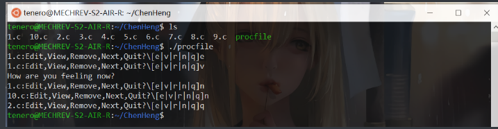

#### 2.一个求数字累加和的程序

```bash
#!/bin/bash
if [ $# = 0 ]
        then echo "Usage:$0 number-list"
        exit 1
fi

sum=0           #sum of numbers
count=$#        #count of numbers
while [ $# != 0 ]
do
        sum=`expr $sum + $1`;
        shift
done

#display final sum
echo "The sum of the given $count numbers is $sum."
exit 0
```

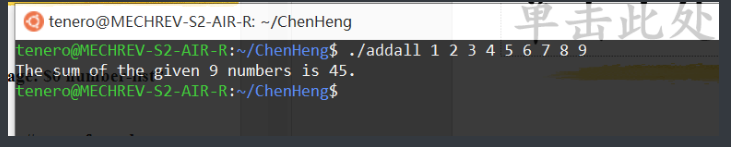

#### 3.一个简单的打包程序

```bash
#!/bin/bash
#bundle:group files into distribution package
echo "# To unbundle,bash this files"
for i in *.c
do
        echo "cat>$i<<'End of $i'"
        cat $i
        echo "End of $i"
done
```

output

```bash
1.c  10.c  2.c  3.c  4.c  5.c  6.c  7.c  8.c  9.c  addall  bundle  procfile
tenero@MECHREV-S2-AIR-R:~/ChenHeng$ ./bundle >x.cc
tenero@MECHREV-S2-AIR-R:~/ChenHeng$ cat x.cc
# To unbundle,bash this files
cat>1.c<<'End of 1.c'
How are you feeling now?
End of 1.c
cat>10.c<<'End of 10.c'
End of 10.c
cat>2.c<<'End of 2.c'
End of 2.c
cat>3.c<<'End of 3.c'
End of 3.c
cat>4.c<<'End of 4.c'
End of 4.c
cat>5.c<<'End of 5.c'
End of 5.c
cat>6.c<<'End of 6.c'
End of 6.c
cat>7.c<<'End of 7.c'
End of 7.c
cat>8.c<<'End of 8.c'
End of 8.c
cat>9.c<<'End of 9.c'
End of 9.c
tenero@MECHREV-S2-AIR-R:~/ChenHeng$ rm *.c
tenero@MECHREV-S2-AIR-R:~/ChenHeng$ ls
addall  bundle  procfile  x.cc
tenero@MECHREV-S2-AIR-R:~/ChenHeng$ bash x.cc
tenero@MECHREV-S2-AIR-R:~/ChenHeng$ ls
1.c  10.c  2.c  3.c  4.c  5.c  6.c  7.c  8.c  9.c  addall  bundle  procfile  x.cc
tenero@MECHREV-S2-AIR-R:~/ChenHeng$
```

## 第十一章

### 启动和关闭系统

系统启动的主要步骤：

    加载内核运行

    设置系统环境

    挂装文件系统

    启动系统服务进程

系统关闭的主要步骤：

    停止系统服务进程

    卸载文件系统

    停止内核运行

ps:逆着来

### 系统的关闭和重启

关机:shutdown

重启：shutdown   -r

### su命令

  功能：转变为另一个用户

格式：su  [-]   [用户名]

说明：不指定用户名时，转换到root。加上-时，同时变换环境:切换到对应的工作目录

### passwd文件

用户账号文件/etc/passwd,存放用户账户的基本信息，每个用户账户占一行。

格式：

```bash
logname:password:UID:GID:userinfo:home:shell
```

### 增加用户

命令:useradd  [选项]   用户名

设置口令指令：passwd   [用户名]

userdel  用于删除一个用户账户

userdel  -r  用户名：同时删除用户目录

### 设置用户登录环境

用户登录时，系统自动执行一些初始化脚本，建立其Shell环境：

/etc/profile：设置系统级的Shell环境及用户登录时的初始化程序。在用户登录时执行此脚本。

~/.bash_profile：设置用户个人的bash环境及登录时要执行的程序。在用户登录时执行此脚本。

~/.bashrc：设置用户定义的bash环境变量。bash启动时执行此脚本

### 主要的系统目录

/：根目录。

/bin：普通用户可以使用的命令。

/sbin：超级用户使用的命令。

/boot：内核引导程序。

/dev：设备文件。

/etc：系统的配置文件。

/root：root的主目录。

/home：用户主目录的目录。

/lib：系统库文件。

/usr：可共享的文件和程序。

    /usr/bin：普通用户可以使用的命令。

    /usr/sbin：超级用户使用的命令。

    /usr/include：系统头文件

    /usr/lib：系统库文件。

    /usr/src：系统源文件。

/mnt：文件系统挂装点。

/opt：可选择安装的应用软件。

/proc：系统内核和进程映像文件。

/tmp：临时文件。

/var：系统运行的数据和文件。

### 建立文件系统

mkfs：make file system

建立指定类型的文件系统：对分区进行格式化

### mount

挂载

格式：mount  [-t  vfstype]  [-o options]  device  dir

功能：卸下一个文件系统

格式：unmount  device或dir

### 监视进程的运行

top：实时监视系统中的进程，按cpu使用率排列，并提供交互界面管理进程

ps：显示进程相关信息，pid等

### 软件打包安装

传统方式

    tar

专用打包工具

    rpm，deb

在线发布与更新

    yum，apt

#### RPM：

RPM：Red Hat的软件包管理工具，功能：

    软件打包

    软件包安装与升级

    软件包查询

    软件包校验

    软件包卸载
