### docker 架构

 镜像(image):相当于是一个静态的文件系统

容器(container):相当于镜像运行的实体，是以image为模板创建的个体，可以创建多个，而且都是不同的实体，可以各异修改配置。相当于类的实例化。

仓库(repository):可以看成一个代码控制中心，用来保存镜像

卷(volume):删除容器会直接删除所有的数据，volume可以将容器的数据挂载在磁盘上，删除容器后继续保留数据

网络(network):创建子网，分配给容器使其互联

### 镜像的使用

#### 查看所有的容器

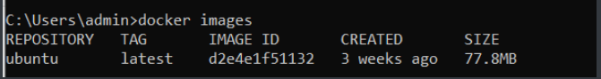

#### 运行容器

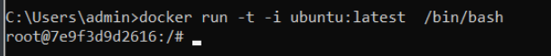

-t:终端

-i：交互式操作

ubuntu:latest  :repository + tag

/bin/bash:指定交互的指令位置

#### **获取镜像**

docker  pull  ubuntu:18.04

#### **查找镜像**

docker  search  httpd

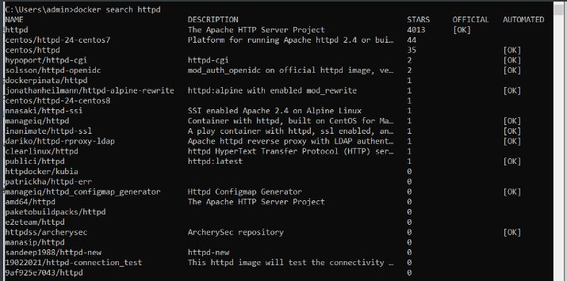

#### **删除镜像**

docker  rmi  ubuntu:tt

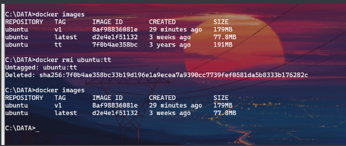

#### 创建镜像

当从docker hub pull的镜像不能满足要求时，修改镜像

    1.从已经创建的容器中更新镜像，并提交这个镜像

    2.使用Dockerfile来创建一个新的镜像

#### **更新镜像**

1.首先使用镜像创建一个容器

docker run -t -i ubuntu  /bin/bash

2.进入容器后进行一些个异化操作

apt update;  apt upgrade;  apt install  vim

3.docker   ps 查看当前运行的容器

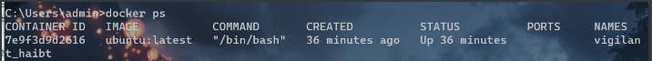

记录其Container ID：  7e9f3d9d2616

4.提交更改，创建新镜像(用name也行)

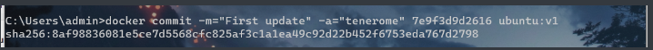

5.查看新的images

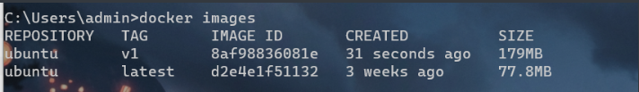

#### **构建镜像**

创建文件，名为Dockfile

内容：

```dockerfile
FROM    centos:6.7
MAINTAINER    Fisher  "fisher@sudops.com"
RUN    /bin/echo 'root:123456' | chpasswd
RUN    useradd tenero
RUN    /bin/echo  'tenero:123456' | chpasswd
RUN    /bin/echo -e "LANG=\"en_US.UTF-8"" > /etc/default/local
EXPOSE 22
EXPOSE 80
CMD    /usr/sbin/ssh -D
```

ps:

每个指令的前缀都必须大写

FROM：指定使用哪个镜像源

RUN：  在镜像内执行的命令

使用docker build来创建镜像

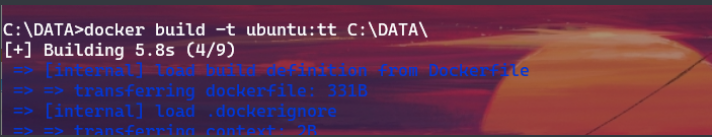

-t: 设置镜像名字和版本  

C:\DATA\  :Dockerfile所在路径

检验：

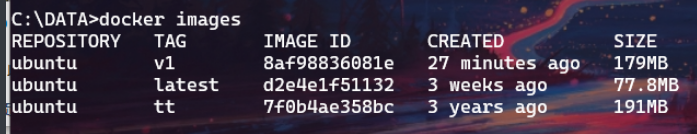

创建成功

#### **设置镜像标签**

docker  tag  d2e4e1f51132  ubuntu:default

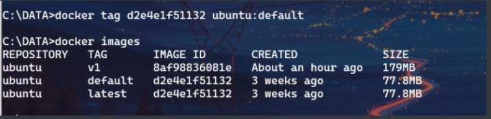

可以看到image id为d2e4e1f51132的Ubuntu有两个tag

### 容器的使用

#### 创建容器

docker run  -it  --name  server0 ubuntu  /bin/bash

退出终端：exit

#### 启动容器

启动未运行的容器

docker  start  容器id或name

#### 查看容器

查看运行中的容器：docker  ps

查看所有容器：docker  ps  -a 

#### 后台运行

docker   run  -itd  --name ubuntu-test  ubuntu  /bin/bash

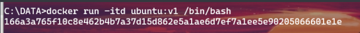

--name:为容器命名

-d:后台运行

#### 停止容器

docker  stop  <容器的ID或name>

停止的容器可以重启

docker  restart  <容器的ID或name>

#### 进入容器

进入后台运行中的容器

1.docker  attach  <容器ID或name>

    直接进入容器，不需要参数

    不推荐用，因为exit容器时会使容器停止运行    

2.docker  exec  -it   <容器ID或name>    /bin/bash

    

用这个进入容器后exit不会停止容器

进入容器相当于进入docker提供的默认linux操作环境

#### 导入和导出容器

##### 导出容器

docker  export <容器ID或name>  >  filename

\>重定向到文件


##### 导入容器

docker  import  URL或PATH

导入之后不是容器，而是镜像

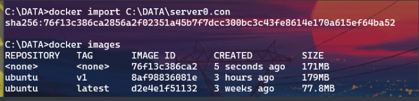

#### 删除容器

docker  rm  -f  容器ID或name

-f：强制删除

### 容器连接

#### 网络端口的映射

创建容器时用-P或-p指定容器绑定的网络地址

docker  run  -d -P  training/webapp  python  app.py

docker ps

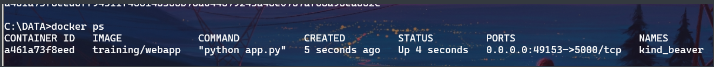

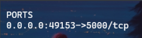


0.0.0.0:49153 :主机端口号

5000/tcp:容器的端口号和类型

-P：容器内部端口随机映射到主机的端口

-p：容器内部端口绑定到指定的端口

docker run -d -p 127.0.0.1:5001\:5000 training/webapp python app.py

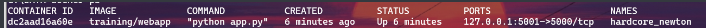

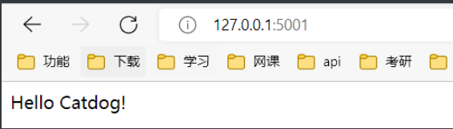

默认绑定tcp端口，使用/udp绑定udp端口

#### 查看端口绑定情况

docker  port  容器ID或name  容器内部端口号

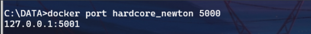

#### docker网络

创建网络

docker  network  create  -d  bridge  test-net

-d：指定网络类型，有bridge，overlay

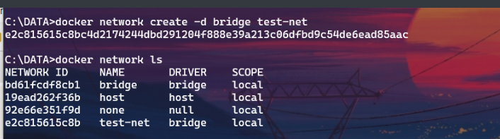

查看网络：

docker  network  ls

创建容器并将容器加入网络

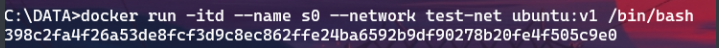

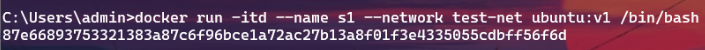

创建了s0和s1

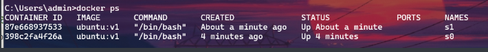

测试其连通性：

在s0 ping s1

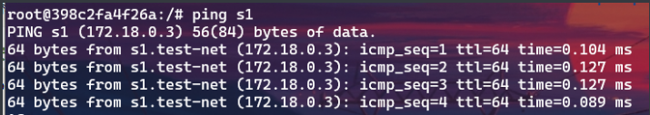

成功ping通

在s1 ping  s0

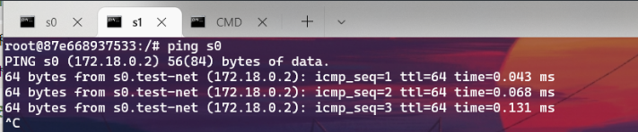

同样成功ping通

### 和主机共享资源

docker  cp  主机path   容器ID或name:容器path/   :将主机的path目录拷贝到容器path下

docker cp  主机path   容器name:容器path1       ：将主机的path  拷贝到容器并改名为path1

docker cp 容器name:path 主机path/：将容器path拷贝到主机path

### docker开发tips

开发的时候保持一个容器为最新的，如果变更，则更新image，其他的子容器不同变更，直接删除了，重新克隆

docker容器之间ssh连接

    先配置sshd_config

    ssh-keygen -t rsa生成各自的密钥

    在.ssh touch authorized_keys

    把所有的id_keys.pub追加到authorized_keys

就可以了
