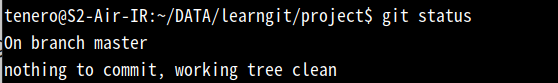

## 本地仓库

### 简介

git:世界上使用最多的分布式版本控制系统

工作流程：


Remote：远程仓库

Repository：本地仓库

Index/stage：暂存区

Workspace：工作区

### git和SVN的区别

SVN是集中式版本控制系统，版本库放在中央服务器上，SVN没有本地仓库，也就没有工作区，暂存区等的概念。只有Main分支和其他的分支，直接对云仓库操作。

### 安装配置git

下载好git安装，并配置环境

首先需要配置区别不同机器的用户名和邮箱

打开git

```bash
git config --golbal user.name "Tenerome"
git config --global user.email "Tenerome@test.com"
```

用于配置全局的用户名和邮箱

将global换成local可以配置不同仓库的用户名和邮箱

#### 实操：

1,新建文件夹并cd进去，这个文件夹就是本地仓库，在这打开git的操作就会保存在这个仓库


2，初始化并配置仓库用户名和邮箱


查看配置文件

```bash
cat ./.git/
```


### 本地仓库管理

#### add

add是将工作区的文件添加到暂存区，用于再commit到本地仓库或者取消暂存。

首先新建文件并输入信息


通过git status来查看文件的状态信息


这里的Untracked(或unstage)即使base的当前状态，未追踪的

并且提示了使用git add来将base添加到暂存区


将base add后，再查看信息

base已经被追踪，且提示使用git rm --cached 来取消追踪


#### commit

将文件添加到暂存区后，使用commit来提交变更


接着会进入编辑界面来添加改动信息

添加完并保存


会提示改动信息

此时再查看状态，会提示工作区已经没有新改动了



也可以直接用-m加上提交信息

```bash
git commit -m "改动1"
```

来提交改动

并且，add和commit是可以一起用的

```bash
git commit -a -m "改动2"
```

#### log

git log可以用来显示所有的提交信息


#### .gitignore

如果有些文件不需要提交，就可以创建.gitignore,并将无需提交的文件名添加进去就可以忽略掉

#### diff

git diff 可以显示文件修改的信息和仓库文件信息的对比 

比如本地仓库的文件现在是


接着在工作区修改


然后git diff


这时git status


提示使用git add添加到暂存，git restore来丢弃更改

#### reset

git reset 用于版本回退

回退到上一个版本

```bash
git reset --hard HEAD^
```

回退到第n个版本

```bash
git reset --hard HEAD~n
```

通过版本号和commit信息回退

首先查看版本号

```bash
git reflog
```


比如要回退到改动2，其版本号为c2a69d8

```bash
git reset --hard c2a69d8
```


#### branch

分支是git的核心功能，用于创建主支的副本，创建的分支在空间上和主支独立。

***ps:但是如果文件在.gitignore中的话，分支对untracked文件的操作也会对主支造成影响***

##### 创建分支

```bash
git branch copy1
```


使用git branch查看分支


刚创建完分支不会立即跳转到分支工作区

需要使用checkout来签出

```bash
git checkout copy1
```


如果想创建分支的同时跳转可以这样

```bash
git checkout -b temp
```

# 


##### 合并分支


##### 删除分支

```bash
git branch -d copy1
```

如果分支还未合并

-d会提示不能删除，这时可以用-D强制删除

#### Head

head相当于一个指针，指向当前激活的分支


