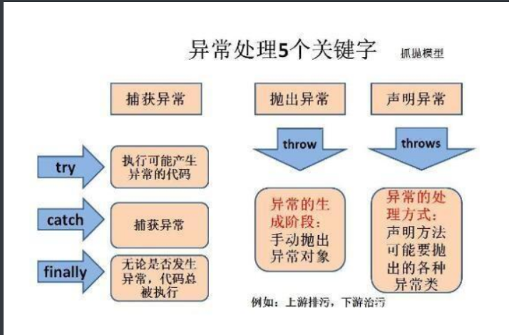
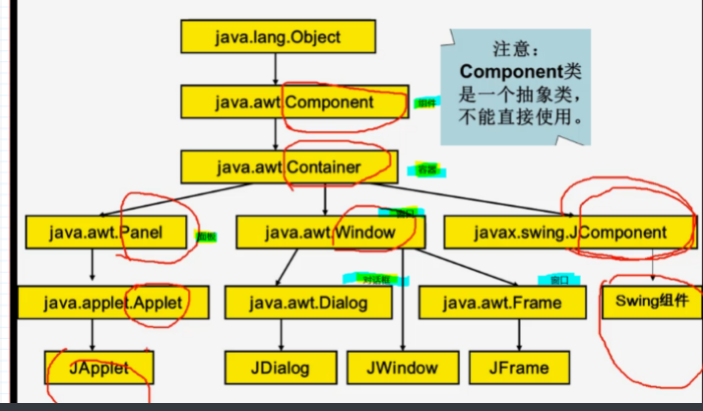

## java课程

### 初识

java面对对象编程语言

版本：

javase：java标准版，java基础，写C/S结构的客户端

javaee：java企业版，分布式，写B/S

javame：micro嵌入式java，写旧版nokia应用

### debug for java

单步跳过：直接一步一步调试不进入函数

单步调试：进入函数，会一直进入下一层函数

单步退出：退出当前函数返回上一层

### jdk和jre

jre=jvm虚拟机+java类库

jdk=jre+java开发工具（java,javac,javadoc,javap等）

### 杂知识

#### java枚举

枚举限制变量只能是预先设定好的值。使用枚举可以减少代码中的 bug 

```java
//枚举
class dog{
    enum dogsize{small,large}
    dogsize size;//枚举型变量，它的值只能是枚举中的元素
}
public class test1{
    public static void main(String[] args) {
        dog do1=new dog();
        do1.size=dog.dogsize.small;
        System.out.println(do1.size);
    }
}
```

#### instanceof运算符

用于检验对象是否为特定类型

```java
String name = 'James';
boolean result = name instanceof String; // 由于name是String类型，所以返回真
```

#### java增强for循环

```java
int array[]={1,2,3,4,5,6};
for(int x:array){
    sysout(x);//相当于，int i=0; int x=array[i++]; 
}
```

#### java数组

1.可以直接用数组名.length直接调用数组长度

##### foreach

可以不使用下标遍历数组

```java
public class test1{
    public static void main(String[] args) {
        int a[]={0,1,2,3,4,5};
        for(int element:a){
            System.out.println(element);
        }
    }
}
```

就是增强for循环

##### java中数组可以作为函数返回值

```java
public class test1{
    public static int [] test(){
        int array[]=new int[10];
        for(int i=0;i<=9;i++){
            array[i]=i+1;
        }
        return array;
    }
    public static void main(String[] args) {
        System.out.println(test()[2]);
    }
}
```

### java日期和时间

### 对象基础

#### 对象，类和方法

对象：对客观世界里的任何实体的抽象

属性：表示实体的静态特征，所有属性的组合反映实体的状态

行为：表示实体的动态特征，一个行为的过程可能会影响或改变实体的状态

#### 对象的创建

new运算符用于创建对象，完成3个工作：

在堆中为对象分配内存

调用构造方法

返回该对象在堆中的地址

concat：用于连接数组

```java
arrayObject.concat(arrx,arry);
```

substring

substring() 方法用于提取字符串中介于两个指定下标之间的字符。

```java
stringObject.substring(start,stop)
```

### 类

格式：

修饰符(public等) class <类名>{

成员变量；

构造方法；

成员方法；

}

#### 成员变量

修饰符：

public，protected，private：定义变量可见性

final：定义变量有名常量

static：定义静态变量，也叫类变量

#### 成员方法

#### this，return，do，get

```java
 protected int a,b;
    public int getA(){
        return a;
    }
    public void setA(int a){
        this.a=a;
    }
    public int getB(){
        return this.b;//return 的是这个类的变量，就算是protected，也可以直接return，也可以用this
    }
    public void setB(int b){
        this.b=b;       //this.b是类的变量，b是方法setB()的形参
    }
```

#### 构造方法

1.构造方法名字和类名相同

2.构造方法没有返回值

3.构造方法一般用于对成员变量的初始化，重载

4.构造方法在创建对象时自动创建

|可以在一个构造方法中调用其他重载的构造方法 

eg:

```java
public class Car {
    int id;
    String brand;
    String color;
    int weight;

    public Car() {
    }
    public Car(int id,String brand){
        this(id, brand, null);
    }
    //（2）在构造方法中做调用，调用另一个重载的构造方法，让重复的代码只写一次，也便于以后的时候修改变量。
    public Car(int id,String brand,String color){

        //this.id = id;
        //this.brand = brand;
        //this.color = color;
        //重复的代码只写一次做调用
        //一个构造方法，调用另一个重载的构造方法
        this(id, brand, color, 0);//0位重量的默认值
    }

    //（1）我们在构造方法中集中的处理所有参数
    public Car(int id,String brand,String color,int weight){
        this.id = id;
        this.brand = brand;
        this.color = color;
        this.weight = weight;
    }

    public void go(){
        System.out.println(
            id+"号"+color+"的汽车启动");
    }
    public void stop(){
        System.out.println(
            id+"号"+color+"的汽车停止");
    }
    public void turnLeft(){
        System.out.println(
            id+"号"+color+"的汽车左转");
    }
    public void turnRight(){
        System.out.println(
            id+"号"+color+"的汽车右转");
    }
}
```

#### 实例成员和类成员

|类成员（静态成员）：

用static修饰

属于类，也属于该类创建的对象

在类外，可以用类名访问也可以用对象名访问

|实例成员：

不用static修饰

只属于对象

在类外只能用对象名访问

|在类内，实例方法可以访问实例成员和类成员，类方法只能访问类成员（不用static修饰的方法可以访问static修饰的变量和不用static修饰的，用static修饰的方法只能访问static修饰的变量）

eg：

```java
public class InstanceStatic {

    int x = 3;// 类的实例变量，初始化值为3
    static int y = 4;// 类的静态变量，初始化值为4

    public static void staticmethod()// 静态方法
    {
        //System.out.println(x);  X  静态方法不能直接调用实例成员
        System.out.println("实例变量x = " + new InstanceStatic().x);// 在静态方法中访问类的实例变量需首先进行类的实例化
        System.out.println("静态变量y = " + y);// 在静态方法中可直接访问类的静态变量
        staticmethod1();//静态方法可以调用其他静态方法
        // instancemethod();  X 静态方法不能访问实例方法
        new InstanceStatic().instancemathod1();
    }

    public static void  staticmethod1(){  //静态方法2
        System.out.println("另一个静态方法");
    }
    public void instancemathod(){
        System.out.println(x);//实力访问可以直接访问实例变量，类变量，实例方法，类方法
        System.out.println(y);
        staticmethod1();
        instancemathod1();
    }
    public void instancemathod1(){
        System.out.println("另一个实例方法");
    }
    public static void main(String[] args) {
        System.out.println("====类方法====");
        InstanceStatic.staticmethod();
        System.out.println("====实例方法===");
        InstanceStatic cc=new InstanceStatic();
        cc.instancemathod();
    }
}

结果：
====类方法====
实例变量x = 3
静态变量y = 4
另一个静态方法
另一个实例方法
====实例方法===
3
4
另一个静态方法
另一个实例方法
```

### 包

导包：

```java
import 包名1.包名2. ...  类名；

import 包名1.包名2.*;//   .*表示导入该包下所有类
```

### 类和类成员的可见性：

#### 类的可见性：

public修饰：任何位置可见

不用public 修饰：仅在当前包可见

|一个类文件，只能有一个public修饰的class，且和文件名字相同

#### 成员可见性：

public：任何位置可见

protected：当前包和当前类的子类

private：只能在当前类可见

无修饰符：默认，当前包可见

### 包装类和字符串类

#### 常用包装类：

Boolean(boolean)

Character(char)

Byte(byte)

Integer(int)

Short(short)

Long(long)

Float(float)

Double(double)

由编译器特别支持的包装称为装箱，所以当内置数据类型被当作对象使用的时候，编译器会把内置类型装箱为包装类。相似的，编译器也可以把一个对象拆箱为内置类型。Number 类属于 java.lang 包。

就是对象和基本类型之间的转换

eg：

```java
public class Test{

   public static void main(String args[]){
      Integer x = 5; // boxes int to an Integer object
      x =  x + 10;   // unboxes the Integer to a int
      System.out.println(x); 
   }
}
```

#### Integer的方法：

```java
byte  byteValue();//把字符串转化成byte型
static int compare(int x,int y);//比较两个整数的大小
static int max(int x,int y);//取较小值
static int min(int x,int y);
static int parseInt(String s);//把字符串转换成整型
static Integer valueOf(String s);//把字符串转换成Integer
```

#### Character 方法

下面是 Character 类的方法：

```java
isLetter()是否是一个字母
isDigit()是否是一个数字字符
isWhitespace()是否一个空格
toString()返回字符的字符串形式，字符串的长度仅为1
```

#### 字符串类：

String静态字符串:

```java
char charAt(int index);//获取字符串的第n位
boolean equals(Object anObject);//判断两个字符串是否相等
int length();//获取字符串长度
String subString(int x,int y);//截取字符串x到y位
```

StringButtfer动态字符串

```java
StringBuffer append();//末尾插入
StringBuffer insert();//中间插入
```

#### StringBuffer和StringBuild

StringBuffer:多线程安全

#### Array类

方法：

```java
static int binarySearch(int[] a,int k);查找数组元素    
static int compare(boolean[] a,boolean[] b);比较两个数组
static int[] copyOf(int[] original,int newlength)复制数组
static boolean equals(boolean[] a,boolean[] b)比较是否相等
static void fill(int[] a,int val)添加元素
static void sort(int[] a)对数组排序
static String toString(int[] a)数组字符串化
```

### 链表和动态数组

#### LinkedList<E>泛型

方法

```java
boolean    add(E e)
          将指定元素添加到此列表的结尾。
 void    add(int index, E element)
          在此列表中指定的位置插入指定的元素。
 void    addFirst(E e)
          将指定元素插入此列表的开头。
 void    addLast(E e)
          将指定元素添加到此列表的结尾。
 void    clear()
          从此列表中移除所有元素。
 boolean    contains(Object o)
          如果此列表包含指定元素，则返回 true。
 E    element()
          获取但不移除此列表的头（第一个元素）。
 E    get(int index)
          返回此列表中指定位置处的元素。
 E    getFirst()
          返回此列表的第一个元素。
 E    getLast()
          返回此列表的最后一个元素。
 boolean    offer(E e)
          将指定元素添加到此列表的末尾（最后一个元素）。
 boolean    offerFirst(E e)
          在此列表的开头插入指定的元素。
 boolean    offerLast(E e)
          在此列表末尾插入指定的元素。
 E    pop()
          从此列表所表示的堆栈处弹出一个元素。
 void    push(E e)
          将元素推入此列表所表示的堆栈。
 E    remove()
          获取并移除此列表的头（第一个元素）。
 E    remove(int index)
          移除此列表中指定位置处的元素。
          从此列表中移除最后一次出现的指定元素（从头部到尾部遍历列表时）。
 E    set(int index, E element)
          将此列表中指定位置的元素替换为指定的元素。
 int    size()
          返回此列表的元素数。
 Object[]    toArray()
          返回以适当顺序（从第一个元素到最后一个元素）包含此列表中所有元素的数组。
<T> T[]
toArray(T[] a)
          返回以适当顺序（从第一个元素到最后一个元素）包含此列表中所有元素的数组；返回数组的运行时类型为指定数组的类型。
```

#### Vector<E>动态数组

方法

```java
boolean    add(E e)
          将指定元素添加到此向量的末尾。
 void    add(int index, E element)
          在此向量的指定位置插入指定的元素。
 int    capacity()
          返回此向量的当前容量。
 void    clear()
          从此向量中移除所有元素。
 boolean    contains(Object o)
          如果此向量包含指定的元素，则返回 true。
 void    copyInto(Object[] anArray)
          将此向量的组件复制到指定的数组中。
 Enumeration<E>    elements()
          返回此向量的组件的枚举。
 void    ensureCapacity(int minCapacity)
          增加此向量的容量（如有必要），以确保其至少能够保存最小容量参数指定的组件数。
 boolean    equals(Object o)
          比较指定对象与此向量的相等性。
 E    firstElement()
          返回此向量的第一个组件（位于索引 0) 处的项）。
 E    get(int index)
          返回向量中指定位置的元素。
 int    hashCode()
          返回此向量的哈希码值。
 int    indexOf(Object o)
          返回此向量中第一次出现的指定元素的索引，如果此向量不包含该元素，则返回 -1。
 int    indexOf(Object o, int index)
          返回此向量中第一次出现的指定元素的索引，从 index 处正向搜索，如果未找到该元素，则返回 -1。
 void    insertElementAt(E obj, int index)
          将指定对象作为此向量中的组件插入到指定的 index 处。
 boolean    isEmpty()
          测试此向量是否不包含组件。
 E    lastElement()
          返回此向量的最后一个组件。
 int    lastIndexOf(Object o)
          返回此向量中最后一次出现的指定元素的索引；如果此向量不包含该元素，则返回 -1。
 int    lastIndexOf(Object o, int index)
          返回此向量中最后一次出现的指定元素的索引，从 index 处逆向搜索，如果未找到该元素，则返回 -1。
 E    remove(int index)
          移除此向量中指定位置的元素。
 boolean    remove(Object o)
          移除此向量中指定元素的第一个匹配项，如果向量不包含该元素，则元素保持不变。
 boolean    removeAll(Collection<?> c)
          从此向量中移除包含在指定 Collection 中的所有元素。
 void    removeAllElements()
          从此向量中移除全部组件，并将其大小设置为零。
 boolean    removeElement(Object obj)
          从此向量中移除变量的第一个（索引最小的）匹配项。
 void    removeElementAt(int index)
          删除指定索引处的组件。
protected  void    removeRange(int fromIndex, int toIndex)
          从此 List 中移除其索引位于 fromIndex（包括）与 toIndex（不包括）之间的所有元素。
 boolean    retainAll(Collection<?> c)
          在此向量中仅保留包含在指定 Collection 中的元素。
 E    set(int index, E element)
          用指定的元素替换此向量中指定位置处的元素。
 void    setElementAt(E obj, int index)
          将此向量指定 index 处的组件设置为指定的对象。
 void    setSize(int newSize)
          设置此向量的大小。
 int    size()
          返回此向量中的组件数。
 List<E>    subList(int fromIndex, int toIndex)
          返回此 List 的部分视图，元素范围为从 fromIndex（包括）到 toIndex（不包括）。
 Object[]    toArray()
          返回一个数组，包含此向量中以恰当顺序存放的所有元素。
<T> T[]
toArray(T[] a)
          返回一个数组，包含此向量中以恰当顺序存放的所有元素；返回数组的运行时类型为指定数组的类型。
 String    toString()
          返回此向量的字符串表示形式，其中包含每个元素的 String 表示形式。
 void    trimToSize()
          对此向量的容量进行微调，使其等于向量的当前大小。
```

### 类的继承

类的层次关系：一般性类和特殊性类，比如动物和人，政府机构和检察院

继承：描述一般类和特殊类之间的关系的机制

​    父类：一般类

​    子类：特殊类

​    子类拥有父类成员，实现程序复用

传递性：A是B的子类，B是C的子类，那么A是C的子类

定义格式：

修饰符  class  子类  extends  父类{

成员变量；

构造方法；

成员方法；

}

修饰符为public，用于控制子类的可见性

除了object类，所有的类都是子类，都有父类，父类可以指定，默认是object

#### 继承和构造方法：

构造方法不是类的成员

父类的构造方法不能被子类继承

在子类构造方法中可以访问父类中的构造方法，用super来指定父类成员

在子类创建对象时，先调用父类构造方法，再调用子类构造方法

在子类构造方法中第一行必须是super(),如果不是，系统自动添加

#### 继承和变量隐藏

如果子类和父类有相同名称的成员变量

用super.变量名访问父类的成员

用this.变量名访问子类成员

如果不加this，super，按就近原则确定被访问的变量

#### 继承与方法覆盖

如果子类和f父类有相同名称的方法

this.方法 访问子类方法

super.方法访问父类方法

如果没有this，super，按就近原则，如果当前类有，访问当前类，没有就访问父类

#### 继承和类型转换

格式

类型1    变量名=    new    类型2(实参)

当类型1和2不同时，1和2需要有父子关系

自动转换：1的范围比2大，即1是2的父类

```java
AA aa=new BB(5);
```

强制转换：1的范围比2小，1是2的子类

```java
BB bb=(bb)new AA(5);
```

变量的类外访问取决于引用变量的类型，上述，aa.x访问的是AA中的x，bb.x访问的是BB中的x，和前面的类型相关

#### 抽象类和抽象方法

抽象方法：

定义：用abstract 修饰，只有方法声明，没有方法体

格式：public    abstract     返回值类型    方法名(形参)；

eg:   public abstract    void    show(int x);

抽象类：

定义：用abstract修饰，。含有抽象方法的类

格式：

修饰符    abstract     class{

抽象方法

}

继承抽象方法的类，如果没有完全继承抽象类的所有方法，本身还是个抽象类，还需要abstract修饰

说明：

抽象类不能用来创建对象，只能被继承

### 接口

接口是一种抽象类

类和类的关系叫继承

接口和接口的关系也叫继承

类和接口的关系叫实现

一个类只有一个父类，但可以实现多个接口

#### 接口定义：

修饰符    interface    接口名{

公共类常量；//用public  static  final修饰

公共抽象方法；//public static  final

}

接口的实现：

修饰符    class      类名    implement    接口名{

方法体；

}

### 多态

重载多态，静态多态性：通过方法实现重载，一个类中的多个方法名相同，形参不同

覆盖多态：通过方法覆盖实现多态，子类和父类的方法具有相同的方法名和形参，由父类型变量指向的对象类型确定哪个方法执行

### 异常

#### 异常的分类：

Throwable类及其子类统称为异常类

Throwable有两个直接子类：Error和Exception，Exception又分运行时异常（RuntimeException）和一般异常（CheckedException）

**所有error和exception都可以抛出或者捕获，但是error和运行时exception的捕获抛出意义不大，应着重注意一般异常的捕获和抛出**

#### 常见的异常类:

ArithmeticException：算数异常，

ArrayIndexOutOfBoundsException：数组跃进异常,

FileNotFoundException：文件找不到异常

ClassNotFountException：类找不到异常

#### 异常的处理

1.抛出异常

throws:如果当前方法不知道如何处理异常，可以使用throws抛出给调用者（方法）或者交给jvm，jvm打印异常的跟踪栈信息并终止程序，throws放在方法后，可以抛出多个异常

格式:

```java
public void test() throws ExceptionClass1,ExceptionClass2{
//code
};
```

子类方法声明抛出的异常类型应该时父类方法声明抛出异常类型的子类或相同

```java
public class ThrowsTest2{
    //因为test();会抛出IOException，main方法是调用者
    //则需要使用try...catch进行捕获或者抛给JVM
    //抛出时要遵循父类声明抛出“大于”子类声明抛出的原则
    public static void main(String[] args) throws Exception {
        test();
    }
    public static void test() throws IOException() {
        //因为FileInputStream构造器会抛出IOException
        //所以需要使用try...catch块进行处理或使用throws抛给调用者
        FileInputStream fis = new FileInputStream("a.txt");
    }
}
```

throw:如果需要程序自行抛出异常，应使用throw，抛出的不是类而是对象且只能抛出一个对象，可以单独使用也可以结合catch捕获使用。如果抛出的异常对象是Checked异常则处于try块里被catch捕获或者放在一个带throws的方法里；如果抛出的是RuntimeException则既可以显式使用try…catch捕获也可以不理会它

```java
public class ThrowTest {
    public static void main(String[] args) {
        try{
            throwChecked(3);
        }catch(Exception e) {
            System.out.println(e.getMessage());
        }
        throwRuntime(-3);
    }
    //该方法内抛出一个Exception异常对象，必须捕获或抛给调用者
    public static void throwChecked(int a) throws Exception {
        if(a < 0) {
            throw new Exception("a的值应大于0，不符合要求")
        }
    }
    //该方法内抛出一个RuntimeException对象，可以不理会直接交给JVM处理
    public static void throwRuntime(int a) {
        if(a < 0) {
            throw new RuntimeException("a的值应大于0，不符合要求")
        }
    }
}
```

在Java7之前，父类和子类在声明抛出异常时应符合父类包含的异常“大于等于”子类包含的异常的规则；从Java7开始，Java编译器会检查throw语句抛出的异常的实际类型



### swing

java提供两个除磷图形用户界面的类库：

1.java.awt包：Abstract Window Toolkit：抽象窗口工具包

​    java处理图形用户界面的初始途径

​    重量级组件，调用目标平台的GUI处理

2.java.swing包：在AWT基础上构建的新图形界面系统

​    JFC（Foundation Classes）的一部分，轻量级组件，界面和本机OS无关，调用java GUI

#### GUI设计的三个概念：

组件（Component）：是java的图形用户界面的最基本的组成 部分

容器（Container）：Component的子类，本身也是组件

布局管理器：（layout Manager）：每个容器都有一个布局管理器，用于对组件的定位和尺寸控制



​    

#### Swing的分类：

1.顶层容器：JFrame（顶层窗口），JApplet（小程序），JDialog（对话框），JWindow（基本窗口）

2.中间容器：JPane（面板），JScrollPane（滑动面板），JSplitPane（分隔面板），JToolBar（工具栏）

3.特殊容器：在GUI上有特殊作用的中间层，eg：JInternalJFrame，JLaveredPane，JRootPane

4.基本控件：人机交互控件：Jbutton（按钮），JComboBox（复选框），JList（列表），JSlider（滚动条），JMenu（菜单栏），JTextField（文本框）

5.信息提示组件：JLable（标签），JProgressBar（进度条），ToolTip（悬浮提示）

6.可编辑的格式化组件：JColorChooser（颜色选择器），JFileChooser（文件选择器），JTable（表格）

#### Swing使用规则：

Swing组件不能直接添加到顶层容器中，必须添加到与顶层容器相关联的内容面板上

避免使用非Swing的重量级组件

#### 对JFrame添加组件的两种方式

1.用getContentPane（）的add方法

```java
frame.getContentPane().add(childComponentName);
```

2.建立一个JPanel或JDesktoppane的中间容器，先把组件添加到容器中，用setContentpane（）方法把该容器置为JFrame的内容面板

```java
JPanel contentPane=new JPanel();
....//把其他组件添加到JPanel中
frame.setContentPane(contentpane);
```
