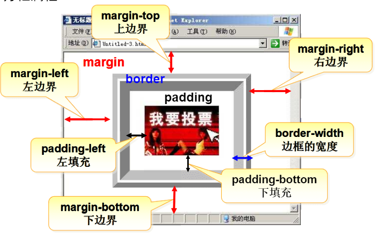
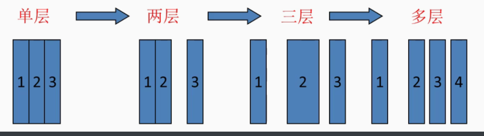
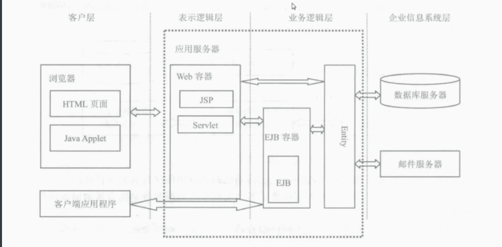

## 复习html


### 1.表单


网页中用于输入信息的区域

语法格式

````html
<form action="接受表单数据的地址" method="传输数据的方法">
    .....
</form>
````

说明：action属性：用于设置接收表单数据的地址

2. method属性：设置传输数据的方法

   get：将表单数据附加在程序地址的后面

   post：将表单数据打包单独传送，在地址栏看不到数据

### 2.常用的表单控件

1. 单行文本框

   ````html
   <input type="text" name="控件名称" value="默认值"/>
   ````

   说明，type：设置控件类型

   name：设置控件名称

   value：设置控件值

2. 密码框

   ````html
   	<input type="password" name="控件名称" value="默认值">
   ````

   

3. 单选按钮

````html
<input type="radio" name="控件名称" value="值">
````

同一组单选按钮要启用name相同

4. 复选框

````html
<input type="checkbox" name="控件名称">
````

同一组复选框name相同

5. 下拉列表

   ````html
   <select name="控件名称">
       <option value="值">提示信息</option>
       ...
   </select>
   ````

6. 多行文本框

   ````html
   <textarea name="" rows="行数" cols="列数">
       
   </textarea>
   ````

   7. 提交和重置

      ````html
      <input type="submit" value="提示信息"/>
      <input type="reset" value="提示信息"/>
      ````

      #### 总结

      ````html
      <input type="控件类型" name="控件名称" value="默认值"/>
                   控件类型：text/password/radio/checkbox/submit/reset
      ````

      

### 3.框架

````css
<frameset cols="25%,50%,*" rows="50%,*" border="5">//设置窗口框架，cols设置行，rows设
	<frame src="first.html">						列，以及各部分百分比，用						                                 <frame>标签设置窗口内容
</frameset>
````

### 4.css

css：层叠样式表，用于分开html标签和样式

#### 选择器

##### 1. 元素选择器

````css
<style type="text/css">
p{color:red,font-size:30px,font-family:"隶书"}//所有的p标签都会被选择，改变样式
</style>

//使用
<p>床前明月光</p>

````

##### 2.类选择器

````css
<style type="text/css">
.red{
    color:red;
    font-size:12px; //任意标签都可以通过class属性调用
    
}
</style>

//使用
<p class="red">低头思故乡</p>

````

#### 常用文本属性

font-size:字体大小

font-family:字体类型

font-style：字体样式

color：设置或检索文本颜色

text-align:文本对齐

#### 方框属性



| margin-top     | 设置对象的上边距           |
| :------------- | -------------------------- |
| margin-right   | 设置对象的右边距           |
| margin-bottom  | 设置对象的下边距           |
| margin-left    | 设置对象的左边距           |
| border-style   | 设置边框的样式             |
| border-width   | 设置边框的宽度             |
| border-color   | 设置边框的颜色             |
| padding-top    | 设置内容与上边框之间的距离 |
| padding-right  | 设置内容与右边框之间的距离 |
| padding-bottom | 设置内容与下边框之间的距离 |

#### a标签

a:link       超级链接的初始状态
a:hover   把鼠标放上去时悬停的状况
a:active   鼠标点击时
a:visited   访问过后的情况


## javaee

### 简介


软件构成：

用户界面部分：表示层

应用逻辑部分：业务逻辑层

数据访问部分：数据访问层



单层本机					 网络/本机（C/S) 数据分离		  B/S(浏览器/应用服务，数据服务)						

分布式：不同模块在不同计算机运行

### javaee是中间件体系结构




期末

servlet工作流程

1客户端将请求发送到服务器

2服务器加载servlet并调用init()创建对象

3servlet处理请求并将结果返回给服务器

4服务器将结果返回给客户端

5服务器关闭或空间不足，调用destroy()退出

jsp forword和sendRedirect的区别

sendRedirect,服务器告诉浏览器要跳转的地址，在浏览器跳转，不传参

forword 直接在服务器中跳转，可以传参数

jsp第一次运行时的过程

html部分先不做处理，jsp部分由jsp引擎翻译为java文件，调用jdk编译为class文件，调用jvm执行该class，将结果处理为html和之前的html返回给用户界面

javabean的四种生存范围

page：保存在一页的范围之中，跳转之后无效；

request：可以保存在一次服务器跳转范围中；

session：在一个用户的操作范围中保存，重新打开浏览器的时候才会声明新的；

application：在整个服务器上保存，服务器关闭时才会消失。

jdbc连接数据库常用的类和接口

​    class，DriverManager,Connection,Statement,Resultset,Preparedstatement

request.getRemoteAddrr()获取ip

简述include指令和include动作的功能及区别

指令：

<% @ include file=”xxxx”%>

静态包含页面

不能传递参数

在编译时被执行

在逻辑和语法上和包含页面统一

 

动作：

<jsp:include page=”xxx”>

动态包含页面

能传递参数

在运行时执行

在逻辑和语法上和包含页面独立

jsp访问数据库的基本步骤

​    1加载驱动程序

​    2创建数据库连接

​    3创建SQL语句对象

​    4执行SQL语句

​    5处理数据返回

HTML，JAVAEE，JSP，JDBC全称和中文

​    HTML:Hyper Text Markup Language:超文本标记语言

​    JAVAEE:Java Enterprise Edition :java企业版

​    JSP:Java Server Page:java服务器端页面

​    JDBC:Java Database Connection:java数据库连接

servlet和jsp的作用和地位

servlet和jsp都是javaee的组件

jsp用于实现软件界面

servlet用于实现软件和组成系统的控制

JAVAEE是一个标准中间件体系结构

是企业分布式应用开发标准集

 

CONN.COMMIT

 

JDBC JAVA DateBase Connection

 

HTTP1.1 无状态 无连接

 

所有的servlet都必须实现通过servlet接口或者httpseret接口

 

创建servlet调用init(),摧毁调用destroy()

 

下列标签中，可以省略尾标签的是

P table title body

jsp注释可以在窗口看到的是：html注释能看到<!--dawd-->，jsp，java注释看不到

 

xml，servlet，servlet-mapping

<servlet>

<servlet-name>name(servlet唯一的名字)</servlet-name>

<servlet-class>com.bean….(servlet在classes的包结构，也是其完整的包路径)</servlet-class>

</servlet>

 

<servlet-mapping>

<servlet-name>name(和servlet中的名字必须相同)</servlet-name>

<url-patten>/xxx/xxx(相对路径，相当于注解，是servlet相对于整个webapp的路径)</url-patten>

</servlet-mapping>

 

Jsp:useBean 没有name属性

 

<%request.setCharacterEncoding("UTF-8"); %>

 

<jsp:useBean id="stu" class="com.entity.Student" scope="page"></jsp:useBean>

Id：bean的name，就是下面set,get中的name，相当于实例化的对象名

Scope：作用域，page，request,session,application.

<jsp:setProperty name="stu" property="name" param="name" value=“”/>

Property相当于存储对象stu的成员变量的文件，如果为* 则，自动匹配所有变量

Param，接受表单中name的值，如果为 *，自动匹配同名

Value：手动设置值，

Param和value不能同时用

 

 


