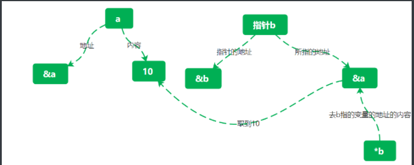

## 

## 从c到c++


### gcc和g++的区别

gcc和g++

g++对文件都处理成c++

gcc对.c文件处理成c，.cpp处理成c++

### 传参数的实质

````c
void swap(int a,int b){
int s=a;
a=b;
b=s;
}

int main(){
int x,y;
swap(x,y);     
}
````

不能实现函数，传参相当于 int a=x,int b=y.

所以相当于给局部变量a和b赋值了，交换了，但对x,y没有影响

而&和*可以的原因是

int &a=x,int &b=y;是引用变量

int *a=x,int *b=y;是指针

### c和c++


#### c++的const

const 用来定义变量，一旦定义不能再改变

int * const 定义常指针，只能指向一个变量

const float a=4.5，与c的define不同，define 预处理，不占内存，而const是实际的变量

#### c++变量检查能力加强

int a;

int a=1;   在c中可以，c++不能重复定义

#### c++增强struct，可以省略struct来实例化

#### c++所用的变量和函数都必须有类型

eg：f（）{

}在c中可以，c++不行

#### c++增强三目运算符

（a>b?a:b）=50；可以当左值

#### c++输出输入

输出：cout<<""<<endl;

输入：cin>>a>>b；

#### c++定义函数声明时必须和定义相同

#### c++增加引用变量

int &b=a；b是a的别名

不能引用数组

### c++函数重载

eg：

````c++
template<typename T>
T min(T a, Tb){
}
实现重载
int x=min();

float y=min();
````

### *和&

*前有类型时为定义指针

&前有类型时为引用变量

*p取内容

&p取地址



### c++内联函数

````c
#include <stdio.h>  

inline int prin(){
return "hhh";
}

int main(){
for(int i=0;i<100;i++){
prin();
}
}
````


不用内联的话，每次循环都会开辟空间运行prin()函数，而内联之后，相当于把return "hhh";临时复制在for循环中，每次循环不用开辟新空间，只需要运行return "hhh"

## c++

### 枚举类型

````c++
enum color{red,yellow,blue}
color c;
enum:定义枚举关键字
color枚举类型名
red，blue枚举常量/元素
c：枚举变量
或者：ennum color {red,red ,blue},c,b;
````

注意：

1. 枚举元素都是常量，不是变量，不能为枚举元素赋值
2. 每个枚举元素都有一个确定的整数值，可以在枚举类型定义的时候显式地给出枚举元素的值，若缺省则默认0，1，2，...
3. 可以将一个整数强制转换类型后赋给枚举变量
4. 枚举常量可以直接赋给整型变量

### 运算

如果某个算术运算符的两个运算对象都是整数，那么，运算将按照整型数的运算规则来运算

只要其中有一个是浮点型数，则按照浮点数运算规则来进行

### 强制类型转换

c：(类型名)表达式

c++:类型名(表达式)

### goto

````c++
#include"iostream.h"
void main(){
    int i;
    float sum;
    sum=1;
    i=2;
  L1:sum+=1/(float)i;
    i+=2;
    goto L1;
    cout<<sum;
}
````


### 输入输出

cin：标准输入流

cout：标准输出流

cerr：非缓冲型的标准出错流

clog：缓冲型的标准出错流

#### 十六进制，八进制

默认：十进制

hex：十六进制

oct：八进制

dec:十进制

eg：

cin>>hex>>j;指定输入为十六进制

#### 占位

1. setw()

   需要头文件iomanip.h

   ````c++
   #include<iomanip>
   cout<<setw(6)<<i<<setw(10) //左右空格6和10位
   ````

2. width（）

   位于iostream

   ````c++
   #include"iostream"
   cout.width(10);
   ````

3. cout.fill()

填充自定义字符,配合width使用

````c++
#include"iostream"
cout.width(10);
cout.fill('#');
````

#### 精度控制

cout.pricision();

````c++
cout.precision(7);
cout<<1234.4558<<endl;
````

输出：1234.456

从左开始精确n位，第n位四舍五入

#### 刷新

cout.flush()

刷新

或者cin.tie(&cout)

#### 科学计数法

   cout.setf(ios::scientific,ios::floatfield);


#### get(),put()

cin只能输入字符，不能输入空格，回车等

cin.get()可以获取所有字符

cout.put()

#### getline()

cin.getline()

定义形式:istream&get/getline(char *ss,int count,char delim='\n')

ss:缓冲区指针，count最多向ss存入的字符数，delim：如果遇到此字符，输入结束

get( )和getline( )函数的功能基本相同，getline( )函数读入由delim标识的区分字符

### 文件

头文件：include<fstream>

ifstream：文件输入用流类

ofstream：输出

fstream：输入输出

#### 文件的打开和关闭

````c++
//文件的输入输出
#include <iostream>
#include <fstream>
using namespace std; //ifstream,ofstream都是std中的
int main()
{
    char c;
    ifstream fin;  //获取打开的文件的内容，待写入变量，只能和>>匹配
    ofstream fout; //打开一个文件，将内容写入这个文件,只能和<<匹配
    fstream file;  //打开一个文件，用>>是读文件内容，用<<是写文件内容

    char aa[100], bb[100] = "HHALL", cc[100];

    fin.open("aa.txt");
    fout.open("bb.txt");
    file.open("cc.txt");

    fin >> aa;  //将aa.txt的内容写到aa   相当与aa.txt>>fin>>aa    从文件读
    fout << bb; //相当于bb.txt<<fout<<bb,将bb的内容写到bb.txt,也可以是直接的字符串      向文件写
    file >> cc;
    file << bb;
    //fout <<"Hello,world"<<endl;//将"Hello,world"写入bb.text
    fin.close();
    fout.close();
    cout << aa[1] << endl;
    cout << cc[0] << endl;
}
````


