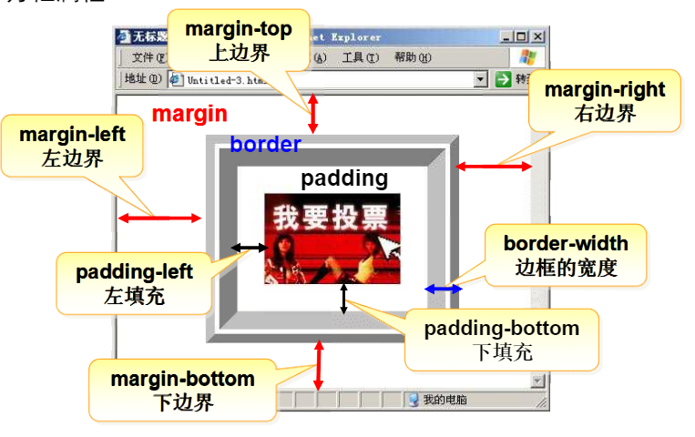

## 简介


单层本机					 网络/本机（C/S) 数据分离		  B/S(浏览器/应用服务，数据服务)						

分布式：不同模块在不同计算机运行

## javaee是中间件体系结构


### 框架

````css
<frameset cols="25%,50%,*" rows="50%,*" border="5">//设置窗口框架，cols设置行，rows设
	<frame src="first.html">						列，以及各部分百分比，用						                                 <frame>标签设置窗口内容
</frameset>
````

## css

css：层叠样式表，用于分开html标签和样式

### 选择器

### 1.元素选择器


````css
<style type="text/css">
p{color:red,font-size:30px,font-family:"隶书"}//所有的p标签都会被选择，改变样式
</style>

//使用
<p>床前明月光</p>

````

效果：

### 2.类选择器

````css
<style type="text/css">
.red{
    color:red;
    font-size:12px; //任意标签都可以通过class属性调用
    
}
</style>

//使用
<p class="red">低头思故乡</p>

````

效果：

### 常用文本属性：

font-size:字体大小

font-family:字体类型

font-style：字体样式

color：设置或检索文本颜色

text-align:文本对齐

## 方框属性



| margin-top     | 设置对象的上边距           |
| :------------- | -------------------------- |
| margin-right   | 设置对象的右边距           |
| margin-bottom  | 设置对象的下边距           |
| margin-left    | 设置对象的左边距           |
| border-style   | 设置边框的样式             |
| border-width   | 设置边框的宽度             |
| border-color   | 设置边框的颜色             |
| padding-top    | 设置内容与上边框之间的距离 |
| padding-right  | 设置内容与右边框之间的距离 |
| padding-bottom | 设置内容与下边框之间的距离 |

### a标签

a:link       超级链接的初始状态
a:hover   把鼠标放上去时悬停的状况
a:active   鼠标点击时
a:visited   访问过后的情况


