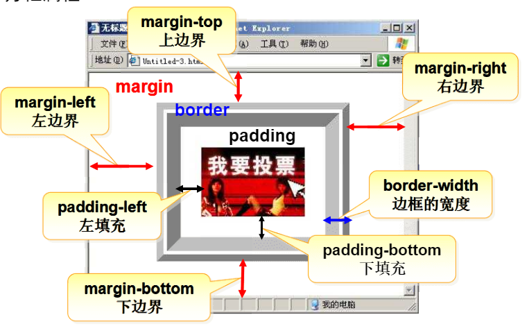
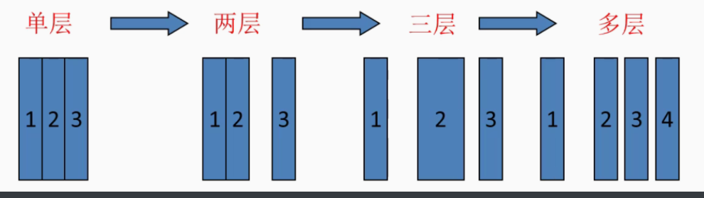
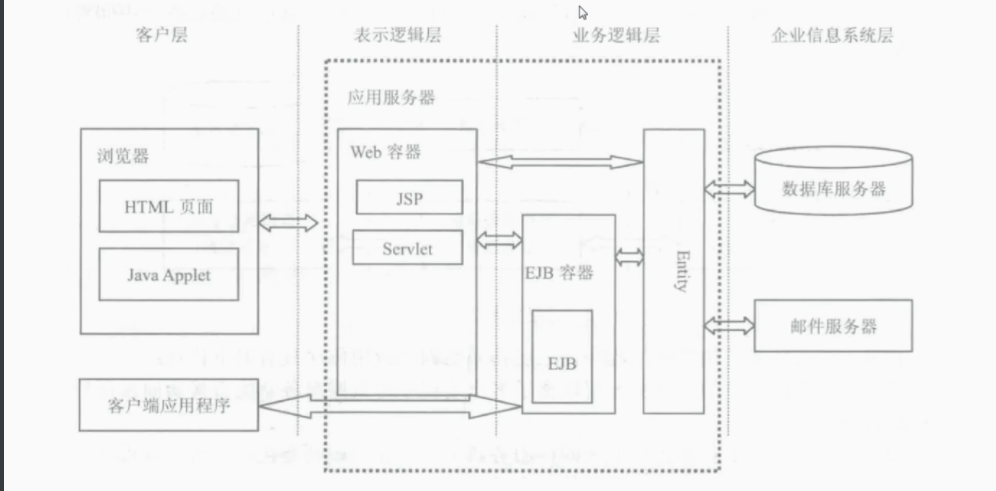

## 复习html


### 1.表单


网页中用于输入信息的区域

语法格式

````html
<form action="接受表单数据的地址" method="传输数据的方法">
    .....
</form>
````

说明：action属性：用于设置接收表单数据的地址

2. method属性：设置传输数据的方法

   get：将表单数据附加在程序地址的后面

   post：将表单数据打包单独传送，在地址栏看不到数据

### 2.常用的表单控件

1. 单行文本框

   ````html
   <input type="text" name="控件名称" value="默认值"/>
   ````

   说明，type：设置控件类型

   name：设置控件名称

   value：设置控件值

2. 密码框

   ````html
   	<input type="password" name="控件名称" value="默认值">
   ````

   

3. 单选按钮

````html
<input type="radio" name="控件名称" value="值">
````

同一组单选按钮要启用name相同

4. 复选框

````html
<input type="checkbox" name="控件名称">
````

同一组复选框name相同

5. 下拉列表

   ````html
   <select name="控件名称">
       <option value="值">提示信息</option>
       ...
   </select>
   ````

6. 多行文本框

   ````html
   <textarea name="" rows="行数" cols="列数">
       
   </textarea>
   ````

   7. 提交和重置

      ````html
      <input type="submit" value="提示信息"/>
      <input type="reset" value="提示信息"/>
      ````

      #### 总结

      ````html
      <input type="控件类型" name="控件名称" value="默认值"/>
                   控件类型：text/password/radio/checkbox/submit/reset
      ````

      

### 3.框架

````css
<frameset cols="25%,50%,*" rows="50%,*" border="5">//设置窗口框架，cols设置行，rows设
	<frame src="first.html">						列，以及各部分百分比，用						                                 <frame>标签设置窗口内容
</frameset>
````

### 4.css

css：层叠样式表，用于分开html标签和样式

#### 选择器

##### 1. 元素选择器

````css
<style type="text/css">
p{color:red,font-size:30px,font-family:"隶书"}//所有的p标签都会被选择，改变样式
</style>

//使用
<p>床前明月光</p>

````

##### 2.类选择器

````css
<style type="text/css">
.red{
    color:red;
    font-size:12px; //任意标签都可以通过class属性调用
    
}
</style>

//使用
<p class="red">低头思故乡</p>

````

#### 常用文本属性

font-size:字体大小

font-family:字体类型

font-style：字体样式

color：设置或检索文本颜色

text-align:文本对齐

#### 方框属性



| margin-top     | 设置对象的上边距           |
| :------------- | -------------------------- |
| margin-right   | 设置对象的右边距           |
| margin-bottom  | 设置对象的下边距           |
| margin-left    | 设置对象的左边距           |
| border-style   | 设置边框的样式             |
| border-width   | 设置边框的宽度             |
| border-color   | 设置边框的颜色             |
| padding-top    | 设置内容与上边框之间的距离 |
| padding-right  | 设置内容与右边框之间的距离 |
| padding-bottom | 设置内容与下边框之间的距离 |

#### a标签

a:link       超级链接的初始状态
a:hover   把鼠标放上去时悬停的状况
a:active   鼠标点击时
a:visited   访问过后的情况


## javaee

### 简介


软件构成：

用户界面部分：表示层

应用逻辑部分：业务逻辑层

数据访问部分：数据访问层



单层本机					 网络/本机（C/S) 数据分离		  B/S(浏览器/应用服务，数据服务)						

分布式：不同模块在不同计算机运行

### javaee是中间件体系结构





