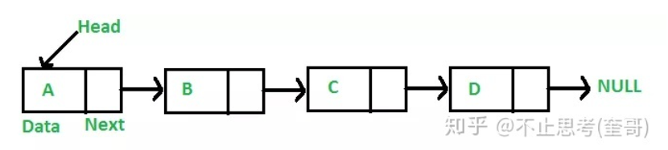
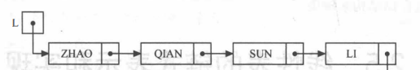
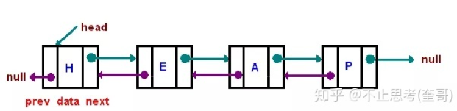
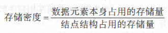
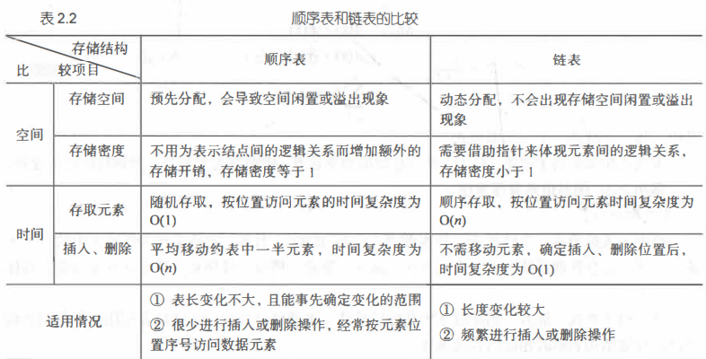
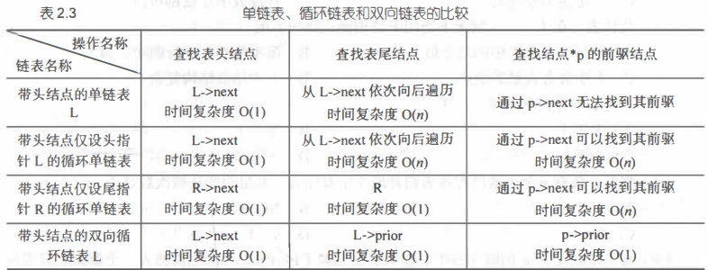

## 算法

算法 (Algorithm) 是为了解决某类问题而规定的一个有限长的操作序列。

 一个算法必须满足以下五个重要特性。 

(1)有穷性。一个算法必须总是在执行有穷步后结束，且每一步都必须在有穷时间内完成。 

(2) 确定性。对千每种情况下所应执行的操作，在算法中都有确切的规定，不会产生二义性， 使算法的执行者或阅读者都能明确其含义及如何执行。 

(3) 可行性。算法中的所有操作都可以通过已经实现的基本操作运算执行有限次来实现。

(4) 输入。一个算法有零个或多个输入。当用函数描述算法时，输入往往是通过形参表示的， 在它们被调用时，从主调函数获得输入值。 (5) 输出。一个算法有一个或多个输出，它们是算法进行信息加工后得到的结果，无输出的 算法没有任何意义。当用函数描述算法时，输出多用返回值或引用类型的形参表示。


一个算法的优劣应该从以下几方面来评价。 

(1)正确性。在合理的数据输入下，能够在有限的运行时间内得到正确的结果。 

(2) 可读性。一个好的算法，首先应便千人们理解和相互交流 ， 其次才是机器可执行性。可 读性强的算法有助于人们对算法的理解，而难懂的算法易千隐藏错误，且难千调试和修改。 

(3) 健壮性。当输入的数据非法时，好的算法能适当地做出正确反应或进行相应处理，而不 会产生一些莫名其妙的输出结果。 

(4) 高效性。高效性包括时间和空间两个方面。时间高效是指算法设计合理，执行效率高， 可以用时间复杂度来度量；空间高效是指算法占用存储容量合理，可以用空间复杂度来度量。时 间复杂度和空间复杂度是衡量算法的两个主要指标。

## 时间复杂度和空间复杂度


### 大O表示法：

T(n)=O(f(n))

f(n)是程序运行次数和的函数，一般和循环结构次数n相关

O(),取级数，取函数的数量级：去掉常数和系数,取最大的级数

​	eg：4n²+2n+5取级数：

​	O(f(n))=O(n²)

### 常见的时间复杂度量级：

- 常数阶O(1)：无循环结构

- 对数阶O(logN)：执行的次数N和log₂n相关

  ​	

  ```c
  int i = 1;
  while(i<n)
  {
      i = i * 2;
  }
  ```

  

- 线性阶O(n)：一阶循环

- 线性对数阶O(nlogN)：将O(logN)循环n遍

  ```c
  for(m=1; m<n; m++)
  {
      i = 1;
      while(i<n)
      {
          i = i * 2;
      }
  }
  ```

  

- 平方阶O(n²)：二次循环

- 立方阶O(n³)：三次循环

- K次方阶O(n^k)：k次循环

- 指数阶(2^n)

  从上而下时间复杂度越来越大，程序的执行效率也越来越低

### 空间复杂度

S(n)=O(f(n))

O(1):算法执行所需要的临时空间不随着变量n的大小变化

```c
int i = 1;
int j = 2;
++i;
j++;
int m = i + j;
```

O(n):空间和变量n相关

```c
int[] m = new int[n]
```

## 线性表(forsaken)

主要有顺序表（数组），链表，队列，栈

### 顺序表

功能类似数组，存储相同类型的数据，在内存空间中连续存储。

数组优势：数据访问，可以直接通过下标访问到对应元素，原理：array[n]的地址=array的首地址+n*数据大小

各操作时间复杂度：

按序查找：O(1):直接取用

按值查找：O（n）（最坏情况，具体看算法）

插入或删除：O(n):每次插入或删除元素都要对后面的所有元素后移或前移，若操作的元素在开头或末尾，则需要操作n次

#### 静态顺序表的实现

```c++
//线性表-顺序表-静态顺序表
//顺序表的操作顺序是从1开始的，而对顺序表下标访问是从零开始的
#include<iostream>
using namespace std;
#define maxSize 10

typedef struct//定义静态顺序表的结构
{
    int data[maxSize];
    int length;
}SqList;

void initList(SqList &L){//初始化顺序表
    for (int i = 0; i < maxSize; i++)
    {
        L.data[i]=0;//将所有元素置零
    }
    L.length=0;//顺序表长度置零
}

void printList(SqList &L){//输出
    cout<<"输出元素:"<<endl;
    for (int i = 0; i < L.length; i++)
    {
        cout<<L.data[i]<<" ";
    }
    cout<<endl;
}

void listInsert(SqList &L,int i,int e){//插入,i:待出入位置，e待插入元素
    if(i<1||i>L.length+1){
        cout<<"插入位置无效"<<endl;//判断位置有效性
        return;//void类型时，直接return退出函数
    }
    if(L.length>=maxSize){
        cout<<"存储空间已满"<<endl;//判断空间余量
        return;
    }
    for (int j = L.length; j>=i; j--)//将第i个元素之后的元素后移
    {
        L.data[j]=L.data[j-1];
    }
    L.data[i-1]=e;
    L.length++;
}

void listDelete(SqList &L,int i,int &e){//删除第i个元素，并记录其值
    if(i<1||i>L.length){
        cout<<"删除位置无效"<<endl;//判断位置
        return;
    }
    e=L.data[i-1];//记录被删除元素的值
    for (int j = i; j < L.length; j++)
    {
        L.data[j-1]=L.data[j];//i元素后所有元素前移
    }
    L.length--;
    
}

void locateElem(SqList &L,int e){//按值查找
    int i=0;
    for ( i = 0; i < L.length; i++)
    {
        if(L.data[i]==e){
            cout<<"元素"<<e<<"在第"<<i+1<<"位"<<endl;
            return;
        }
           
    }
    cout<<"未查到该元素"<<endl;
    
}

void getElem(SqList L,int i){
    if(i<1||i>L.length){
        cout<<"查找范围无效"<<endl;
        return;
    }
    cout<<"第"<<i<<"个元素为"<<L.data[i-1]<<endl;
}
int main(){
    SqList L;
    initList(L);
    listInsert(L,1,2);
    listInsert(L,2,5);
    listInsert(L,3,9);
    listInsert(L,2,4);
    printList(L);
    locateElem(L,9);
    getElem(L,5);
}
```

#### 动态顺序表

本质是在结构体中存储一个指针，当容量不足时，申请新的空间，把旧的移到新区就行了

```c
//线性表-顺序表-动态顺序表
#include<iostream>
using namespace std;
#define initSize 3//设置初始大小3

typedef struct{//==定义动态顺序表结构==
    int *data;//用指针操作
    int maxSize;
    int length;
}SeqList;

void initList(SeqList &L){//==初始化==
    L.data=(int *)malloc(initSize * sizeof(int));//动态分配内存，并转为int指针
    L.length=0;
    L.maxSize=initSize;
}

void printList(SeqList &L){//==输出顺序表==
    cout<<"输出顺序表:"<<endl;
    for (int i = 0; i < L.length; i++)
    {
        cout<<L.data[i]<<" ";//指针也可以用[i]下标表示距离指针位置i个单位的地址
    }
    cout<<endl;
}

void increaseSize(SeqList &L,int len){//==动态增加长度==
    int *p=L.data;//先将旧空间首地址存下来
    L.data=new int[L.maxSize + len];//申请新的空间
    for (int i = 0; i < L.length; i++)
    {
        L.data[i]=p[i];//将旧空间的元素转移到新空间
    }
    L.maxSize+=len;
    delete p;//new出来的用过后要delete，避免内存泄漏
    return;
}

void listInsert(SeqList &L,int i,int e){//==插入==
    if(i<1||i>L.length+1){
        cout<<"插入范围无效"<<endl;//判断范围
        return;
    }
    if(L.length>=L.maxSize){
       increaseSize(L,5);//判断余量，若不足，则申请5个新空间
    }
    for (int j = L.length; j >= i; j--)
    {
        L.data[j]=L.data[j-1];//第i个元素后的元素后移
    }
    L.data[i-1]=e;//插入
    L.length++;
    return;
}

void listDelete(SeqList &L,int i,int &e){//==删除==
    if(i<1||i>L.length){
        cout<<"删除范围无效"<<endl;//判断范围
        return;
    }
    e=L.data[i-1];//记录被删除元素值
    for (int j = i; j < L.length; j++)
    {
        L.data[j-1]=L.data[j];//第i个元素前的元素前移
    }
    L.length--;
    return;
}

void locateElem(SeqList &L,int e){//==查找==
    int i;
    for (i = 0; i < L.length; i++)
    {
        if(L.data[i]==e){
            cout<<"元素"<<e<<"是第"<<i+1<<"个"<<endl;
            return;
        }
    }
    cout<<"未查到元素"<<e<<endl;
    return;
}

void getElem(SeqList &L,int i){//==按序查找==
    if(i<1||i>L.length){
        cout<<"查找范围无效"<<endl;
        return;
    }
    cout<<"第"<<i<<"个元素为"<<L.data[i-1]<<endl;
    return;
}
int main(){
    SeqList L;
    initList(L);
    listInsert(L,1,2);
    listInsert(L,2,3);
    listInsert(L,2,5);
    printList(L);
    listInsert(L,1,1);
    printList(L);
    locateElem(L,5);
    getElem(L,2);
}
```

### 链表

链表：在物理单元上非连续，非顺序的存储结构，数据元素的逻辑顺序通过指针链接顺序实现

#### 单链表



每个节点由数据和后继指针两部分组成

最开始的节点叫做Head头节点，末尾节点指向NULL

## 线性表


### 顺序表

主要有顺序表（数组），链表，队列，栈

**基本操作**

InitList (&L)  ：构造一个空的线性表L。 

DestroyList(&L) ：销毁线性表L。 

ClearList (&L)：将L重置为空表。 

ListEmpty(L)  ：若L为空表， 则返回true, 否则返回false。 

ListLength(L)  ：返回L中数据元素个数。 

GetElem(L,i,&e)  ：若，1≤i≤ListLength(L),则用e返回L中第i个数据元素的值。 

LocateElem(L,e)  ：返回L中第1个 值与e相同的元素在 L中的位置 。若这样的数据元素不存在 ， 则返回值为0。

PriorElem(r,,cur_e,&pre_e)  ：若cur_e是L的数据元素，且不是第一个，则用pre_e返回其前驱，否则操作失败，pre_e无定义。

NextElem(L,cur_e,&next_e)  ：若cur_e是L的数据元素，且不是最后一个，则用next_e返回其后继，否则操作失败，next_e无定义。 

Listinsert(&L,i,e)  ：若1≤i≤ListLength(L)+1，在 L中第1个位置之前插入新的数据元素 e, L的长度加1。

 ListDelete(&L,i)  ：若1≤i≤ListLength(L),删除L的第1个数据元素，L的长度减1。 

TraverseList(L)  ：对线性表L进行遍历，在遍历过程中对 L的每个结点访问一次。

**各操作时间复杂度：**

按序查找：O(1):直接取用

按值查找：O（n）（最坏情况，具体看算法）

插入或删除：O(n):每次插入或删除元素都要对后面的所有元素后移或前移，若操作的元素在开头或末尾，则需要操作n次

#### 静态顺序表

长度固定，一旦初始化后不再改变

```c++
//静态顺序表
#include<iostream>
using namespace std;
#define maxSize 5//定义最大长度
class StaticOrderList//==静态顺序表存储结构==
{
public:
    int * elem;//首地址
    int length;//已存入的元素的长度
    StaticOrderList();
    ~StaticOrderList();
};
StaticOrderList::StaticOrderList()
{
}
StaticOrderList::~StaticOrderList()
{
}

bool initList(StaticOrderList &L){//==初始化==
    L.elem=new int[maxSize];//静态分配空间
    if(!L.elem){
        cout<<"存储空间分配失败"<<endl;
        return false;
    }
    L.length=0;
    return true;
}

bool getElem(StaticOrderList &L,int i,int &e){//==取值==
    if(i<1||i>L.length){
        cout<<"取值范围无效"<<endl;
        return false;
    }
    e=L.elem[i-1];
    return true;
}

int locateElem(StaticOrderList &L,int e){//==查找==
    for (int i = 0; i < L.length; i++)
    {
        if(L.elem[i]==e){
            return i+1;
        }
    }
    cout<<"未查到该元素"<<endl;
    return 0;
}

bool listInsert(StaticOrderList &L,int i,int e){//==插入==
    if(i<1||i>L.length+1){
        cout<<"插入范围无效"<<endl;
        return false;
    }
    if(L.length==maxSize){
        cout<<"空间已满"<<endl;
        return false;
    }
    for(int j=L.length-1;j>=i-1;j--){
        L.elem[j+1]=L.elem[j];
    }
    L.elem[i-1]=e;
    L.length++;
    return true;
}

bool listDelete(StaticOrderList &L,int i){//==删除==
    if(i<1||i>L.length){
        cout<<"删除范围无效"<<endl;
        return false;
    }
    for(int j=i;j<=L.length-1;j++){
        L.elem[j-1]=L.elem[j];
    }
    L.length--;
    return true;
}

void printList(StaticOrderList &L){
    cout<<"输出表:";
    for(int i=0;i<=L.length-1;i++){
        cout<<L.elem[i]<<" ";
    }
    cout<<endl;
}
int main(){
    StaticOrderList L;
    initList(L);
    listInsert(L,1,2);
    listInsert(L,1,4);
    listInsert(L,1,6);
    listInsert(L,1,3);
    listInsert(L,2,7);
    printList(L);
    listDelete(L,2);
    printList(L);
    cout<<L.length;
}
```


#### 动态顺序表

长度不定，可根据需求申请新的空间

```c++
//动态顺序表
#include<iostream>
using namespace std;
#define initSize 3
class DynamicOrderList
{
public:
    int *elem;
    int length;
    int maxSize;
    DynamicOrderList(){};
    ~DynamicOrderList(){};
};

bool initList(DynamicOrderList &L){//==初始化==
    L.elem=(int *)malloc(initSize * sizeof(int));
    if(!L.elem){
        cout<<"存储空间分配失败"<<endl;
        return false;
    }
    L.length=0;
    L.maxSize=initSize;
    return true;
}

void increaseSize(DynamicOrderList &L,int len){//动态增加长度
    int *p=L.elem;
    L.elem=new int[L.maxSize + len];
    for(int i=0;i<L.length;i++){
        L.elem[i]=p[i];
    }
    L.maxSize+=len;
    delete p;
}

bool getElem(DynamicOrderList &L,int i,int &e){//==取值==
    if(i<1||i>L.length){
        cout<<"取值范围无效"<<endl;
        return false;
    }
    e=L.elem[i-1];
    return true;
}

int locateElem(DynamicOrderList &L,int e){//==查找==
    for (int i = 0; i < L.length; i++)
    {
        if(L.elem[i]==e){
            return i+1;
        }
    }
    cout<<"未查到该元素"<<endl;
    return 0;
}

bool listInsert(DynamicOrderList &L,int i,int e){//==插入==
    if(i<1||i>L.length+1){
        cout<<"插入范围无效"<<endl;
        return false;
    }
    if(L.length==L.maxSize){
        increaseSize(L,2);//空间满了之后再申请
    }
    for(int j=L.length-1;j>=i-1;j--){
        L.elem[j+1]=L.elem[j];
    }
    L.elem[i-1]=e;
    L.length++;
    return true;
}

bool listDelete(DynamicOrderList &L,int i){//==删除==
    if(i<1||i>L.length){
        cout<<"删除范围无效"<<endl;
        return false;
    }
    for(int j=i;j<=L.length-1;j++){
        L.elem[j-1]=L.elem[j];
    }
    L.length--;
    return true;
}

void printList(DynamicOrderList &L){
    cout<<"输出表:";
    for(int i=0;i<=L.length-1;i++){
        cout<<L.elem[i]<<" ";
    }
    cout<<endl;
}
int main(){
    DynamicOrderList L;
    initList(L);
    listInsert(L,1,2);
    listInsert(L,1,3);
    listInsert(L,2,7);
    printList(L);
    cout<<L.maxSize;
    listInsert(L,2,5);
    printList(L);
    cout<<L.maxSize;
}
```

### 链表

  在物理存储单元上非连续，非顺序的存储结构

  根据链表结点所含指针个数、指针指向和指针连接方式，可将链表分为单链表、循环链表、 双向链表、二叉链表、十字链表、邻接表、邻接多重表等。

  其中单链表、循环链表和双向链表用 千实现线性表的链式存储结构，其他形式多用于实现树和图等非线性结构。

#### 单链表

##### 分类

普通单链表



带头节点的单链表


##### 几个概念：

首元节点：链表中第一个数据的节点，普通单链表的第一个，带头结点的单链表的第二个

头节点：首元节点前设置的节点，其指针域指向首元节点，数据域可以不存储任何信息，也可以存储单链表的附加信息

头指针：链表的首地址，若无头节点，指向第一个数据，若有，指向第一个元素

##### 增加头节点

1.增加头节点，对链表的第一个元素的操作与其他元素相同，无需特殊处理

2.无头节点的链表判空条件：L==NULL；有头节点的链表判空条件：L->next==NULL

##### 带头节点的单链表的实现

```c++
//有头节点的单链表
/*ps:开始用的对象和指针，后来发现函数中实例化的对象是局部变量，返回出来的L
只能记录相邻的数据，之后的数据随函数释放而消失，所以改用malloc分配空间，对
地址的操作是可以记录的*/

#include<iostream>
using namespace std;
class SingleLinkedList{//==单链表的存储结构==
public:
    int data;
    SingleLinkedList *nextp;
    SingleLinkedList(){};
    ~SingleLinkedList(){};
};
typedef SingleLinkedList * Linkpoint;

void initList(Linkpoint &L){//==初始化==
    L=(Linkpoint)malloc(sizeof(SingleLinkedList));
    L->data=0;//头节点的data域存单链表的长度
    L->nextp=NULL;//nextp域存下一个节点地址
}

void listInsert(Linkpoint &L,int i,int e){//插入
    Linkpoint p=L;//在函数内对L操作都用新的指针，不要直接对L操作
    Linkpoint s=(Linkpoint)malloc(sizeof(SingleLinkedList));
    int j=1;
    while(p&&(j<i)){
        p=p->nextp;
        j++;
    }
    if(!p||j>i){
        cout<<"插入范围无效"<<endl;
        return;
    }
    s->data=e;
    s->nextp=p->nextp;
    p->nextp=s;
    L->data++;
}

void printList(Linkpoint &L){//==输出==
    Linkpoint p=L->nextp;
    cout<<"输出单链表"<<endl;
    while(p){//因为头节点最初指向NULL，每次插入后，尾节点都指向NULL
        cout<<p->data<<"->";
        p=p->nextp;
    }
    cout<<"NULL"<<endl;
    cout<<"单链表的长度为:"<<L->data<<endl;
}

void getElem(Linkpoint &L,int i){//==取值==
    Linkpoint p=L->nextp;
    int j=1;
    while (p&&(j<i)){
        p=p->nextp;
        j++;
    }
    if(!p||j>i){
        cout<<"取值范围无效"<<endl;
        return;
    }
    cout<<"第"<<i<<"个元素为:"<<p->data<<endl;
}

void locateElem(Linkpoint &L,int e){//==查找==
    Linkpoint p=L->nextp;
    int j=1;
    while(p){
        if(p->data==e){
            cout<<"元素"<<e<<"在第"<<j<<"位"<<endl;
            return;
        }
        p=p->nextp;
        j++;
    }
    cout<<"待查找元素不存在"<<endl;
}

void deleteElem(Linkpoint &L,int i){//==删除==
    Linkpoint p=L;
    Linkpoint s=(Linkpoint)malloc(sizeof(SingleLinkedList));
    int j=1;
    while(p&&(j<i)){
        p=p->nextp;
        j++;
    }
    if(!p||j>i){
        cout<<"删除范围无效"<<endl;
        return;
    } 
    Linkpoint q;
    q=p->nextp;
    p->nextp=q->nextp;//令p-next指向p-next-next就把p-next删除了
    delete q;
    L->data--;
}

//建立单链表-头插法和尾插法
void createList_H(Linkpoint &L,int n){//==输入n个字符插入单链表==
    L=(Linkpoint)malloc(sizeof(SingleLinkedList));
    L->nextp=NULL;
    L->data=0;//L.data存长度
    cout<<"输入数据按回车继续:";
    for(int i=0;i<n;i++){
        Linkpoint p=(Linkpoint)malloc(sizeof(SingleLinkedList));
        cin>>p->data;
        p->nextp=L->nextp;
        L->nextp=p;
        L->data++;
    }
}

void createList_R(Linkpoint &L,int n){//==尾插法==
    L=(Linkpoint)malloc(sizeof(SingleLinkedList));
    L->nextp=NULL;
    L->data=0;
    Linkpoint r=L;
    for(int i=0;i<n;i++){
        Linkpoint p=(Linkpoint)malloc(sizeof(SingleLinkedList));
        cin>>p->data;
        p->nextp=NULL;
        r->nextp=p;
        r=p;
        L->data++;
    }
}
int main(){
    Linkpoint L;
    createList_R(L,5);
    printList(L);
}
```

#### 循环链表

循环链表就是一种特殊的单链表，其尾节点的指针指向了头节点，使节点首尾相连

循环链表和单链表的主要区别就是遍历链表时，判断当前指针是否指向尾节点的条件不同

单链表：p=NULL或p->next=NULL

循环链表:p=L或p->next=NULL

#### 双向链表

循环单链表中查找后继节点的执行时间为O(1),而查找其前驱节点的时间为O(n),因为只能顺指针方向像狗查询，双向链表加上前驱指针后解决了这个问题

双向链表和单链表的区别就是双链表有前后两个指针，分别指向其前驱和后继



对于双链表，有d->next->prior=d->prior->next=d

##### 实现

因为初始化的节点也可以存数据，所以加入flag标志是否初始节点

此双链表的结构是可以随意插入删除，L始终是首节点的地址，输出是从L开始向后输出的

且首节点的len记录链表长度，当L地址发生变化时，确保新L的len还能记录长度

L地址变化的情况：首节点前插入，删除首节点

```c++
//双链表
//本程序的初始节点不是头节点，只是初始化后的第一个点
//开始用p.next==NULL&&p.prior==NULL来判断初始节点，然后对其data域操作，
//但是操作后，L的next和prior还是null的，所以增加flag来标志初始节点
#include<iostream>
using namespace std;

class DoubleLinkedList{//==双链表存储结构==
public:
    int data;
    int flag=0;//flag标志节点是否初始节点,默认不是初始节点
    int len;
    DoubleLinkedList * prior;
    DoubleLinkedList * next;
    DoubleLinkedList(){};
    ~DoubleLinkedList(){};
};

typedef DoubleLinkedList * DuLinkList;

void initList(DuLinkList &L){//==初始化==
    L=(DuLinkList)malloc(sizeof(DoubleLinkedList));
    L->prior=NULL;
    L->next=NULL;
    L->flag=1;//初始化
    L->len=0;//len记录链表长度
}

void listInsert_H(DuLinkList &L,int i,int e){//==前插==
    if(L->flag){//如果是初始节点，把第一个数据插在其data域
        L->data=e;
        L->flag=0;//之后标志位置零
        L->len++;//长度+1
        return;
    }
    int j=1;
    int len=L->len;//记录旧长度
    DuLinkList p=L;
    while(p&&(j<i)){//p移动到待插位置
        p=p->next;
        j++;
    }
    if(!p||j>i){
        cout<<"插入范围无效"<<endl;
        return;
    }
    DuLinkList s=(DuLinkList)malloc(sizeof(DoubleLinkedList));
    s->data=e;
    s->prior=p->prior;
    if(p->prior){
        p->prior->next=s;//p的前驱的后继本来是p，现在是前插的s;(这里，
    }                    //若p是初始节点，则其没有前驱和后继节点)
    s->next=p;           //严蔚敏的教材上没有这一步的判断，导致NULL无
    p->prior=s;          //指针程序错误
    if(i==1){//如果，插在第一个元素前面，则更新L，使L始终为开头
        L=s;
    }
    L->len=len+1;//记录新长度
}

void listInsert_R(DuLinkList &L,int i,int e){//==后插==
    if(L->flag){
        L->data=e;
        L->flag=0;
        L->len++;
        return;
    }
    int j=1;
    int len=L->len;//记录旧长度
    DuLinkList p=L;
    while(p&&(j<i)){
        p=p->next;
        j++;
    }
    if(!p||j>i){
        cout<<"插入范围无效"<<endl;
        return;
    }
    DuLinkList s=(DuLinkList)malloc(sizeof(DoubleLinkedList));
    s->data=e;
    s->next=p->next;
    if(p->next){//同前插，若后继为NULL，则跳过，否则更新
        p->next->prior=s;
    }
    s->prior=p;
    p->next=s;
    L->len=len+1;
}

void printList(DuLinkList &L){//==输出==
    if(L->flag){
        cout<<"NULL<->NULL"<<endl;
        cout<<"链表长度为:0"<<endl;
        return;
    }
    DuLinkList p=L;
    cout<<"输出双链表"<<endl;
    cout<<"NULL<->";
    while(p){//因为头节点最初指向NULL，每次插入后，尾节点都指向NULL
        cout<<p->data<<"<->";
        p=p->next;
    }
    cout<<"NULL"<<endl;
    cout<<"链表长度为:"<<L->len<<endl;
}

void deleteElem(DuLinkList &L,int i){//==删除==
    int j=1;
    int len=L->len;//记录旧长度
    DuLinkList p=L;
    while(p&&(j<i)){
        p=p->next;
        j++;
    }
    if(!p||j>i){
        cout<<"删除范围无效"<<endl;
        return;
    }
    if(!(p->prior||p->next)){//分情况：初始节点
        L->flag=1;//初始节点，flag置1
    }else if(!p->prior){//首节点,此时需要更新L
        p->next->prior=NULL;
        L=p->next;
    }else if(!p->next){//尾节点
        p->prior->next=NULL;
    }else{//中间节点
        p->prior->next=p->next;
        p->next->prior=p->prior;
    }
    L->len=len-1;
}
int main(){
    DuLinkList L;
    initList(L);
    listInsert_H(L,1,23);
    listInsert_H(L,1,45);
    listInsert_H(L,2,12);
    deleteElem(L,2);
    deleteElem(L,1);
    deleteElem(L,1);
    printList(L);
}
```


### 顺序表和链表的比较








## 栈和队列

栈和队列都是受限的线性表，栈只能从一端进出，队列只能一端进一端出

### 栈

栈有两个端，表尾端称为栈顶(top),表头端称为栈底(bottom),不含元素的空表称为空栈

原则：后进先出

#### 顺序栈

利用顺序存储结构实现栈，这指针top表示栈顶元素在顺序栈中的位置，设base表示栈底元素的位置


