### course

#### 模块管理

##### 内置模块

```python
import math
dir(math)
```

```
['__doc__',
 '__loader__',
 '__name__',
 '__package__',
 '__spec__',
 'acos',
 'acosh',
 'asin',
 'asinh',
 'atan',
 'atan2',
 'atanh',
 'ceil',
 'comb',
 'copysign',
 'cos',
 'cosh',
 'degrees',
 'dist',
 'e',
 'erf',
 'erfc',
 'exp',
 'expm1',
 'fabs',
 'factorial',
 'floor',
 'fmod',
 'frexp',
 'fsum',
 'gamma',
 'gcd',
 'hypot',
 'inf'
```

```python
print(math.e)
```

```
2.718281828459045
```

```python
#用type()查看类型
print(type(math.e))
```

```
<class 'float'>
```

```python
#使用help()查看帮助文档
help(math)
```

```
Help on built-in module math:

NAME
    math

DESCRIPTION
    This module provides access to the mathematical functions
    defined by the C standard.

FUNCTIONS
    acos(x, /)
        Return the arc cosine (measured in radians) of x.

        The result is between 0 and pi.

    acosh(x, /)
        Return the inverse hyperbolic cosine of x.

    asin(x, /)
        Return the arc sine (measured in radians) of x.

        The result is between -pi/2 and pi/2.

    asinh(x, /)
        Return the inverse hyperbolic sine of x.

    atan(x, /)
        Return the arc tangent (measured in radians) of x.

        The result is between -pi/2 and pi/2.

    atan2(y, x, /)
        Return the arc tangent (measured in radians) of y/x.

        Unlike atan(y/x), the signs of both x and y are considered.

    atanh(x, /)
        Return the inverse hyperbolic tangent of x.

    ceil(x, /)
        Return the ceiling of x as an Integral.

        This is the smallest integer >= x.

    comb(n, k, /)
        Number of ways to choose k items from n items without repetition and without order.

        Evaluates to n! / (k! * (n - k)!) when k <= n and evaluates
        to zero when k > n.

        Also called the binomial coefficient because it is equivalent
        to the coefficient of k-th term in polynomial expansion of the
        expression (1 + x)**n.

        Raises TypeError if either of the arguments are not integers.
        Raises ValueError if either of the arguments are negative.

    copysign(x, y, /)
        Return a float with the magnitude (absolute value) of x but the sign of y.

        On platforms that support signed zeros, copysign(1.0, -0.0)
        returns -1.0.

    cos(x, /)
        Return the cosine of x (measured in radians).

    cosh(x, /)
        Return the hyperbolic cosine of x.

    degrees(x, /)
        Convert angle x from radians to degrees.

    dist(p, q, /)
        Return the Euclidean distance between two points p and q.

        The points should be specified as sequences (or iterables) of
        coordinates.  Both inputs must have the same dimension.

        Roughly equivalent to:
            sqrt(sum((px - qx) ** 2.0 for px, qx in zip(p, q)))

    erf(x, /)
        Error function at x.

    erfc(x, /)
        Complementary error function at x.

    exp(x, /)
        Return e raised to the power of x.

    expm1(x, /)
        Return exp(x)-1.

        This function avoids the loss of precision involved in the direct evaluation of exp(x)-1 for small x.

    fabs(x, /)
        Return the absolute value of the float x.

    factorial(x, /)
        Find x!.

        Raise a ValueError if x is negative or non-integral.

    floor(x, /)
        Return the floor of x as an Integral.

        This is the largest integer <= x.

    fmod(x, y, /)
        Return fmod(x, y), according to platform C.

        x % y may differ.

    frexp(x, /)
        Return the mantissa and exponent of x, as pair (m, e).

        m is a float and e is an int, such that x = m * 2.**e.
        If x is 0, m and e are both 0.  Else 0.5 <= abs(m) < 1.0.

    fsum(seq, /)
        Return an accurate floating point sum of values in the iterable seq.

        Assumes IEEE-754 floating point arithmetic.

    gamma(x, /)
        Gamma function at x.

    gcd(*integers)
        Greatest Common Divisor.

    hypot(...)
        hypot(*coordinates) -> value

        Multidimensional Euclidean distance from the origin to a point.

        Roughly equivalent to:
            sqrt(sum(x**2 for x in coordinates))

        For a two dimensional point (x, y), gives the hypotenuse
        using the Pythagorean theorem:  sqrt(x*x + y*y).

        For example, the hypotenuse of a 3/4/5 right triangle is:

            >>> hypot(3.0, 4.0)
            5.0

    isclose(a, b, *, rel_tol=1e-09, abs_tol=0.0)
        Determine whether two floating point numbers are close in value.

          rel_tol
            maximum difference for being considered "close", relative to the
            magnitude of the input values
          abs_tol
            maximum difference for being considered "close", regardless of the
            magnitude of the input values

        Return True if a is close in value to b, and False otherwise.

        For the values to be considered close, the difference between them
        must be smaller than at least one of the tolerances.

        -inf, inf and NaN behave similarly to the IEEE 754 Standard.  That
        is, NaN is not close to anything, even itself.  inf and -inf are
        only close to themselves.

    isfinite(x, /)
        Return True if x is neither an infinity nor a NaN, and False otherwise.

    isinf(x, /)
        Return True if x is a positive or negative infinity, and False otherwise.

    isnan(x, /)
        Return True if x is a NaN (not a number), and False otherwise.

    isqrt(n, /)
        Return the integer part of the square root of the input.

    lcm(*integers)
        Least Common Multiple.

    ldexp(x, i, /)
        Return x * (2**i).

        This is essentially the inverse of frexp().

    lgamma(x, /)
        Natural logarithm of absolute value of Gamma function at x.

    log(...)
        log(x, [base=math.e])
        Return the logarithm of x to the given base.

        If the base not specified, returns the natural logarithm (base e) of x.

    log10(x, /)
        Return the base 10 logarithm of x.

    log1p(x, /)
        Return the natural logarithm of 1+x (base e).

        The result is computed in a way which is accurate for x near zero.

    log2(x, /)
        Return the base 2 logarithm of x.

    modf(x, /)
        Return the fractional and integer parts of x.

        Both results carry the sign of x and are floats.

    nextafter(x, y, /)
        Return the next floating-point value after x towards y.

    perm(n, k=None, /)
        Number of ways to choose k items from n items without repetition and with order.

        Evaluates to n! / (n - k)! when k <= n and evaluates
        to zero when k > n.

        If k is not specified or is None, then k defaults to n
        and the function returns n!.

        Raises TypeError if either of the arguments are not integers.
        Raises ValueError if either of the arguments are negative.

    pow(x, y, /)
        Return x**y (x to the power of y).

    prod(iterable, /, *, start=1)
        Calculate the product of all the elements in the input iterable.

        The default start value for the product is 1.

        When the iterable is empty, return the start value.  This function is
        intended specifically for use with numeric values and may reject
        non-numeric types.

    radians(x, /)
        Convert angle x from degrees to radians.

    remainder(x, y, /)
        Difference between x and the closest integer multiple of y.

        Return x - n*y where n*y is the closest integer multiple of y.
        In the case where x is exactly halfway between two multiples of
        y, the nearest even value of n is used. The result is always exact.

    sin(x, /)
        Return the sine of x (measured in radians).

    sinh(x, /)
        Return the hyperbolic sine of x.

    sqrt(x, /)
        Return the square root of x.

    tan(x, /)
        Return the tangent of x (measured in radians).

    tanh(x, /)
        Return the hyperbolic tangent of x.

    trunc(x, /)
        Truncates the Real x to the nearest Integral toward 0.

        Uses the __trunc__ magic method.

    ulp(x, /)
        Return the value of the least significant bit of the float x.

DATA
    e = 2.718281828459045
    inf = inf
    nan = nan
    pi = 3.141592653589793
    tau = 6.283185307179586

FILE
    (built-in)
```

```python
#也可以查看函数
help(math.pow)
```

```
Help on built-in function pow in module math:

pow(x, y, /)
    Return x**y (x to the power of y).
```

```python
math.pow(2,5)
```

```
32.0
```

```python
help(math.floor)
```

```
Help on built-in function floor in module math:

floor(x, /)
    Return the floor of x as an Integral.

    This is the largest integer <= x.
```

```python
math.floor(5.9)
```

```
5
```

##### 自定义模块

###### 导入其他文件

```python
#fun.py
def shout():
    print("hello")
shout()
```

在另一个py文件中定义函数,导入文件可以调用另一个文件的函数

```python
#test.py
import fun
fun.shout()
```

输出的结果是:
hello
hello
因为导入的时候会先执行一遍,为了避免fun中主函数的执行,可以添加判断条件

```python
if __name__=='_main_':
    shout()
```

函数执行时有个参数__name__,指代函数名,在本身里面它的值是__main__,其他文件调用时不是,用这个来区分.

另外一种导入方法:直接导入库函数,调用的时候不需文件名.库函数,可以直接用函数名

```python
from fun import shout
shout()
```

```
hello
```

还可以给导入库函数命名,然后用新命名调用

```python
from fun import shout as f
f()
```

```
hello
```

还可以用*导入,调用时也时直接用函数名

```python
from fun import *
shout()
```

```
hello
```

###### 包的概念

python中的包,就是一个文件夹,但是需要一个__init__.py文件来标志成包,且需要将包放在sys.path路径中

```python
import sys
sys.path
```

```
['c:\\Users\\Tenerome\\Desktop\\python',
 'c:\\environment\\python\\python39.zip',
 'c:\\environment\\python\\DLLs',
 'c:\\environment\\python\\lib',
 'c:\\environment\\python',
 '',
 'C:\\Users\\Tenerome\\AppData\\Roaming\\Python\\Python39\\site-packages',
 'C:\\Users\\Tenerome\\AppData\\Roaming\\Python\\Python39\\site-packages\\win32',
 'C:\\Users\\Tenerome\\AppData\\Roaming\\Python\\Python39\\site-packages\\win32\\lib',
 'C:\\Users\\Tenerome\\AppData\\Roaming\\Python\\Python39\\site-packages\\Pythonwin',
 'c:\\environment\\python\\lib\\site-packages']
```

sys.path路径就是拥有__pycache__文件夹的路径

```python
#导入调用
from bao import fun
fun.shout()
```

```
Moximoxi
```

#### 快速入门

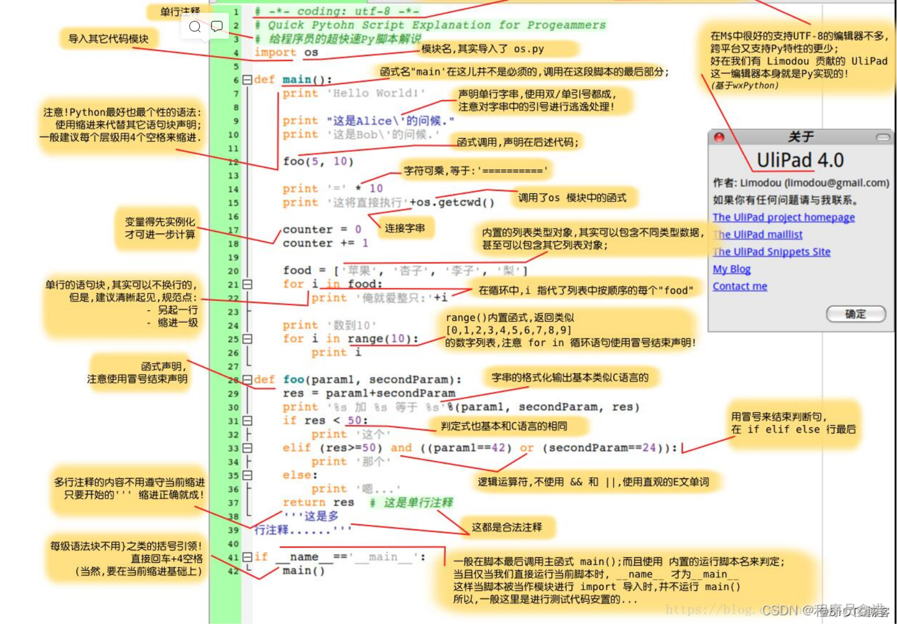

##### 1.Python标识符

在 Python 里，标识符有字母、数字、下划线组成。

在 Python 中，所有标识符可以包括英文、数字以及下划线(_)，但不能以数字开头。

Python 中的标识符是区分大小写的。

以下划线开头的标识符是有特殊意义的。以单下划线开头 _foo 的代表不能直接访问的类属性，需通过类提供的接口进行访问，不能用 from xxx import * 而导入；

以双下划线开头的 foo 代表类的私有成员；以双下划线开头和结尾的 foo 代表 Python 里特殊方法专用的标识，如 init__() 代表类的构造函数。

##### 2.Python有五个标准的数据类型

Numbers（数字）  
String（字符串）  
List（列表）  
Tuple（元组）  
Dictionary（字典）  

Python支持四种不同的数字类型：

int（有符号整型）  
long（长整型[也可以代表八进制和十六进制]）  
float（浮点型）  
complex（复数）  

python的字串列表有2种取值顺序:

从左到右索引默认0开始的，最大范围是字符串长度少1  
从右到左索引默认-1开始的，最大范围是字符串开头  

List（列表） 是 Python 中使用最频繁的数据类型。

列表可以完成大多数集合类的数据结构实现。它支持字符，数字，字符串甚至可以包含列表（即嵌套）。  

列表用 [ ] 标识，是 python 最通用的复合数据类型。  

列表中值的切割也可以用到变量 [头下标:尾下标] ，就可以截取相应的列表，从左到右索引默认 0 开始，从右到左索引默认 -1 开始，下标可以为空表示取到头或尾。  

加号 + 是列表连接运算符，星号 * 是重复操作。  

元组是另一个数据类型，类似于List（列表）

。

元组用”()”标识。内部元素用逗号隔开。但是元组不能二次赋值，相当于只读列表。  

字典(dictionary)是除列表以外python之中最灵活的内置数据结构类型。

列表是有序的对象结合，字典是无序的对象集合。两者之间的区别在于：字典当中的元素是通过键来存取的，而不是通过偏移存取。  

字典用”{ }”标识。字典由索引(key)和它对应的值value组成。

##### 3.Python数据类型转换

有时候，我们需要对数据内置的类型进行转换，数据类型的转换，你只需要将数据类型作为函数名即可。

以下几个内置的函数可以执行数据类型之间的转换。这些函数返回一个新的对象，表示转换的值。

int(x [,base]): 将x转换为一个整数

long(x [,base] ): 将x转换为一个长整数

float(x): 将x转换到一个浮点数

complex(real [,imag]): 创建一个复数

str(x):将对象 x 转换为字符串

repr(x): 将对象 x 转换为表达式字符串

eval(str): 用来计算在字符串中的有效Python表达式,并返回一个对象

tuple(s): 将序列 s 转换为一个元组

list(s): 将序列 s 转换为一个列表

set(s): 转换为可变集合

dict(d): 创建一个字典。d 必须是一个序列 (key,value)元组。

frozenset(s): 转换为不可变集合

chr(x) :将一个整数转换为一个字符

unichr(x): 将一个整数转换为Unicode字符

ord(x): 将一个字符转换为它的整数值

hex(x): 将一个整数转换为一个十六进制字符串

oct(x): 将一个整数转换为一个八进制字符串

##### 4.Python 运算符

算术运算符  
比较（关系）运算符  
赋值运算符  
逻辑运算符  
位运算符  
成员运算符  
身份运算符  
运算符优先级  

#### 序列

##### 列表

列表,类似某些语言的Arraylist,但不是数组.用[]表示

定义列表

```python
x=[1,2,3,4,5]
x2=list(range(1,9))
print(x)
print(x2)
```

```
[1, 2, 3, 4, 5]
[1, 2, 3, 4, 5, 6, 7, 8]
```

output:
[1, 2, 3, 4, 5]
[1, 2, 3, 4, 5, 6, 7, 8]

列表可以像数组一样按下标取值,自左向右从0开始,逆序从-1开始

```python
print(x[2])
print(x2[-3])
```

output:
3
6

列表支持切片操作,[a:b],取x,a≤x＜b

```python
x[1:4]
```

output:
[2, 3, 4]

列表元素可以是不同类型,还可以嵌套子列表

```python
x3=[1,'a',True,[1,2,3]]
x3[3]
```

output:[1, 2, 3]

访问子列表的元素

```python
x3[3][1]
```

output:2

追加列表的几种方式

```python
a=[1,2,3]+[4,5]
print(a)
a.append(6)
print(a)
a.extend([100,200])
print(a)
```

output:[1, 2, 3, 4, 5]
[1, 2, 3, 4, 5, 6]
[1, 2, 3, 4, 5, 6, 100, 200]

插入列表:可以按下表插入,也可以逆序

```python
a.insert(0,'c')
print(a)
a.insert(-2,'mc')
print(a)
```

output:
['c', 1, 2, 3, 4, 5, 6, 100, 200]
['c', 1, 2, 3, 4, 5, 6, 'mc', 100, 200]

列表可以直接修改某个元素,按下标

```python
a[0]=300
print(a)
```

output:[300, 1, 2, 3, 4, 5, 6, 'mc', 100, 200]

如果想切片修改,比如把a0,a1修改成4,不能直接赋值4,会报错:can only assign an iterable,只能分配一个迭代器.所以要用列表赋值

```python
# a[0:2]=4  会报错
a[0:2]=[4]
print(a)
```

output: [4, 2, 3, 4, 5, 6, 'mc', 100, 200]

删除操作
del :支持删除指定下标元素,支持切片,删除是真正删除了这个元素

```python
a1=[1,2,3,4,'a','c']
del a1[2]
print(a1)
del a1[0:2]
print(a1)
```

output: [1, 2, 4, 'a', 'c']
[4, 'a', 'c']

pop():出栈,没有参数时,默认出栈栈顶元素,可以加参数指定位置,但不支持切片.相比于del,它有返回值,出栈时返回出栈元素

```python
a2=[1,2,3,4,5,6,7]
a2.pop()
print(a2)
b=a2.pop(0)
print(b,a2)
```

output:[1, 2, 3, 4, 5, 6]
1 [2, 3, 4, 5, 6]

列表支持*操作,重复元素

```python
a2=a2 * 3
print(a2)
```

output: [2, 3, 4, 5, 6, 2, 3, 4, 5, 6, 2, 3, 4, 5, 6]

按值删除,remove(value)函数,参数value会在列表中查找等于value的第一个值,并删除之

```python
a2.remove(3)
print(a2)
```

output:[2, 4, 5, 6, 2, 3, 4, 5, 6, 2, 3, 4, 5, 6]

清空列表:clear()

```python
a2.clear()
print(a2)
```

output: []

列表排序

```python
x=[2,5,3,100,45,77]
sorted(x)
```

output: [2, 3, 5, 45, 77, 100]

sorted()只是排序一下并输出,列表x本身次序并未改变,可以用列表排序函数

```python
x.sort()
print(x)
```

output: [2, 3, 5, 45, 77, 100]

列表推导式/列表解析式

①x=[1,2,3,4,5,6,7,8,9,10],求每个元素平方后输出

```python
#如果使用for循环<br>
x=[1,2,3,4,5,6,7,8,9,10]
for i in x: 
    print(i**2)
```

使用列表推导式

```python
[i ** 2 for i in x]
```

output: [1, 4, 9, 16, 25, 36, 49, 64, 81, 100]

还可以继续添加条件,循环嵌套

```python
[i ** 2 for i in x if i%2 ==0]
[(i,j) for i in range(2) for j in range(3)]
```

output: [4, 16, 36, 64, 100]
[(0, 0), (0, 1), (0, 2), (1, 0), (1, 1), (1, 2)]

②求两个列表对应位置元素的和,x从1到100,y为100个1

```python
#不用列表推导式
x=range(1,101)
y=[1]*100
z=list()
for i in range(100):
    z.append(x[i]+y[i])
print(z)
```

列表推导式

```python
[x[i] + y[i] for i in range(100)]
#或者
print([i+j for i,j in zip(x,y)],end=" ")
```

output: [2, 3, 4, 5, 6, 7, 8, 9, 10, 11, 12, 13, 14, 15, 16, 17,  
18, 19, 20, 21, 22, 23, 24, 25, 26, 27, 28, 29, 30, 31, 32, 33,  
34, 35, 36, 37, 38, 39, 40, 41, 42, 43, 44, 45, 46, 47, 48, 49, 50,  
51, 52, 53, 54, 55, 56, 57, 58, 59, 60, 61, 62, 63, 64, 65, 66,  
67, 68, 69, 70, 71, 72, 73, 74, 75, 76, 77, 78, 79, 80, 81, 82, 83,  
84, 85, 86, 87, 88, 89, 90, 91, 92, 93, 94, 95, 96, 97, 98, 99, 100, 101]

class zip(object)
 | zip(*iterables) --> A zip object yielding tuples until an input is exhausted.

| >>> list(zip('abcdefg', range(3), range(4)))
 | [('a', 0, 0), ('b', 1, 1), ('c', 2, 2)]
 | The zip object yields n-length tuples, where n is the number of iterables passed as positional arguments to zip(). The i-th element in every tuple comes from the i-th iterable argument to zip(). This continues until the shortest argument is exhausted.

使用向量表达式

```python
import numpy as np
x=np.array(x)
y=np.array(y)
z=x+y
print(z)
```

使用映射map()

```python
list(map(lambda x:x[0]+x[1],zip(x,y)))
```

##### 元组tuple

元组是不可变类型,比支持删除和添加操作

元组用()表示,可以用来作为函数多返回值类型

```python
def f():
    a=1
    b=2
    return a, b
x,y=f()
print(x,y)
```

```
1 2
```

查看返回值类型

```python
t=f()
print(type(t))
```

```
<class 'tuple'>
```

python 支持同时多赋值

```python
x,y,z=1,2,3
```

也可以使用元组

```python
x,y,z=(1,2,3)
```

如果元组中只有一个元素,要用','标志

```python
x=(1)
print(type(x))
x=(1,)
print(type(x))
```

```
<class 'int'>
<class 'tuple'>
```

元组也支持按下标取值还有切片

```python
x=(1,2,3,4,5)
print(x[1])
print(x[0:2])
```

```
2
(1, 2)
```

##### 集合set

用{}表示,不支持按下标取值,不支持切片

集合最大的特点:集合中的元素不能重复,类似数学中的集合的概念,也有交集,并集等性质

```python
x={1,2,2,3,4,4,5,5,5,6}
print(x)
```

```
{1, 2, 3, 4, 5, 6}
```

所以可以利用集合去重其他类型

```python
l=[1,2,3,4,4,4,5,5,6,6]
s=set(l)
print(s)
```

```
{1, 2, 3, 4, 5, 6}
```

交集

```python
a={1,2,3,4}
b={3,4,5}
a & b
```

```
{3, 4}
```

并集

```python
a | b
```

```
{1, 2, 3, 4, 5}
```

异或

```python
a ^ b
```

```
{1, 2, 5}
```

##### 字典dict

字典也用{}表示,区别于集合,它在初始化时,用键值对表示

```python
dic={'a':100,'b':200,'c':300}
```

添加update,添加的键值对用{}

```python
dic.update({'d':400})
print(dic)
```

```
{'a': 100, 'b': 200, 'c': 300, 'd': 400}
```

python中的字典类似与其他语言的hash表,按键取值

```python
dic['d']
```

```
400
```

如果无对应键,会报异常

```python
dic['e']
```

```
---------------------------------------------------------------------------

KeyError                                  Traceback (most recent call last)

c:\Users\Tenerome\Desktop\python\lesson.ipynb Cell 35 in <cell line: 1>()
----> <a href='vscode-notebook-cell:/c%3A/Users/Tenerome/Desktop/python/lesson.ipynb#Y220sZmlsZQ%3D%3D?line=0'>1</a> dic['e']


KeyError: 'e'
```

可以用get()方法try to get value

```python
dic.get('e','none')
```

```
'none'
```

get()有两个参数,第一个参数为键,若字典有对应键,返回键值.若无对用键,返回第二个参数

遍历

```python
for i in dic:
    print(i,end=" ")
```

```
a b c d 
```

直接对dic遍历返回的是键(还可以用dic.keys()),遍历键值,使用dic.values()

```python
for i in dic.values():
    print(i,end=" ")
```

```
100 200 300 400 
```

输出键值对

```python
print(dic)
print(dic.items())
```

```
{'a': 100, 'b': 200, 'c': 300, 'd': 400}
dict_items([('a', 100), ('b', 200), ('c', 300), ('d', 400)])
```

区别:dic是字符串,dic.items()是元组

```python
for i in dic:
    print(type(i),end=" ")
print()
for i in dic.items():
    print(type(i),end=" ")
```

```
<class 'str'> <class 'str'> <class 'str'> <class 'str'> 
<class 'tuple'> <class 'tuple'> <class 'tuple'> <class 'tuple'> 
```

字典的键必须是不可变类型:数字(numbers),字符串(string),元组(tuple)

```python
dic1={(1,2):'苹果','a':'橘子',3:'香蕉'}
print(dic1)
```

```
{(1, 2): '苹果', 'a': '橘子', 3: '香蕉'}
```

字典的键不能重复,其他语言中hash键重复会报异常,python虽然不报异常,但重复的键会覆盖之前的键

```python
dic2={'a':100,'b':200,'a':300}
print(dic2)
```

```
{'a': 300, 'b': 200}
```

#### 程序流程控制

选择结构

①编写程序,判断某个日期是该年的第几天

```python
import time
def demo(year,month,day):
    day_month=[31,28,30,31,30,31,31,30,31,30,31]#十二个月的天数
    pass#pass关键字用来做占位符,表示待实现
print((demo(2021,1,15)))
print(demo(2021,3,26))
```

```python
import time
def demo(year,month,day):
    day_month=[31,28,30,31,30,31,31,30,31,30,31]
    if year % 400 ==0 or (year %4==0 and year%100!=0):
        day_month[1]=29
    # if month==1:
    #     return day
    # else:
    return sum(day_month[:month-1],day)
```

```python
print(demo(2021,3,26))
```

```
85
```

获取现在的时间,并调用demo()

```python
date=time.localtime()
print(type(date))
print(date)
print(date[:3])
```

```
<class 'time.struct_time'>
time.struct_time(tm_year=2022, tm_mon=9, tm_mday=22, tm_hour=14, tm_min=45, tm_sec=39, tm_wday=3, tm_yday=265, tm_isdst=0)
(2022, 9, 22)
```

time.localtime()获取当前的时间,返回值为一个struct

struct切片后返回的是一个元组

第一种调用方法:赋值给三个变量

```python
year,month,day=date[:3]
demo(year,month,day)
```

```
264
```

第二种:使用序列解包方式传参

```python
demo(*date[:3])
```

```
264
```

year % 100 !=0 可以简写为year % 100.因为在python条件判断时,只要表达式不为0,False,None,空(序列)时判断结果都是True

三元表达式

```python
w=100
h=1 if w>=100 else 2
print(h)
```

```
1
```

python中没有Switch结构,C语言中的Switch其实使用hash表实现跳转的,在python中可以用字典代替

```python
def func1():
    pass
def func2():
    pass
def func3():
    pass
d={'key1':func1(),'key2':func2(),'key3':fun3()}
```

##### 循环结构

编写程序,打印100以内的所有素数

仿C结构

```python
for i in range(2,101):
    flag=True
    for j in range(2,int(i**0.5)+1):
        if i%j ==0:
            flag=False
            break
    if flag:
        print(i,end=" ")
```

```
2 3 5 7 11 13 17 19 23 29 31 37 41 43 47 53 59 61 67 71 73 79 83 89 97 
```

python提供了for...else结构.若内循环正常结束(而不是遇到break跳出)或没有执行for循环,则执行else语句.如果是由break语句跳出的,则不执行else语句

用for...esle结构

```python
for i in range(2,101):
    for j in range(2,int(i**0.5)+1):
        if i%j ==0:
            break
    else:
        print(i,end=" ")
```

```
2 3 5 7 11 13 17 19 23 29 31 37 41 43 47 53 59 61 67 71 73 79 83 89 97 
```

使用列表推导式

```python
print([i for i in range(2,101) if 0 not in [i%j for j in range(2,int(i**0.5)+1)]])
```

```
[2, 3, 5, 7, 11, 13, 17, 19, 23, 29, 31, 37, 41, 43, 47, 53, 59, 61, 67, 71, 73, 79, 83, 89, 97]
```

##### 异常处理

③创建txt文本文件,内容三行文字

```python
f=open('2.txt',encoding='utf-8')
```

```
---------------------------------------------------------------------------

FileNotFoundError                         Traceback (most recent call last)

c:\Users\Tenerome\Desktop\python\lesson.ipynb Cell 31 in <cell line: 1>()
----> <a href='vscode-notebook-cell:/c%3A/Users/Tenerome/Desktop/python/lesson.ipynb#X42sZmlsZQ%3D%3D?line=0'>1</a> f=open('2.txt',encoding='utf-8')


FileNotFoundError: [Errno 2] No such file or directory: '2.txt'
```

如果没有创建,就会报出异常

对可能产生异常的程序,可以用try...except Exception...else...finally

```python
try:
    f=open('test.txt',encoding='utf-8')
except Exception:
    print('文件不存在')
else:
    print(f.read())
finally:
    f.close()
```

```
Hi
Hello
CCVV
```

try:尝试运行后面的程序
如果有异常,except Exception捕获,并做个性化处理
若无异常,esle
不管有没有异常,finally

④断言语句assert,用户输入一个数字,判断是否在20-120之间,否则产生异常,并提示用户重新输入

```python
while True:
    x=int(input('请输入一个在20-120之间的数字'))
    try:
        assert x>=20 and x<=120
    except AssertionError:
        print('输入数字不合法')
    else:
        print('OK')
        break
```

```
输入数字不合法
输入数字不合法
OK
```

#### 函数与函数式编程

##### 函数的定义与调用

返回斐波那契数列中小于整数n的所有值

```python
def fib(n):
    pass
fib(1000)
```

python中的函数,用def关键字定义.函数不需要返回值类型,不需要参数类型

##### 函数的参数

函数参数的集中类型:  
位置参数(positional arguments):形参和实参数量相同,位置一致.  
缺省参数(default arguments):形参有默认值,有缺省参数的形参要在位置参数之后.  
关键字参数(keyword arguments):实参顺序可以和形参顺序不一致,避免了用户需要牢记位置参数顺序的麻烦  
可变参数(variable-length arguments):*parameter用来接受多个实参并将其放在元组中.**parameter接收多个关键参数并存放到字典中

位置参数:

```python
def func(a,b,c):
    print(a,b,c)
func(1,2)
```

```
---------------------------------------------------------------------------

TypeError                                 Traceback (most recent call last)

c:\Users\Tenerome\Desktop\python\lesson.ipynb Cell 45 in <cell line: 3>()
      <a href='vscode-notebook-cell:/c%3A/Users/Tenerome/Desktop/python/lesson.ipynb#X63sZmlsZQ%3D%3D?line=0'>1</a> def func(a,b,c):
      <a href='vscode-notebook-cell:/c%3A/Users/Tenerome/Desktop/python/lesson.ipynb#X63sZmlsZQ%3D%3D?line=1'>2</a>     print(a,b,c)
----> <a href='vscode-notebook-cell:/c%3A/Users/Tenerome/Desktop/python/lesson.ipynb#X63sZmlsZQ%3D%3D?line=2'>3</a> func(1,2)


TypeError: func() missing 1 required positional argument: 'c'
```

这个就是positional 参数,缺少时报错

缺省参数:

```python
def func1(a,b,c=1):
    print(a,b,c)
func1(2,3)
```

```
2 3 1
```

定义函数时就对形参赋值,就是缺省参数,后面传实参会覆盖

关键字参数:

```python
def func2(a,b,c):
    print(a,b,c)
func2(c=3,a=1,b=2)
```

```
1 2 3
```

可以看到调用的时候没有按形参顺序来,但是用关键字(形参名)来调用的,就可以忽略顺序

```python
def stu(country='中国',name):
    print("%s,%s" %(name,country))
stu('美国','Tom')
```

```
  Input In [7]
    def stu(country='中国',name):
                             ^
SyntaxError: non-default argument follows default argument
```

有缺省值的参数必须放位置参数后面

```python
def stu(name,country='中国'):
    print("%s ,%s" %(name,country))
stu('美国','Tom')
```

```
美国 ,Tom
```

可变参数:

##### 变量的作用域

函数体外部的变量:全局变量  
内部:局部变量

函数内可以调用全局变量

```python
x=100
def f():
    print(x)
f()
```

```
100
```

在函数内部的变量赋值操作,该变量就是局部变量.

```python
x=100
def f():
    print(x)
    x=200
    print(x)
f()
```

```
---------------------------------------------------------------------------

UnboundLocalError                         Traceback (most recent call last)

c:\Users\Tenerome\Desktop\python\lesson.ipynb Cell 63 in <cell line: 6>()
      <a href='vscode-notebook-cell:/c%3A/Users/Tenerome/Desktop/python/lesson.ipynb#Y116sZmlsZQ%3D%3D?line=3'>4</a>     x=200
      <a href='vscode-notebook-cell:/c%3A/Users/Tenerome/Desktop/python/lesson.ipynb#Y116sZmlsZQ%3D%3D?line=4'>5</a>     print(x)
----> <a href='vscode-notebook-cell:/c%3A/Users/Tenerome/Desktop/python/lesson.ipynb#Y116sZmlsZQ%3D%3D?line=5'>6</a> f()


c:\Users\Tenerome\Desktop\python\lesson.ipynb Cell 63 in f()
      <a href='vscode-notebook-cell:/c%3A/Users/Tenerome/Desktop/python/lesson.ipynb#Y116sZmlsZQ%3D%3D?line=1'>2</a> def f():
----> <a href='vscode-notebook-cell:/c%3A/Users/Tenerome/Desktop/python/lesson.ipynb#Y116sZmlsZQ%3D%3D?line=2'>3</a>     print(x)
      <a href='vscode-notebook-cell:/c%3A/Users/Tenerome/Desktop/python/lesson.ipynb#Y116sZmlsZQ%3D%3D?line=3'>4</a>     x=200
      <a href='vscode-notebook-cell:/c%3A/Users/Tenerome/Desktop/python/lesson.ipynb#Y116sZmlsZQ%3D%3D?line=4'>5</a>     print(x)


UnboundLocalError: local variable 'x' referenced before assignment
```

也就是说,在函数内,一旦引用了全局变量,就不能在函数内对全局变量赋值

但是可以先赋值再引用,这时两个x并不是同一个,相当于两个变量,一个全局,一个局部,但是有相同的变量名

```python
x=100
def f():
    x=200
    print(id(x))
f()
id(x)
```

```
2413391733392
2413391730128
```

想要在函数内真正调用全局变量,可以用global声明

```python
x=100
def f():
    global x
    x=200
    print(id(x))
f()
id(x)
```

```
2413391733392
2413391733392
```

python支持使用nonlocal关键字定义一宗介于全局和局部之间的变量,成为闭包作用域变量.关键字nonlocal声明的变量会引用距离最近的非全局作用域的变量(闭包变量或局部变量).要求声明的变量已经存在.关键字nonlocal不会创建新变量

##### lambda表达式

```python
def fsum(x,y):
    return x+y
```

像上面的函数,只是很简单的功能,就定义了函数.lambda表达式就是用来代替简单的函数的

基本结构lambda left : right.其中left是参数,right是返回值.

```python
f=lambda x,y : x+y
f(3,5)
```

```
8
```

lambda表达式就是把简单的函数改成无函数体的形式,只有参数和返回值.返回值用表达式的形式.只要能改成这样的结构的函数,都可以写成lambda表达式的形式

##### 函数式编程

函数式编程就是把函数作用于一个或多个序列,来实现一些功能

① 内置函数map()可以将一个函数作用到一个或多个序列或迭代器对象上,返回可迭代的map对象

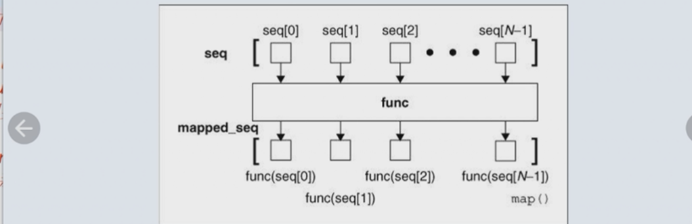

map()会把seq中的元素一个个作用在func()上,并将返回值组成一个新的可迭代对象mapped_seq

结构:map(func, *iterables) --> map object
第一个参数是函数名,也可以是lambda表达式,第二个参数是一个可迭代的对象,返回值为map object

```python
import math
map(lambda x:math.pow(x,2),[1,2,3,4,5,6,7])
```

```
<map at 0x231ffcec3a0>
```

返回结果是map object 是可迭代的

```python
list(map(lambda x:math.pow(x,2),[1,2,3,4,5,6,7]))
```

```
[1.0, 4.0, 9.0, 16.0, 25.0, 36.0, 49.0]
```

②标准库functools中的reduce(function,sequence)函数可以接收一个有两个参数的函数function(),以迭代的方式从左到右依次作用到一个序列sequence上实现类huffman树的聚集操作(求和,求连乘积等)

Huffman树聚集 

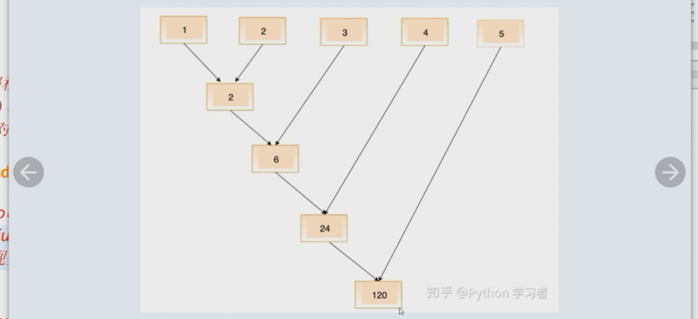

```python
from functools import reduce
reduce(lambda i,j:i+j,range(1,101))
```

```
5050
```

③内置函数filter将一个函数作用到一个序列上,返回该序列中式函数返回值为True的元素组成的filter对象,filter对象也是可迭代的 


如:输出从1到1000所有的素数

```python
import math
def is_prime(n):
    if n<2:
        return False
    if n==2:
        return True
    if n%2==0:
        return False
    sqrt_n=math.floor(math.sqrt(n))
    for i in range(3,sqrt_n+1,2):
        if n%i==0:
            return False
    return True
```

```python
print(list(filter(is_prime,range(1,101))),end=" ")
```

```
[2, 3, 5, 7, 11, 13, 17, 19, 23, 29, 31, 37, 41, 43, 47, 53, 59, 61, 67, 71, 73, 79, 83, 89, 97] 
```

④内置函数zip

zip函数像一个拉链,把两个序列连接返回一个zip对象,可迭代.其元素是两个序列元素组成的元组 


```python
list(zip(range(10),'abcdefghij'))
```

```
[(0, 'a'),
 (1, 'b'),
 (2, 'c'),
 (3, 'd'),
 (4, 'e'),
 (5, 'f'),
 (6, 'g'),
 (7, 'h'),
 (8, 'i'),
 (9, 'j')]
```

#### 面对对象设计

##### 类的定义和实例化

①结构

class 类名:
    类成员

关键字为class,类名首字母要大写,如果是自定义类的派生类,则需要用类名+(object)形式.类中的方法和属性不需要使用Pascal法则命名,即首字母不用大写

*例:定义Sheep类,内部定义一个name变量,一个shout方法,实例化一个对象sheep,调用shout方法,喊出它的name*

```python
class Sheep:
    name='Shown'
    def shout(name):
        print('My name is:',name)

sheep=Sheep()
sheep.shout()
```

```
My name is: <__main__.Sheep object at 0x000002715D415640>
```

运行提示<__main__.Sheep object>很明显这不是想传进去的name,而是实例化的sheep对象

```python
print(sheep)
```

```
<__main__.Sheep object at 0x000002713C772BE0>
```

类中的方法,分类方法和实例方法.类方法作用于类,实例方法作用域实例.python中的实例方法必须用self来做第一个参数

调用类中的全局变量时用self.变量名

```python
class Sheep:
    name='Shown'
    def shout(self):
        print('My name is:',self.name)

sheep=Sheep()
sheep.shout()
```

```
My name is: Shown
```

也可以用类名调用

```python
class Sheep:
    name='Shown'
    def shout(self):
        print('My name is:',Sheep.name)#用Sheep.name
    def run(self):
        self.shout()
        print('I am running')
sheep=Sheep()
sheep.run()
```

```
My name is: Shown
I am running
```

同样的,类中的实例方法互相调用时也需要用self.方法名,但是不能用类名

```python
class Sheep:
    name='Shown'
    def shout(self):
        print('My name is:',self.name)
    def run(self):
        self.shout()
        print('I am running')
sheep=Sheep()
sheep.run()
```

```
My name is: Shown
I am running
```

如果想在实例化的时候对对象赋初值,则会用到构造方法.python中的构造方法叫做初始化方法,用__init__表示.python中的类,通过__new__实例化,通过__init__来初始化

```python
print(dir(sheep),end=" ")
```

```
['__class__', '__delattr__', '__dict__', '__dir__', '__doc__', '__eq__', '__format__', '__ge__', '__getattribute__', '__gt__', '__hash__', '__init__', '__init_subclass__', '__le__', '__lt__', '__module__', '__ne__', '__new__', '__reduce__', '__reduce_ex__', '__repr__', '__setattr__', '__sizeof__', '__str__', '__subclasshook__', '__weakref__', 'name', 'run', 'shout'] 
```

类中带双下划线的方法或属性如__new__叫做魔法方法/属性,它是类中的已经定义好的方法,一般有类自己调用,也可以通过编程调用或者重写.后面的name,run,shout才是自已定义的方法/属性

重写__init__,添加参数,用来实例化的时候赋初值

```python
class Sheep:
    def __init__(self,name):
        self.name=name
    def shout(self):
        print('my name is:',self.name)
sheep=Sheep('Tom')
sheep.shout()
```

```
my name is: Tom
```

这里的self相当于实例后的独有的空间  
self{  
    name;  
    shout()  
}
self和类class的关系就相当于 


```python
class Panda:
    attr1='Pandas'
    def func1():
        pass
    def func2(self):
        self.attr2='cats'
    def func3(self):
        print(self.attr2)

        a=3
        print(a)
        pass
pan=Panda()
print('class:',[i for i in dir(Panda) if i[0]!='_'])
print('self:',[i for i in dir(pan) if i[0]!='_'])
```

```
class: ['attr1', 'func1', 'func2', 'func3']
self: ['attr1', 'func1', 'func2', 'func3']
```

可以看到class和self共有attr1,func1,func2,func3,也就是说,在没有调用实例化方法时,self中的属性并不会创建

```python
pan.func2()
print('class:',[i for i in dir(Panda) if i[0]!='_'])
print('self:',[i for i in dir(pan) if i[0]!='_'])
```

```
class: ['attr1', 'func1', 'func2', 'func3']
self: ['attr1', 'attr2', 'func1', 'func2', 'func3']
```

调用pan.func2()后,self区创建了attr2

```python
pan.func3()
print('class:',[i for i in dir(Panda) if i[0]!='_'])
print('self:',[i for i in dir(pan) if i[0]!='_'])
```

```
cats
3
class: ['attr1', 'func1', 'func2', 'func3']
self: ['attr1', 'attr2', 'func1', 'func2', 'func3']
```

可以看到,虽然attr2是在func2()中创建的,但在func3()中仍能调用.但是func3()中的局部变量3并不在pan中.

但是不同的实例之间并不能共用self区

```python
class Panda:
    attr1='Pandas'
    def func1():
        pass
    def func2(self):
        self.attr2='cats'
    def func3(self):
        print(self.attr2)

        a=3
        print(a)
        pass
pan=Panda()
pan1=Panda()
pan.func2()
pan1.func2()
#pan修改attr2不影响pan1
pan.attr2='dogs'
print('pan1.attr2:',pan1.attr2)
```

```
pan1.attr2: cats
```

所以不同实例之间的关系是这样的 


如果形参,self变量,类变量名字相同就这样区分

```python
class Panda:
    name='Aa'
    def func(self):
        self.name='Bb'
        name='Cc'
        print(Panda.name)
        print(self.name)
        print(name)
pan=Panda()
pan.func()
print('class:',[i for i in dir(Panda) if i[0]!='_'])
print('self:',[i for i in dir(pan) if i[0]!='_'])
```

```
Aa
Bb
Cc
class: ['func', 'name']
self: ['func', 'name']
```

可以看到三个name值不同.而class和self虽然在内部空间存在相同的属性名name,但他们是两个值

再继续看实例调用类变量的情况

```python
class Panda:
    name='Aa'
    def func(self):
        self.name='Bb'
        name='Cc'
pan=Panda()
print(pan.name)
```

```
Aa
```

未调用func(),实例可以访问类变量

```python
pan.func()
print(pan.name)
```

```
Bb
```

调用func()后,self区的name就被覆盖了

但如果是不同的变量名

```python
class Panda:
    cname='Aa'
    def func(self):
        self.name='Bb'
        name='Cc'
pan=Panda()
print(pan.cname)
pan.func()
print(pan.cname)
print('self:',[i for i in dir(pan) if i[0]!='_'])
```

```
Aa
Aa
self: ['cname', 'func', 'name']
```

就不会覆盖,self此时既有cname,又有name.所以如果类属性和实例属性名字相同,调用函数后,就不能再通过实例访问类属性

sum up:  
类中的变量分类变量(class),实例变量(self)和局部变量  
类变量直接定义在类中,可以被类名和实例化的对象调用  
实例变量定义在方法中,且由self修饰,只有在调用方法时才创建,能被所有实例调用,不能通过类名访问  
如果类变量和实例变量名相同,实例调用函数后,会覆盖  
局部变量也定义在函数中,使用后销毁,并不占用实例空间

python中的self就是java中的this,唯一区别就是self必须是实例方法的参数的第一个.其实,self只是规定了第一个参数的位置,命名什么都行,也可以用this

```python
class Sheep:
    def __init__(this,name):
        this.name=name
    def shout(this):
        print('my name is:',this.name)
sheep=Sheep('Tom')
sheep.shout()
```

```
my name is: Tom
```

②python类型是动态性的,可以动态为自定义类及对象改变为新的属性和行为,俗称混入(mixin)机制

```python
a=1
print(type(a))
a='hello'
print(type(a))
```

```
<class 'int'>
<class 'str'>
```

但是实际a的引用地址已经发生了改变

```python
a=1
print(id(a))
a='hello'
print(id(a))
```

```
2734448994608
2734528578672
```

利用这个机制,就可以给已经创建好实例,在不修改类,不重新实例化的前提下添加新属性

```python
class Sheep:
    name=''
    def shout():
        pass
shp=Sheep()
print('shp:',[i for i in dir(shp) if i[0]!='_'])
shp.age=12
print('shp:',[i for i in dir(shp) if i[0]!='_'])
```

```
shp: ['name', 'shout']
shp: ['age', 'name', 'shout']
```

而且也可以给类添加新属性

```python
Sheep.type='sheep'
print('Sheep:',[i for i in dir(Sheep) if i[0]!='_'])
```

```
Sheep: ['name', 'shout', 'type']
```

并且,再新的实例也会有type属性

```python
shp1=Sheep()
print('shp2:',[i for i in dir(shp1) if i[0]!='_'])
```

```
shp2: ['name', 'shout', 'type']
```

还有方法也可以添加,但是需要导入type库

```python
import types
def setSpeed(self,s):
    self.speed=s
shp1.setSpeed=types.MethodType(setSpeed,shp1)
#绑定后,实例不但有了setSpeed方法,而且有了speed属性
shp1.setSpeed(5)
print(shp1.speed)
```

```
5
```

③私有不私有特点:

*XXX:一个下划线开始,表示受保护的成员,不能用from .. import导入  
__XXX_\*:系统定义的特殊成员,如__init__  
__xxx:私有成员,只有类对象自己能访问,子对象不能直接访问.但在对象外部可以通过'对象名._类名__xxx'来访问,所以python中的私有并不是真正的私有

##### 方法

python中的方法分为:实例方法,类方法,静态方法

实例方法第一个参数名为self  
类方法第一个形参为cls  
静态方法没有规定必须的参数

类方法用@classmethod修饰,静态方法用@staticmethod修饰

python中的静态方法不能使用类或实例中的任何属性和方法,相当于一个独立的空间,常作为工具方法使用.python中的类方法更类似于其他语言的静态方法.

共同点:  
类方法和静态方法不能直接访问属于对象的成员  
类方法和静态方法都可以用对象或类名来调用

```python
class Cat:
    @classmethod
    def setName(cls,name='Tom'):
        cls.name=name
cat=Cat()
cat1=Cat()
cat.setName('Jerry')
print(cat1.name)
print (Cat.name)
```

```
Jerry
Jerry
```

如上,python中的类方法的不同实例是共用空间的

python的静态方法是一个独立的空间,一般用于和类对象以及实例对象无关的代码。

```python
class Game():
    @staticmethod
    def menu():
        print('开始游戏')
        print('设置')
        print('退出游戏')
    def func1():
        pass
game=Game()
game.menu()
```

```
开始游戏
设置
退出游戏
```

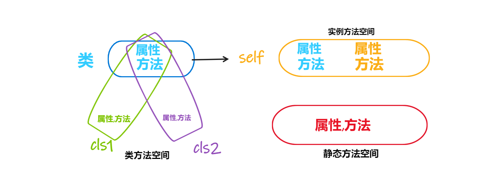

##### 属性

```python
class Sheep:
    def __init__(self,name):
        self.__name=name
    def name(self):
        return self.__name
sheep=Sheep('Shown')
print(sheep.name())
print(sheep.__name)
```

```
Shown


---------------------------------------------------------------------------

AttributeError                            Traceback (most recent call last)

c:\Users\Tenerome\Desktop\python\lesson.ipynb Cell 73 in <cell line: 8>()
      <a href='vscode-notebook-cell:/c%3A/Users/Tenerome/Desktop/python/lesson.ipynb#Y134sZmlsZQ%3D%3D?line=5'>6</a> sheep=Sheep('Shown')
      <a href='vscode-notebook-cell:/c%3A/Users/Tenerome/Desktop/python/lesson.ipynb#Y134sZmlsZQ%3D%3D?line=6'>7</a> print(sheep.name())
----> <a href='vscode-notebook-cell:/c%3A/Users/Tenerome/Desktop/python/lesson.ipynb#Y134sZmlsZQ%3D%3D?line=7'>8</a> print(sheep.__name)


AttributeError: 'Sheep' object has no attribute '__name'
```

想得到sefl.__name私有变量,只能通过函数name的返回值(或用类名+私有变量名),python中的@property装饰器,用它装饰的方法可以对类的私有变量进行读写操作,将来可以通过方法名,不需要加()来对属性读写

```python
class Sheep:
    def __init__(self,name):
        self.__name=name
    @property
    def name(self):
        return self.__name
sheep=Sheep('Shown')
print(sheep.name)
```

```
Shown
```

上面是只读的例子,下面看可读可写的

```python
class Sheep:
    def __init__(self,name):
        self.__name=name
    def __get(self):
        return self.__name
    def __set(self,value):
        self.__name=value
    name=property(__get,__set)
sheep=Sheep('Shown')
print(sheep.name)
sheep.name='Tom'
print(sheep.name)
```

```
Shown
Tom
```

上面是第一种形式,除了getter和setter,还有del

```python
'''class C(object):
    def getx(self): return self._x
    def setx(self, value): self._x = value
    def delx(self): del self._x  
    x = property(getx, setx, delx, "I'm the 'x' property.")'''
```

如果不定义del的话是不能直接删除的

```python
class Sheep:
    def __init__(self,name):
        self.__name=name
    def __get(self):
        return self.__name
    def __set(self,value):
        self.__name=value
    def __del(self):
        del self.__name
    name=property(__get,__set,__del)
```

另一种形式:

```python
'''class C(object):
    @property def x(self):
        "I am the 'x' property." return self._x
    @x.setter def x(self, value):
        self._x = value
    @x.deleter def x(self):
        del self._x'''
```

```python
class Sheep:
    @property 
    def name(self):
        return self.__name
    @name.setter
    def name(self,name):
        self.__name=name
    @name.deleter
    def name(self):
        del self.__name
sheep=Sheep()
sheep.name='Shawn'
print(sheep.name)
# del sheep.name
# print(sheep.name)
```

```
Shawn
```

##### 析构方法

实例化出来的对象都是有声明周期的,当声明周期结束时,会自动调用析构函数,默认无动作.可以在析构函数中自定义语句.析构函数用__func__表示

```python
#在jupyter 中会直接结束对象的声明周期,在py文件中运行这段代码
class Dog:
    def __eat(self):
        print('i am going to eat')
    def can_bite(self,condition):
        if condition==1:
            self.__eat()
        else:
            return "I can't eat"
    def __del__(self):
        print('Over')
dog =Dog()
con=int(input('input one number:'))
dog.can_bite(con)
del(dog)
```

```
i am going to eat
Over
```

##### 继承和多态

①继承:派生类继承基类的属性和方法.

python中的派生类用class 派生类名(基类名):来定义

```python
class A:
    def hello(self):
        print('hello')
class B(A):
    pass
b=B()
b.hello()
```

```
hello
```

如果要在派生类中调用基类的方法,可以使用内置函数super().方法名或者通过基类名.方法名()来调用.私有方法在派生类中不能直接访问

```python
class A:
    def __init__(self):
        __name='shawn'
        self.age=12
    def hello(self):
        print('hello')
class B(A):
    def hi(self):
        super().hello()
b=B()
b.hi()
print(b.age)
print(b.__name)
```

```
hello
12


---------------------------------------------------------------------------

AttributeError                            Traceback (most recent call last)

c:\Users\Tenerome\Desktop\python\lesson.ipynb Cell 93 in <cell line: 13>()
     <a href='vscode-notebook-cell:/c%3A/Users/Tenerome/Desktop/python/lesson.ipynb#Y160sZmlsZQ%3D%3D?line=10'>11</a> b.hi()
     <a href='vscode-notebook-cell:/c%3A/Users/Tenerome/Desktop/python/lesson.ipynb#Y160sZmlsZQ%3D%3D?line=11'>12</a> print(b.age)
---> <a href='vscode-notebook-cell:/c%3A/Users/Tenerome/Desktop/python/lesson.ipynb#Y160sZmlsZQ%3D%3D?line=12'>13</a> print(b.__name)


AttributeError: 'B' object has no attribute '__name'
```

python也支持多继承(C++也支持,java不支持)

②多态(重载)

多态:指基类的同一个方法在不同派生类对象中具有不同的表现和行为.

```python
class Animal:
    def eat(self):
        print('吃')
    def run(self):
        print('跑')

class Dog(Animal):
    def run(self):   #子类重写父类方法
        print('用四个腿跑')#如果想继续调用父类的方法,可以使用super().方法()

dog=Dog()
dog.run()
```

```
用四个腿跑
```

#### 文本

##### 文本文件操作

对文本文件操作,用with open() as f. open是python的内置函数,有三个参数open(filename,mode,encoding),mode是操作模式,有读,写,读写三种.

```python
with open('1.txt','r') as f:
    print(f.read())
```

    Hello world
    Nice to meet you

'r':读模式,read()函数,读取文件内容,返回一个str<br>
'w':写模式<br>
'r+'或'w+':读写,不能用rw<br>
'a':追加

```python
with open('1.txt','r+') as f:
    f.write('哈尔滨商业大学')
    print(f.read())
print(f.read())
#不能同时读写?
```

##### 文件的补充

with open('1.txt','r/w') as f:<br>
这句执行后,r模式会把游标移动到最前面,w模式会清空内容<br>
如果文件不存在,r模式会报错.w模式会自动创建新文件<br>
f.read()会从当前游标位置读取到文档end<br>
f.write()会从当前位置,向后写

①r模式,游标在最前面,先写后读,会覆盖前面的字符,原文档:


r+模式,先写后读

```python
with open('1.txt','r+') as f:
    f.write('Hello')
    print(f.read())
```

    6789

f.write()从最前面开始覆盖写,游标停止在o后,开始读,所以读到的是6789


r+模式,先读后写

```python
with open('1.txt','r+') as f:
   print(f.read())
   f.write('nnnn')
```

    Hello6789

r+模式,开始游标在head,读所有的字符,读完游标在最后,写的内容追加到end


w+模式,先把内容清空

```python
with open('1.txt','w+') as f:
    pass
```


先写后读

```python
with open('1.txt','w+') as f:
    f.write('MMMM')
    print(f.read())
```


能写进去,但写完之后游标在end,自然就读取不到,想要读内容,需要用f.seek()移动游标

```python
with open('1.txt','w+') as f:
    f.write('MMMM')
    f.seek(0)
    print(f.read())
```

    MMMM

w+模式,先读后写

```python
with open('1.txt','w+') as f:
   print(f.read())
   f.write('nnnn')
```


w+模式先清空,所以什么都读不到,然后把内容写进去

a+模式打开时游标默认也在末尾,且文件不存在也新建

##### 二进制文件操作

使用pickle库序列化对象,就是把二进制数据存储在磁盘上

```python
import pickle
i=133000
a=99.23
s='Hello'
lst=[[1,2,3],[4,5,6]]
tu=(2,3,6)
coll={2,4,7}
dic={'a':'apple','b':'banana'}
data=[i,a,s,lst,tu,coll,dic]
```

想把这些数据存下来

```python
with open('sample.dat','wb') as f:
    try:
        pickle.dump(len(data),f)
        for item in data:
            pickle.dump(item,f)
    except:
        print('写文件异常')
```

读写二进制文件,就是在w/r/a后面加b,pickle.dump(obj,file_writeable),dump()函数可以把任意对象写入一个可写的文件对象中

使用pickle库反序列化对象

```python
with open('sample.dat','rb') as f:
    n=pickle.load(f)
    for i in range(n):
        x=pickle.load(f)
        print(x)
        print(type(x))
```

    133000
    <class 'int'>
    99.23
    <class 'float'>
    Hello
    <class 'str'>
    [[1, 2, 3], [4, 5, 6]]
    <class 'list'>
    (2, 3, 6)
    <class 'tuple'>
    {2, 4, 7}
    <class 'set'>
    {'a': 'apple', 'b': 'banana'}
    <class 'dict'>

使用pickle.load()读取二进制文件,返回any,根据不同的类型,x的类型动态变化

##### OS和OS.path模块

open()用来读写单个文件,如果想对目录中的文件读写,需要OS,OS.path库

OS库:<br>
getcwd():  获取当前目录的path<br>
mkdir():   创建目录<br>
listdir(path): 返回path目录下的文件和子目录列表<br>
walk(top,topdown=True,onerror=None): 遍历目录树,就是所有目录及其子目录的所有文件<br>
remove(path):删除指定文件,要求用户拥有删除文件的权限,并且文件没有只读或其他特殊属性<br>
rename(src,dst):重命名文件或目录,可以实现文件的移动<br>
startfile(filepath[,operation] ):使用关联的应用程序打开指定文件或启动指定应用程序

OS.path库:<br>
os.path

```python
import os
import os.path
for i in os.listdir():
    if os.path.isfile(i) and i.endswith('.py'):
        print(i)
```

    test.py

os.path.isfile(path):判断是否为文件,返回bool<br>
S.endswith('suffix'):Return True if S ends with the specified suffix<br>
os.path.exist(path):判断当前路径是否存在指定的目录或文件<br>
os.path.dirname('1.txt'):获取文件的目录部分,是相对路径<br>
os.path.splittext('1.png'):分隔文件名和扩展名,运行结果:('1','png')<br>
os.path.join(path,*path),连接两个或多个path

#### python高阶

##### python的可变类型和不可变类型

可变类型:

- 列表[]

- 集合

- 字典

不可变类型

- 数字(整型,浮点型等)

- 字符串

- 元组:()

<mark>可变和不可变的实质:</mark> 可变数据和不可变数据是相对于**引用地址**来说的，不可变数据类型不允许变量的值发生变化，<u>如果改变了的变量的值，相当于新建了一个对象</u>，而对于相同的值的对象，内部会有一个引用计数来记录有多少个变量引用了这个对象。可变数据类型允许变量的值发生变化。对变量进行修改操作只会改变变量的值，不会新建对象，变量引用的地址也不会发生变化，不过对于相同的值的不同对象，在内存中则会存在不同的对象，即每个对象都有自己的地址，相当于内存中对于同值的对象保存了多份，这里不存在引用计数，是实实在在的对象。

简单地讲，可变数据和不可变数据的“变”是相对于引用地址来说的，不是不能改变其数据，而是改变数据的时候会不会改变变量的引用地址。

比如:

python中可以使用id()函数查看变量的引用地址

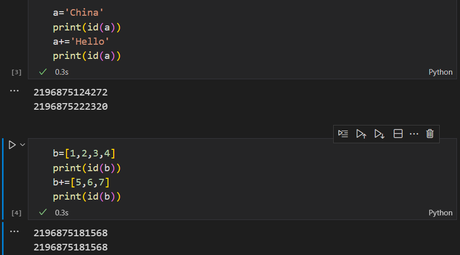

可以看到,字符串虽然值改变了,但它的引用地址也发生了变化,在内存中实际是

```python
a='China'
a->str1->'China'
a+='hello'
a->str2->'China hello'
```

而可变类型如列表不需要开辟新空间,还是曾经的引用地址

小数据池

```python
a=3
b=3
print(id(a)==id(b))
```

    True

python将-5~256的整数进行了缓存,当将这些整数赋值给变量时并不会创建新的对象

```python
a=300
b=300
print(id(a)==id(b))
```

    False

对于字符串变量,当字符串变量的长度为0或1时,也缓存

```python
a=' '
b=' '
print(id(a)==id(b))
```

    True

```python
a='a'
b='a'
print(id(a)==id(b))
```

    True

当字符串长度>1,且字符串中只有字母数字和下划线时,也会缓存

```python
a='adawFF1__aawd3444___1ffa'
b='adawFF1__aawd3444___1ffa'
print(id(a)==id(b))
```

    True

最后还有bool变量也适用小数据池

```python
a=True
b=True
print(id(a)==id(b))
```

    True

其他情况不缓存

```python
a='a '
b='a '
print(id(a)==id(b))
```

    False

##### 迭代器和生成器

生成器generator:也叫生成器函数,含有yield修饰的表达式.每次执行到yield语句时会返回一个值然后暂停或挂起后面代码的执行.下次通过生成器对象的__next__()方法,内置函数next(),for循环遍历生成器对象元素或其他方法显示'索要'数据时恢复执行.

普通函数

```python
def fun():
    i=0
    while i<10:
        print(i,end=" ")
        i=i+1
fun()
```

    0 1 2 3 4 5 6 7 8 9 

添加yield修饰变量,变成生成器

```python
def fun():
    i=0
    while i<10:
        yield i
        print('i=',i,end=" ")
        i=i+1
a=fun()
print(a)
```

    <generator object fun at 0x000001DCA95B5900>

a就是一个生成器对象

通过内置函数next()生成下一个a

```python
next(a)
next(a)
next(a)
next(a)
next(a)
```

    i= 0 i= 1 i= 2 i= 3 
    
    
    
    
    4

可以看到前三个是i=,最后一个是直接一个数字,也就是说,程序顺序执行,执行到yield时,后面的print()不执行,返回i的值,就是直接输出i,下次执行时先执行print(),所以出现了三个print()

断点调试:
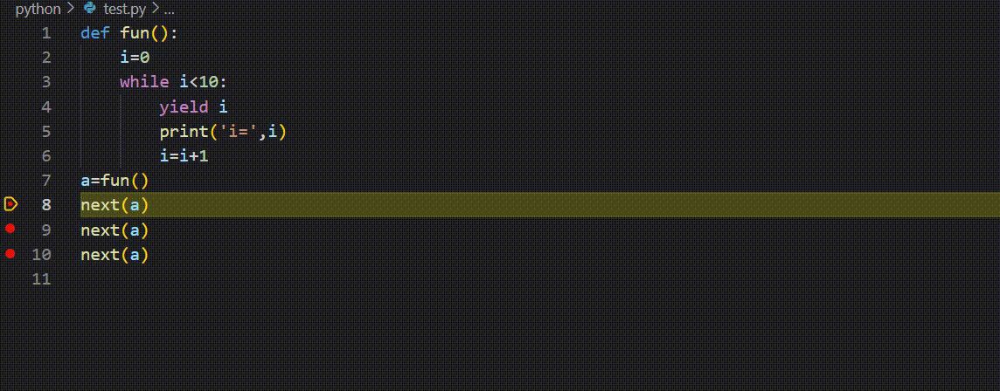

所以yield并不是return那种返回值,而是输出

或使用生成器对象方法__next__()

```python
a.__next__()
```

    i=: 4 
    
    
    
    
    5

```python
def fun():
    i=0
    while i<10:
        yield i
        i=i+1
a=fun()
```

而且可以用for遍历出来

```python
[i for i in a]
```

    [0, 1, 2, 3, 4, 5, 6, 7, 8, 9]

迭代器Iterator:是一种可作用于next()函数的对象,表示一个惰性计算的序列.
惰性计算就是执行到yield就暂停,每调用一次next,就再执行一次,不像其他函数直接执行完

可迭代类型Iterable:凡是可以作用于for循环的对象都是可迭代的,其内部实现了__iter__()函数或__getitem()__函数.list,dict,str等都是Iterable的,但不是Iterator.可以通过iter()函数来获得一个Iterator

range()对象也不是Iterator,range()实际是一个Sequence

```python
x=range(10)
type(x)
```

    range

```python
next(x)
```

    ---------------------------------------------------------------------------
    
    TypeError                                 Traceback (most recent call last)
    
    c:\Users\Tenerome\Desktop\python\lesson.ipynb Cell 35 in <cell line: 1>()
    ----> <a href='vscode-notebook-cell:/c%3A/Users/Tenerome/Desktop/python/lesson.ipynb#X61sZmlsZQ%3D%3D?line=0'>1</a> next(x)
    
    
    TypeError: 'range' object is not an iterator

在python中for语句真正的含义是迭代,while语句才是真正的循环.for类似于java中的foreach语句<br>
循环可以通过增加条件跳过不需要的元素,而迭代只能一个一个往后取数.迭代有固定的格式:for ... in ....

在for语句内部,会通过iter()方法将可迭代对象转换成迭代器,然后重复调用next()方法实现.for语句会自动捕捉StopIteration异常,并在捕捉异常后终止迭代

##### 闭包和装饰器

万物皆为对象,函数也是

```python
def fun():
    pass
print(type(fun))
```

    <class 'function'>

所有的函数都是function类的实例

①内嵌函数<br>
如果一个函数的内部还有一个函数,该如何去调用?

```python
def outer():
    print('this is outer function')
    def inner():
        print('this is inner function')
```

这样的结构是不完整的,想要调用内函数,必须在外函数内return内函数名

```python
def outer():
    print('this is outer function')
    def inner():
        print('this is inner function')
    return inner
```

```python
outer()()
```

    this is outer function
    this is inner function

这里outer()=inner
即f=outer(),f()=inner()

②闭包

如果内嵌函数使用了外函数的资源,则称内嵌函数和它引用的资源为闭包

```python
def line_conf(a):
    b=1
    def line(x):
        return a*x+b
    return line
```

```python
a=line_conf(2)
print(a(3))
```

    7

a=line_conf(2),就相当于:<br>
a(x){<br>
    return 2*x +1}

就是把外函数的参数和用到的资源都传到内函数中,返回这个内函数

如果想要在内内函数中修改用到的外函数的资源,就要用nonlocal声明

```python
def line_conf(a):
    b=1
    def line(x):
        nonlocal b
        b=3
        return a*x+b
    return line
```

```python
a=line_conf(2)
print(a(3))
```

    9

③装饰器(decorator):<br>
封闭-开放原则:封闭已经实现的功能代码块,开放对扩展开发

如现有一个函数f(),编写一个装饰器,计算f()运行时间

```python
import time
def f():
    print('Hello')
    time.sleep(1)
    print('world')
```

装饰器函数

```python
def deco(f):
    def wrapper():
        start_time=time.time()
        f()
        end_time=time.time()
        exec_time=(end_time-start_time)*1000
        print(exec_time)
    return wrapper
```

要在f()前一行添加@deco,装饰器函数名

```python
@deco
def f():
    print('Hello')
    time.sleep(1)
    print('world')
```

运行的时候可以直接用f(),系统会自动加载装饰器函数

```python
f()
```

    Hello
    world
    1004.9920082092285

带参数且有返回值装饰器,被装饰的函数有几个参数,装饰器内部的inner函数就有几个.返回值先在内函数中返回给内函数inner(),再由return inner返回给outer()

```python
def yanzheng(func):
    def inner(a,b):#func有两个参数,inner就有两个参数
        print('开始验证')
        if type(a)==int and type(b)==int:
            return func(a,b)#返回给inner()
        else:
            print('必须输入整数')
    return inner#返回给yanzheng()
@yanzheng
def add_num(a,b):
    return a+b
print(add_num(4,5))
```

    开始验证
    9

##### 赋值,深拷贝和浅拷贝

浅拷贝:copy.copy()或者用切片切出来的也是浅拷贝<br>
深拷贝:copy.deepcopy()

①不可变类型

赋值:

python中的所有赋值,都是引用赋值,类似c语言中的指针的赋值

```python
a=100
b=a
print(id(a),id(b))
```

    2491268879824 2491268879824

此时a和b指向同一个内存

```python
b=200
print(id(a),id(b))
```

    2491268879824 2491268883088

因为a,b是number类,不可原地改变,b=200,是把一个新的内存赋给了b,所以a is not b

对于不可变类型,赋值,浅拷贝,深拷贝的结果都一样:原变量改变,复制变量不变

拷贝需要导入库 copy

浅拷贝

```python
import copy
a=100
b=copy.copy(a)
print(id(a),id(b))
b=200
print(id(a),id(b))
```

    2491268879824 2491268879824
    2491268879824 2491268883088

深拷贝:

```python
import copy
a=100
b=copy.deepcopy(a)
print(id(a),id(b))
b=200
print(id(a),id(b))
```

    2491268879824 2491268879824
    2491268879824 2491268883088

总结:对于不可变类型,赋值,浅拷贝,深拷贝后指向同一个内存空间,但是改变值会指向新的空间,所以两个值互补影响

②可变类型的内部只包含简单的数据类型

赋值

```python
a=[100,200,300]
b=a
print(id(a),id(b))
a.append(400)
print(id(a),id(b))
```

    2491907542016 2491907542016
    2491907542016 2491907542016

浅拷贝

```python
import copy
a=[100,200,300]
b=copy.copy(a)
print(id(a),id(b))
a.append(400)
print(id(a),id(b))
```

    2491907815104 2491907524864
    2491907815104 2491907524864

深拷贝

```python
import copy
a=[100,200,300]
b=copy.deepcopy(a)
print(id(a),id(b))
a.append(400)
print(id(a),id(b))
```

    2491907555136 2491907692544
    2491907555136 2491907692544

总结:可变类型中只包含简单的数据类型的话,对其赋值操作,两个变量指向同一个空间,一起改变.浅拷贝和深拷贝相同都是创建了新的空间

③可变类型中还包含复杂的可变类型

赋值

```python
a=[[1,2,3],[4,5,6],7,8]
b=a
a.append(9)
print(id(a),id(b))
a[3]=100
print(id(a[3]),id(b[3]))
a[0].append(200)
print(id(a[0]),id(b[0]))
```

    2491907952960 2491907952960
    2491268879824 2491268879824
    2491907955584 2491907955584

浅拷贝

```python
a=[[1,2,3],[4,5,6],7,8]
b=copy.copy(a)
a.append(9)
print(id(a),id(b))
a[2]=100
print(id(a[2]),id(b[2]))
a[0].append(200)
print(id(a[0]),id(b[0]))
```

    2491907954624 2491908235328
    2491268879824 2491268688368
    2491907619776 2491907619776

深拷贝:

```python
a=[[1,2,3],[4,5,6],7,8]
b=a
a.append(9)
print(id(a),id(b))
a[2]=100
print(id(a[2]),id(b[2]))
a[0].append(200)
print(id(a[0]),id(b[0]))
```

    2491908213376 2491908213376
    2491268879824 2491268879824
    2491907955584 2491907955584

总结:可变类型含有可变类型时,赋值操作后指向同一块内存,深拷贝操作指向不同的内存.浅拷贝特殊,其中的不可变类型指向不同的空间,可变类型指向相同的空间

总结:<br>
赋值:不管怎么操作都指向同一空间<br>
深拷贝:不可变类型指向同一空间,可变类型指向不同空间<br><br>
浅拷贝:不可变类型指向同一空间<br>
可变类型中的不可变类型:指向不同的空间<br>
可变类型中的可变类型:指向相同的空间

记忆:赋值操作,不可变类型 和 浅拷贝可变类型中的可变类型 指向同一块空间<br>
其他都是不同的空间

##### 正则表达式

RE语法:
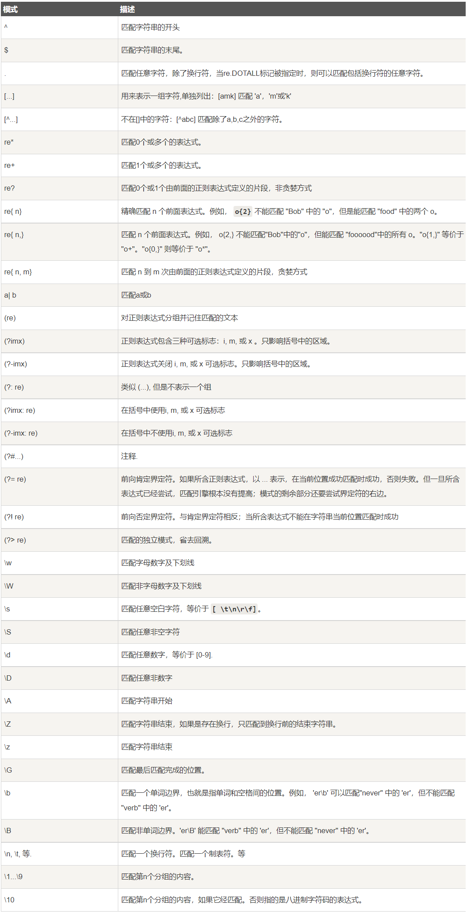

```python
import re
```

①,提取邮编

```python
s='学校邮编是:150028,请牢记150028'
p='[1-9]\d{5}'
re.search(p,s).group(0)
```

    '150028'

p:[1-9]第一个字符,是1-9的任意一个字符,因为邮编不能以0开始<br>
\d:表示任意数字,0-9任意一个字符<br>
{5}:重复5次<br>
所以它匹配的是以1-9开始的六位数字

re.search(pattern,string,flag=0),pattern正则语法.<br>
re.search()方法扫描整个string,并返回第一个成功匹配的对象.如果匹配失败,则返回none.成功匹配后返回一个re.match对象,可以通过对象的group()获得匹配结果,如果pattern指定要返回多个结果,可以通过group(num)获取不同的匹配位置

re.match和re.search的区别:<br>
re.search并不要求从字符串开头进行匹配,re.match必须从开头匹配,若开头匹配失败,整个就失败了,返回none

```python
print(re.match(p,s))
```

    None

②,提取python,cython,jython

```python
s='python的解释器包括cython,jython等'
p='.*([cjp]ython).*([cjp]ython).*([cjp]ython).*'
m=re.search(p,s)
print(m.groups())
for i in range(1,4):
    print(m.group(i))
```

    ('python', 'cython', 'jython')
    python
    cython
    jython

p='.\*([cjp]ython).\*([cjp]ython).\*([cjp]ython).\*'<br>
.表示任意字符,*表示任意个,所以就把句子中的所有ython提取出来了<br>
groups()返回一个元组,group(num)返回第num个匹配字符串

第二种方法:使用re.findall(p,s):

```python
s='python的解释器包括cython,jython等'
p='[cjp]ython'
l=re.findall(p,s)
print(l)
```

    ['python', 'cython', 'jython']

re.findall()和search的区别就是search只返回第一个匹配结果,所以想匹配多个要重复多次模式.findall()就是返回所有的匹配对象,且返回结果是一个列表

用r''形式的字符串,中的\不转义

③,提取姓名和电话

```python
s='''
张三,手机号码13945678823
李四,手机号码18943215634
王五,手机号码12456236671
'''
p=re.compile(r'^(.+),.+(\d{11})',re.M)
for i in p.findall(s):
    print(i)
```

    ('张三', '13945678823')
    ('李四', '18943215634')
    ('王五', '12456236671')

re.compile(pattern,flag)方法将正则表达式编译为re.pattern对象,flag参数指定匹配方式,常见标志有:<br>
1,re.I:忽略大小写<br>
2,re.M多行匹配:当pattern中出现^和$时,默认匹配第一行最开始和最后一行的末尾,如果想让^和&匹配每一行的开始和末尾,则需要加上re.M<br>
3,re.S :使pattern中.匹配任意字符,包括换行,常配合(.*?)

python用''' .....'''定义多行字符串

r'^(.+),.+(\d{11})':<br>
^表示从开头,re.M表示每一行都从开头匹配<br>
():表示要匹配的内容
.:任意字符,+表示任意1和或多个字符,*表示0个或多个<br>
所以^(.+), :表示从开头到,之间的字符,且不能为空<br>
接着.+表示任意字符,(\d)表示要匹配的是数字,{11}表示重复11次

re.I忽略大小写

```python
s='abc,Abc,aBC,ABC,aabc'
re.findall('abc',s,re.I)
```

    ['abc', 'Abc', 'aBC', 'ABC', 'abc']

④,非贪婪匹配(.*?)

```python
import re
s='''
abc,c
Abc,abc,ABC
Harbin University of Commerce
'''
print(re.findall('a(.*)c',s))
print(re.findall('a(.*?)c',s))
```

    ['bc,', 'b', 'rbin University of Commer']
    ['b', 'b', 'rbin University of Commer']

a(.*)c默认贪婪匹配,当第一行abc,c的a匹配到时,它会从后面匹配c,使中间的.\*尽可能更长.<br>
?表示非贪婪匹配,匹配到a后继续向后搜索,遇到第一个c就返回

re.findall()默认从第一行第1个字符到最后一行最后一个字符进行全文搜索,不需要用re.M

⑤,去除字符串中的重复项

```python
s="It's a very good good goood idea"
#可以用set集合的不重复性
' '.join(set(s.split()))
```

    "idea It's goood a good very"

但是集合还有一个无序性,所以输出是无序的

用re.sub(pat,repl,string):将字符串中所有与pat匹配的项用repl替换,返回新的字符串.

```python
re.sub(r'(\b\w+\s)\1+',r'\1',s)
```

    "It's a very good goood idea"

\b表示边界,\w任意字母数字下划线,\s表示空格,(\b\w\s)\1,这个\1是重复前面()的内容,+表示一次或多次,所以第一个参数就是用来匹配重复的项的:good good good,然后用第二个参数替换.

\num表示第num个括号匹配的内容,如'.\*([hv]ello).\*([cb]nmk).*'<br>
\1就表示[hv]ello,\2表示[cb]nmk

⑥匹配字符串中的汉字

```python
s="not 404 found 33.4 张三 99 哈尔滨"
s=re.sub('\d+\.?\d*|[a-zA-Z]+','',s)
s=s.split()
res=' '.join(s)
print(res)
```

    张三 哈尔滨

用sub匹配到所有数字和单词,并用null,""替换.<br>
\d任意数字,+正闭包,一个或多个;  .?0个或1个点,就能匹配整数和小数;\d*,0个或多个数字,就能匹配所有的整数和小数<br>
然后|上所有字母组成的单词,就只剩汉字了

string.join(iterable),将string插入序列s除了第一个和最后一个元素之间,然后返回join之后的字符串.

⑦分割字符串

```python
s="info:zhangsan 22 Harbin"
re.split(':|\s',s)
```

    ['info', 'zhangsan', '22', 'Harbin']

re.split()的第一个参数是分隔的符号,默认空格,这里指定:或空格

⑧列表元素的匹配

```python
email_list=['xiaodaaw@163.com','xiddddaodaaw@163.comaaa','xiaodaaw@qq.com','xiaodaaw@163.ccom']
p='\w+@163\.com$'
def email_check(x):
    if re.match(p,x):
        return True
res=filter(email_check,email_list)
print(list(res))
```

    ['xiaodaaw@163.com']

或用lambda表达式

```python
email_list=['xiaodaaw@163.com','xiddddaodaaw@163.comaaa','xiaodaaw@qq.com','xiaodaaw@163.ccom']
p='\w+@163\.com$'
res=filter(lambda x: re.match(p,x),email_list)
print(list(res))
```

    ['xiaodaaw@163.com']

⑨匹配中文

```python
s='你好,hello,2022,好的'
p=re.compile('[\u4e00-\u9fa5]+')
res=p.findall(s)
print(res)
```

    ['你好', '好的']

\u4e00-\u8fa5是unicode所有的中文

##### 全局解释器锁GIL

GIL:全局解释器锁,当多个线程并行执行时,每个线程在执行前都要先获取GIL锁,保证同一时刻只有一个python线程在运行,目的时解决多线程同时竞争程序中的全局变量而出现的线程安全问题.

所以在python中的多线程执行效率会被GIL大大限制

在过去单核及其上,不能真正的并行,而是并发处理的,所以会有资源竞争问题,也就有了GIL锁,现在的机器都是多线程的了,但GIL仍存在与cpython解释器中.想要使用python多线程,就要想办法绕过GIL

释放GIL的情况:<br>
1,在IO操作等可能会引起阻塞的system call之前,可以暂时释放GIL锁,但在执行完毕后,必须重新获取锁<br>
2,python 3.x使用计时器,执行时间达到阈值后,当前线程释放GIL锁.或python2中,tickets计数达到100时,释放GIL锁

解决GIL问题的方案:<br>
1,使用其他语言:c,java等<br>
2,使用其他解释器,如java的jython<br>
3,使用多进程,python中的多进程是可以利用cpu资源的

虽然有GIL限制,多线程爬取还是比单线程性能高的,因为遇到IO阻塞时会自动释放GIL锁

##### 线程

进程,线程和协程的区别:<br>
(1)进程是资源分配的单位,线程是操作系统系统任务调度的单位,协程是1个线程内的多任务<br>
(2)进程之间不共享全局变量,线程和协程可以共享全局变量<br>
(3)计算密集型任务适合多进程,I/O密集型任务适合多线程或多协程<br>
(4)进程消耗资源大,线程消耗资源少,协程消耗资源最少<br>
(5)使用线程池或进程池可以提高效率减少资源消耗

①单线程-顺序执行方式

```python
import time 
def sing():
    for i in range(3):
        print("唱歌")
        time.sleep(1)
def dance():
    for i in range(3):
        print("跳舞")
        time.sleep(1)
if __name__=='__main__':
    start_time=time.perf_counter()
    sing()
    dance()
    end_time=time.perf_counter()
    print('total time is {}'.format(end_time-start_time))
```

    唱歌
    唱歌
    唱歌
    跳舞
    跳舞
    跳舞
    total time is 6.0794796

计算程序执行时间的几种方式:  
time.time()会将sleep()的时间也算进去  
time.perf_counter() 具有最高可用分辨率的时钟,包含sleep()时间,适合测量短持续时间  
time.process_time()不包括sleep()时间,其他与time.perf_counter类似  
此外python3.7后提供了三个方法精确到纳秒的计时:  
time.perf_counter_ns()  
time.time_ns()  
time.clock()  

②多线程

```python
import time 
import threading
def sing():
    for i in range(3):
        print("唱歌")
        time.sleep(1)
def dance():
    for i in range(3):
        print("跳舞")
        time.sleep(1)
if __name__=='__main__':
    start_time=time.perf_counter()
    t1=threading.Thread(target=sing)
    t2=threading.Thread(target=dance)
    t1.start()
    t2.start()
    end_time=time.perf_counter()
    print(f'total time is {end_time-start_time}')
```

    唱歌
    跳舞
    total time is 0.0035195000000385335
    跳舞唱歌
    
    跳舞唱歌

t1=threading.Thread(),在主线程下创建子线程t1  
target=sing,为子线程t1分配任务sing  
t1.start()开启子线程
运行程序,主线程开始执行,执行到t1,t2start(),创建子线程,接着主线程继续执行,输出了执行时间,主线程的代码执行完毕,但程序并不结束,而是等待子线程t1,t2执行,t1,t2执行完剩下的迭代,程序结束  
如图示

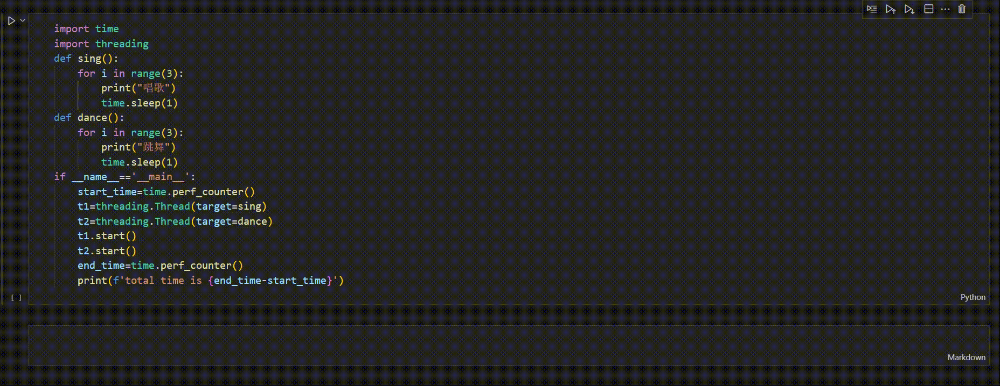

主线程执行完,若子线程未执行完,主线程会等待子线程结束后才退出程序  
子线程是因为sleep()才晚于主线程,如果没有slee()

```python
import time 
import threading
def sing():
    for i in range(3):
        print("唱歌")
        # time.sleep(1)
def dance():
    for i in range(3):
        print("跳舞")
        # time.sleep(1)
if __name__=='__main__':
    start_time=time.perf_counter()
    t1=threading.Thread(target=sing)
    t2=threading.Thread(target=dance)
    t1.start()
    t2.start()
    end_time=time.perf_counter()
    print(f'total time is {end_time-start_time}')
```

    唱歌
    唱歌
    唱歌
    跳舞
    跳舞
    跳舞
    total time is 0.00368129999969824

或者给主线程加上等待时间,也能看到并发执行完

```python
import time 
import threading
def sing():
    for i in range(3):
        print("唱歌")
        time.sleep(1)
def dance():
    for i in range(3):
        print("跳舞")
        time.sleep(1)
if __name__=='__main__':
    start_time=time.perf_counter()
    t1=threading.Thread(target=sing)
    t2=threading.Thread(target=dance)
    t1.start()
    t2.start()
    time.sleep(4)
    end_time=time.perf_counter()
    print(f'total time is {end_time-start_time}')
```

    唱歌
    跳舞
    跳舞唱歌
    
    跳舞唱歌
    
    total time is 4.0054009999998925

 统计多线程运行时间的正确方法:  

```python
import time 
import threading
def sing():
    for i in range(3):
        print("唱歌")
        time.sleep(1)
def dance():
    for i in range(3):
        print("跳舞")
        time.sleep(1)
if __name__=='__main__':
    start_time=time.perf_counter()
    t1=threading.Thread(target=sing)
    t2=threading.Thread(target=dance)
    t1.start()
    t2.start()
    t1.join()
    t2.join()
    end_time=time.perf_counter()
    print(f'total time is {end_time-start_time}')
```

    唱歌
    跳舞
    跳舞
    唱歌
    唱歌跳舞
    
    total time is 3.041722899999968

join函数会等待子线程结束,或者说要判断汇合点,都汇合后主线程才继续执行

③统计线程数 (在独立文件中运行)  

```python
import threading
import time

#查看线程数
def sing():
    for i in range(3):
        print("唱歌")
        time.sleep(1)
def dance():
    for i in range(3):
        print("跳舞")
        time.sleep(1)
if __name__=='__main__':
    sing_t=threading.Thread(target=sing)
    dance_t=threading.Thread(target=dance)
    sing_t.start()
    dance_t.start()

    while True:
        length=len(threading.enumerate())
        print('当前运行的线程数为:%d' %length)
        time.sleep(2)
        if length <=1:
            print("主线程运行结束")
            input()
            break
```

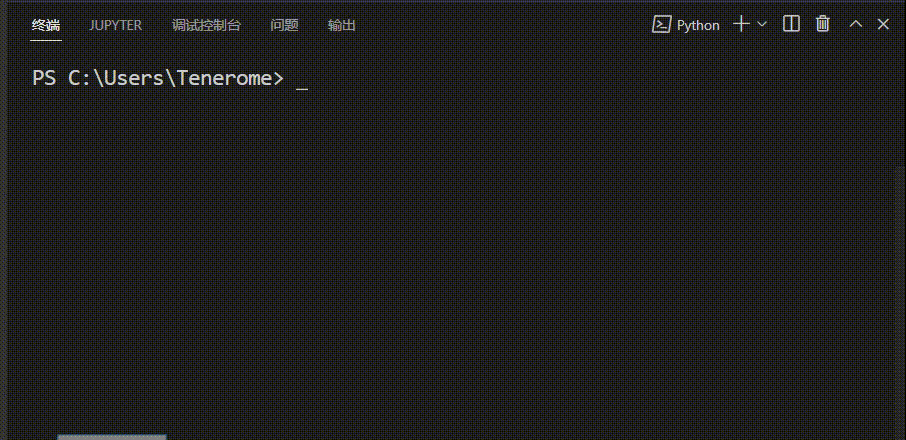

④线程类  
除了通过Threading.Thread()函数创建线程对象外,话可以通过继承threading.Thread类在类中创建多个函数

Thread派生类中必须由一个run()函数

```python
class MyThread(threading.Thread):
    def run(self):
        for i in range(5):
            time.sleep(1)
            print("线程名:%s" %(self.name + "-"+str(i)))
if __name__=="__main__":
    threads=[]
    for i in range(3):
        t=MyThread()
        threads.append(t)
    for t in threads:
        t.start()
```

    线程名:Thread-69-0
    线程名:Thread-68-0
    线程名:Thread-70-0
    线程名:Thread-70-1
    线程名:Thread-68-1
    线程名:Thread-69-1
    线程名:Thread-70-2线程名:Thread-69-2
    线程名:Thread-68-2
    
    线程名:Thread-69-3线程名:Thread-70-3
    线程名:Thread-68-3
    
    线程名:Thread-69-4线程名:Thread-70-4
    线程名:Thread-68-4

三个线程分别是Thread-41,40,39.分别做输出0-4的任务,三个线程并发执行,看着是同时执行的,实际是cpu快速切换,如果给线程执行后添加sleep(),就能看到实际还是一次只有一个线程执行

```python
class MyThread(threading.Thread):
    def run(self):
        for i in range(5):
            time.sleep(1)
            print("线程名:%s" %(self.name + "-"+str(i)))
if __name__=="__main__":
    threads=[]
    for i in range(3):
        t=MyThread()
        threads.append(t)
    for t in threads:
        t.start()
        time.sleep(6)#要让线程等待的时间大于每个线程的总执行时间,即6>5*1
```

    线程名:Thread-79-0
    线程名:Thread-79-1
    线程名:Thread-79-2
    线程名:Thread-79-3
    线程名:Thread-79-4
    线程名:Thread-80-0
    线程名:Thread-80-1
    线程名:Thread-80-2
    线程名:Thread-80-3
    线程名:Thread-80-4
    线程名:Thread-81-0
    线程名:Thread-81-1
    线程名:Thread-81-2
    线程名:Thread-81-3
    线程名:Thread-81-4

⑤守护线程  
如果一个线程别设置为守护线程,那么意味着这个线程是不重要的.如果主线程结束了,守护线程还没有运行完,那么它会被强制结束,在python中可以使用setDaemon方法来将某个线程设置为守护线程  
(复制到独立文件运行)

```python
from threading import Thread
import time
def sayhi(name):
    time.sleep(2)
    print("%s say hello" %name)
    input()
if __name__=="__main__":
    t=Thread(target=sayhi,args=('Tom',))#传参数是用元组传的
    t.setDaemon(True)
    t.start()
    print("主线程")
    print(t.is_alive())
```

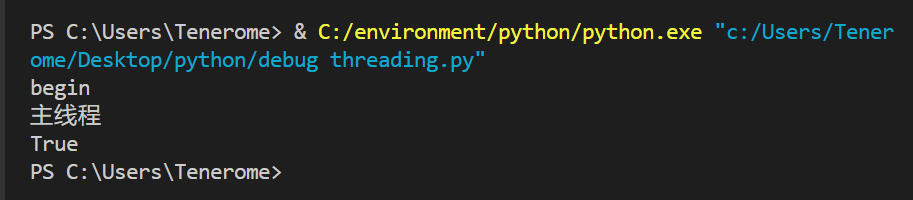

可以看到,程序开始执行,创建子线程t,子线程t启动并打印begin,然后休眠2秒,同时主线程打印"主线程",并输出子线程的状态仍alive,主线程结束,子线程也被结束掉了

⑥线程共享全局变量

```python
from concurrent.futures import thread
import threading
import time
num=100
def test1():
    global num
    num+=100
def test2():
    print("num=",num)
if __name__=="__main__":
    t1=threading.Thread(target=test1)
    t2=threading.Thread(target=test2)
    t1.start()
    time.sleep(2)
    t2.start()
    time.sleep(1)
    print("num=",num)
```

    num= 200
    num= 200

⑦实例

```python
import threading
import time
import requests
#spyder
url_start='http://xinwen.hrbcu.edu.cn/jxky.htm'
urls=[f'http://xinwen.hrbcu.edu.cn/jxky{i}.htm' for i in range(7,0,-1)]
urls.insert(0,url_start)

def craw(url):
    r=requests.get(url)
    print(url,len(r.text))
#单线程
def single_t():
    print("单线称爬取")
    for url in urls:
        craw(url)
#多线程爬取
def multi_t():
    print("多线程爬取")
    threads=[]
    for url in urls:
        threads.append(threading.Thread(target=craw,args=(url,)))
    for thread in threads:
        thread.start()
    for thread in threads:
        thread.join()
#main
if __name__=="__main__":
    start_time=time.time()
    single_t()
    end_time=time.time()
    print("单线程爬取总时间:",end_time-start_time)

    start_time=time.time()
    multi_t()
    end_time=time.time()
    print("多线程爬取总时间:",end_time-start_time)
```

    单线称爬取
    http://xinwen.hrbcu.edu.cn/jxky.htm 28180
    http://xinwen.hrbcu.edu.cn/jxky7.htm 1693
    http://xinwen.hrbcu.edu.cn/jxky6.htm 1693
    http://xinwen.hrbcu.edu.cn/jxky5.htm 1693
    http://xinwen.hrbcu.edu.cn/jxky4.htm 1693
    http://xinwen.hrbcu.edu.cn/jxky3.htm 1693
    http://xinwen.hrbcu.edu.cn/jxky2.htm 1693
    http://xinwen.hrbcu.edu.cn/jxky1.htm 1693
    单线程爬取总时间: 0.7621386051177979
    多线程爬取
    http://xinwen.hrbcu.edu.cn/jxky6.htm 1693
    http://xinwen.hrbcu.edu.cn/jxky5.htm 1693
    http://xinwen.hrbcu.edu.cn/jxky7.htm 1693
    http://xinwen.hrbcu.edu.cn/jxky4.htm 1693
    http://xinwen.hrbcu.edu.cn/jxky3.htm 1693
    http://xinwen.hrbcu.edu.cn/jxky1.htm 1693
    http://xinwen.hrbcu.edu.cn/jxky2.htm 1693
    http://xinwen.hrbcu.edu.cn/jxky.htm 28180
    多线程爬取总时间: 0.18289875984191895

##### 进程

```python
#在独立文件中运行
import multiprocessing
import time
def sing():
    for i in range(3):
        print("唱歌")
        time.sleep(1)
def dance():
    for i in range(3):
        print("跳舞")
        time.sleep(1)
if __name__=="__main__":
    start_time=time.perf_counter()
    processes=[]
    p1=multiprocessing.Process(target=sing)
    p2=multiprocessing.Process(target=dance)
    processes.extend([p1,p2])
    for p in processes:
        p.start()
    for p in processes:
        p.join()
    end_time=time.perf_counter()
    print("total time is ",end_time-start_time)
    input()
```

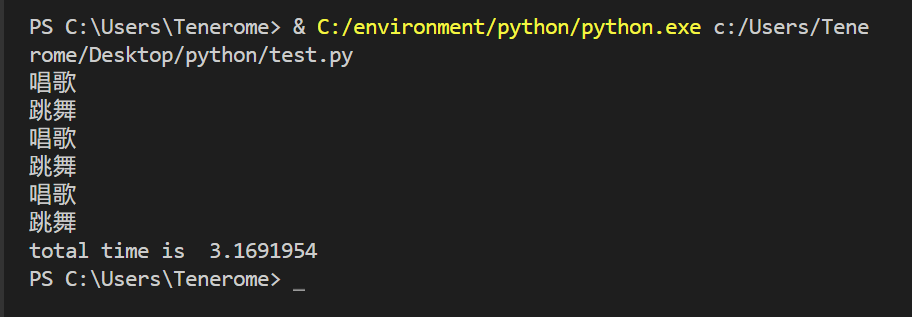

①通过多进程演示计算密集型任务以及进程池

语法方面和线程差不多

```python
#判断是否为素数
import math
import time
import numpy as np

def run_time(f):
    def inner():
        start=time.time()
        f()
        end=time.time()
        print('执行时间为%.3f ms'%((end-start)*1000))
    return inner

def is_prime(n):
    if n<2:
        return False
    if n==2:
        return True
    if n%2==0:
        return False
    sqrt_n=math.floor(math.sqrt(n))
    for i in range(3,sqrt_n+1,2):
        if n%i==0:
            return False
    return True

data=np.random.randint(1e8,1e9,100)

#单线程
@run_time
def single_thread():
    for i in data:
        is_prime(i)
print("单线程",end="")
single_thread()

#多线程
import threading
@run_time
def multi_threads():
    threads=[]
    for i in data:
        t=threading.Thread(target=is_prime,args=(i,))
        threads.append(t)
    for t in threads:
        t.start()
    for t in threads:
        t.join()
print("多线程",end="")
multi_threads()

#多进程
import multiprocessing
@run_time
def multi_processes():
    processes=[]
    for i in data:
        p=multiprocessing.Process(target=is_prime,args=(i,))
        processes.append(p)
    for p in processes:
        p.start()
    for p in processes:
        p.join()

if __name__=='__main__':
    print("多进程",end="")
    multi_processes()
```

    单线程执行时间为7.996 ms
    多线程执行时间为38.205 ms
    多进程执行时间为1405.988 ms

计算密集型任务,多线程比单线慢,因为多线程会交换使用GIL锁,而多进程更慢,因为进程的资源开销比线程大很多

传统进程池

```python
#在独立文件中运行
from multiprocessing import Pool
@run_time
def pool_multi_processes():
    pool=Pool(processes=4)
    for i in data:
        pool.apply_async(is_prime,(i,))
    pool.close()
    pool.join()

if __name__=='__main__':
    print("进程池",end="")
    pool_multi_processes()
```

进程池执行时间为437.055 ms

进程池的定义用Pool(),并可以用参数processes指定核心数.然后使用apply_async(func,args)来分配任务.进程池使用完需要关闭close(),最后一步的join()是等待pool中的所有进程执行完毕,才能继续后面的操作,它必须放在close()后面

新版进程池

```python
from concurrent.futures import ThreadPoolExecutor,ProcessPoolExecutor
@run_time
def multi_process():
    with ProcessPoolExecutor(max_workers=4) as pool:
        pool.map(is_prime,data)
print("新版进程池",end="")
multi_process()
```

    新版进程池执行时间为198.224 ms

新版线程池

```python
@run_time
def multi_thread():
    with ThreadPoolExecutor() as pool:
        pool.map(is_prime,data)
print("线程池",end="")
multi_thread()
```

    线程池执行时间为18.909 ms

##### 协程Coroutine

协程:可以在一个子程序中 中断,去执行其他子程序.这和函数调用不同,因为不会用到栈,而是类似cpu中断  
比如A,B两个函数

```python
def A():
    print('1')
    print('2')
    print('3')
def B():
    print('x')
    print('y')
    print('z')
```

假设由协程执行,在执行A的过程中,可以随时中断去执行B,B也可能在执行中随时中断,去执行A,就可能是这样的结果  
1 2 x y 3 z

这样看起来有点像多线程并发的结果,但协程是在一个线程中实现的.协程的资源消耗很少,而且没有多线程下的锁机制

在python中,协程是通过生成器实现的

①非协程方式的函数调用

```python
import time
def test1():
    print("1",end=" ")
    time.sleep(1)
def test2():
    print("2",end=" ")
    time.sleep(1)
def main():
    for i in range(5):
        test1()
        test2()
main()
```

    1 2 1 2 1 2 1 2 1 2 

②使用生成器实现协程,函数内部通过yield语句实现"让出执行权"操作.与多线程相比,线程遇到I/O操作时会自动进行线程切换,线程切换是通过yield实现的.所以生成器实现的协程是一种半自动的协程

```python
import time
def test1():
    while True:
        print("1",end=" ")
        yield()
def test2():
    while True:
        print("2",end=" ")
        yield()
def main():
    t1=test1()
    t2=test2()
    for i in range(5):
        next(t1)
        next(t2)
main()
```

    1 2 1 2 1 2 1 2 1 2 

此时还是手动切换的程序,对yield进一步封装,可以使用第三方库greenlet实现协程,也可以对greenlet进一步封装,使用gevent库  
使用gevent库实现多协程

②

gevent:  
通过gevent实现coroutine.创建,调度的开销比线程小,执行效率高.gevent实现了python标准库中一些阻塞库的非阻塞版本:socket,os,select等.基本思想是:当一个greenlet遇到IO操作时,比如访问网络,就自动切换其他greenlet,等到IO操作完成,再适当的时候切回来继续执行.

gevent常用方法:  
gevent.spawn()创建一个greenlet对象  
gevent.getcurrent()返回当前正在执行的greenlet对象  
monkey.patch_all(),猴子补丁,会自动将python的一些标准模块替换成gevent的非阻塞版本  
gevent.join() 汇合语句,等待协程结束
gevent.joinall(greenlets):将多个greenlet对象放入列表中批量执行,相当于调用多次spawn和join

```python
import time
def run_time(f):
    def inner():
        start=time.time()
        f()
        end=time.time()
        print('执行时间为%.3f ms'%((end-start)*1000))
    return inner
```

```python
import gevent
def f(n):
    for i in range(n):
        print(gevent.getcurrent(),i)
        gevent.sleep(0.5)
```

gevent.sleep()执行到这自动进行协程切换

```python
@run_time
def gevent_test():
    print('1')
    g1=gevent.spawn(f,5)
    print('2')
    g2=gevent.spawn(f,5)
    print('3')
    g3=gevent.spawn(f,5)
    g1.join()
    g2.join()
    g3.join()
if __name__=="__main__":
    gevent_test()
```

    1
    2
    3
    <Greenlet at 0x26cf1556bf0: f(5)> 0
    <Greenlet at 0x26cf1556e10: f(5)> 0
    <Greenlet at 0x26cf19da040: f(5)> 0
    <Greenlet at 0x26cf1556bf0: f(5)> 1
    <Greenlet at 0x26cf1556e10: f(5)> 1
    <Greenlet at 0x26cf19da040: f(5)> 1
    <Greenlet at 0x26cf1556bf0: f(5)> 2
    <Greenlet at 0x26cf1556e10: f(5)> 2
    <Greenlet at 0x26cf19da040: f(5)> 2
    <Greenlet at 0x26cf1556bf0: f(5)> 3
    <Greenlet at 0x26cf1556e10: f(5)> 3
    <Greenlet at 0x26cf19da040: f(5)> 3
    <Greenlet at 0x26cf1556bf0: f(5)> 4
    <Greenlet at 0x26cf1556e10: f(5)> 4
    <Greenlet at 0x26cf19da040: f(5)> 4
    执行时间为2549.958 ms

正常执行至少7.5s,使用协程后只需2.5s

③猴子补丁

猴子补丁:运行时打补丁,对于某模块,使用时像修改其中某几个功能,在不修改其源码和调用方式的前提下,把这几个功能替换为使用者自定义的功能,这就叫打上猴子补丁  
例如开发初期使用的时import json,后来发现ujson性能更高,如果把每个文件的import json都改成import ujson as json成本较高,只需要在进程入口加上  

```python
import json
import ujson

def monkey_path_json():
    json.__name__='ujson'
    json.dumps=ujson.dumps
    json.loads=ujson.loads
```

给程序打补丁monkey.path_all(),猴子补丁可以让gevent替换那些标准库中造成阻塞调用的标准库,(比如socket,os,select等)替换为gevent自己实现,不需要改动原来的代码即可变为非阻塞

```python
import gevent
import time
from gevent import monkey
monkey.patch_all()

def run_time(f):
    def inner():
        start=time.time()
        f()
        end=time.time()
        print('执行时间为%.3f ms'%((end-start)*1000))
    return inner

def f(n):
    for i in range(n):
        print(gevent.getcurrent(),i)
        time.sleep(0.5)#time.sleep()会被自动替换成gevent.sleep()

@run_time
def gevent_test():
    print('1')
    g1=gevent.spawn(f,5)
    print('2')
    g2=gevent.spawn(f,5)
    print('3')
    g3=gevent.spawn(f,5)
    g1.join()
    g2.join()
    g3.join()
if __name__=="__main__":
    gevent_test()
```

#### python机器学习

##### 用KNN算法实现鸢尾花分类

###### 数据处理

导库

```python
import numpy as np
import pandas as pd
import matplotlib.pyplot as plt
from sklearn.datasets import load_iris#鸢尾花数据集
import seaborn as sns#也用来绘图
from sklearn.model_selection import train_test_split#用来划分训练集和测试你集
from sklearn.preprocessing import StandardScaler#标准化处理
from sklearn.neighbors import KNeighborsClassifier#KNN算法
```

导入数据,分析数据

```python
iris=load_iris()
data=pd.DataFrame(iris.data)#得到data和target,都是一个numpy二维数组
target=pd.DataFrame(iris.target)
df=pd.concat((data,target),axis=1)#把data和target合并
df.columns=['sl','sw','pl','pw','target']#设置列名
df
```

<style scoped>
 .dataframe tbody tr th:only-of-type {
 vertical-align: middle;
 }

```
.dataframe tbody tr th {
    vertical-align: top;
}

.dataframe thead th {
    text-align: right;
}
```

</style>

|     | sl  | sw  | pl  | pw  | target |
| --- | --- | --- | --- | --- | ------ |
| 0   | 5.1 | 3.5 | 1.4 | 0.2 | 0      |
| 1   | 4.9 | 3.0 | 1.4 | 0.2 | 0      |
| 2   | 4.7 | 3.2 | 1.3 | 0.2 | 0      |
| 3   | 4.6 | 3.1 | 1.5 | 0.2 | 0      |
| 4   | 5.0 | 3.6 | 1.4 | 0.2 | 0      |
| ... | ... | ... | ... | ... | ...    |
| 145 | 6.7 | 3.0 | 5.2 | 2.3 | 2      |
| 146 | 6.3 | 2.5 | 5.0 | 1.9 | 2      |
| 147 | 6.5 | 3.0 | 5.2 | 2.0 | 2      |
| 148 | 6.2 | 3.4 | 5.4 | 2.3 | 2      |
| 149 | 5.9 | 3.0 | 5.1 | 1.8 | 2      |

150 rows × 5 columns

```python
target_names=iris.target_names#获取target标签,用于标志
target_names
```

```
array(['setosa', 'versicolor', 'virginica'], dtype='<U10')
```

```python
df.corr()#列出比尔森相关系数
```

<style scoped>
 .dataframe tbody tr th:only-of-type {
 vertical-align: middle;
 }

```
.dataframe tbody tr th {
    vertical-align: top;
}

.dataframe thead th {
    text-align: right;
}
```

</style>

|        | sl        | sw        | pl        | pw        | target    |
| ------ | --------- | --------- | --------- | --------- | --------- |
| sl     | 1.000000  | -0.117570 | 0.871754  | 0.817941  | 0.782561  |
| sw     | -0.117570 | 1.000000  | -0.428440 | -0.366126 | -0.426658 |
| pl     | 0.871754  | -0.428440 | 1.000000  | 0.962865  | 0.949035  |
| pw     | 0.817941  | -0.366126 | 0.962865  | 1.000000  | 0.956547  |
| target | 0.782561  | -0.426658 | 0.949035  | 0.956547  | 1.000000  |

###### 数据可视化

①饼图

```python
plt.rcParams['font.sans-serif'] = ['SimHei']#用plt.rcParams设置字体
counts=df['target'].value_counts() #返回结果按频数从大到小排列
x=[counts.iloc[0],counts.iloc[1],counts.iloc[2]]
labels=[target_names[0],target_names[1],target_names[2]]
colors=['yellowgreen','gold','#FF0000']
explode=(0,0,0.1)
plt.pie(x,explode=explode,labels=labels,colors=colors,autopct="%1.2f%%",startangle=90)
plt.title('各种鸢尾花所占比例')#fontpreperties已弃用
plt.axis('equal')
plt.show()
```

②用seaborn库绘图

盒图

iloc切换,第一个参数表示行,:表示所有行,第二个参数表示列,:4=0:4也就是第0-3列

```python
sns.boxplot(data=df.iloc[:,:4])
plt.show()
sns.boxplot(x=df['target'],y=df['sl'])
plt.show()
```

小提琴图

```python
ax=sns.violinplot(data=df.iloc[:,:4])
ax.set_title('四个特征值的分布情况')
plt.show()
```

###### 数据预处理

①分割训练集和测试集

```python
x_train,x_test,y_train,y_test=train_test_split(data,target,test_size=0.25 ,
random_state=0)
```

有时还会分割出验证集  
 test_size=0.25 :指定测试集占25%,训练集就占75%  
random_state=0 :指定了随机种子,这样每次产生的训练集和测试集元素固定  
由于data,target均为DAtaFrame,所以x_train,x_test,y_train,y_test都是DataFrame,且y_train和y_test的秩为2

②对训练集和测试的特征数据进行标准化(标准化不一定是必须的)

```python
ss=StandardScaler()
x_train=ss.fit_transform(x_train)#求x_train的均值和标准差,然后转换数据
x_test=ss.transform(x_test)
```

ss.transform 用上一步算得的x_train的均值和标准差,来对x_test数据进行标准化.

③定义模型,进行训练

```python
knn=KNeighborsClassifier(n_neighbors=5)
knn.fit(x_train,y_train)
y_predict=knn.predict(x_test)
print(y_predict)
```

```
[2 1 0 2 0 2 0 1 1 1 2 1 1 1 1 0 2 1 0 0 2 1 0 0 2 0 0 1 1 0 2 1 0 2 2 1 0
 2]


c:\environment\python\lib\site-packages\sklearn\neighbors\_classification.py:207: DataConversionWarning: A column-vector y was passed when a 1d array was expected. Please change the shape of y to (n_samples,), for example using ravel().
  return self._fit(X, y)
```

提示了knnfit()的第二个参数要求是1个1维numpy数组,但传入的y_train是一个2维数组的DataFrame,可以使用y_train.values.ravel()

```python
knn.fit(x_train,y_train.values.ravel())
y_predict=knn.predict(x_test)
print(y_predict)
```

```
[2 1 0 2 0 2 0 1 1 1 2 1 1 1 1 0 2 1 0 0 2 1 0 0 2 0 0 1 1 0 2 1 0 2 2 1 0
 2]
```

④结果评估

方法1:使用模型自带的评估函数进行准确性测评

```python
print(knn.score(x_test,y_test))
```

```
0.9473684210526315
```

方法2:使用sklearn.metrics李的classification_report模块对预测结果做更详细的分析

```python
from sklearn.metrics import classification_report
print(classification_report(y_test,y_predict,target_names=target_names))
```

```
              precision    recall  f1-score   support

      setosa       1.00      1.00      1.00        13
  versicolor       1.00      0.88      0.93        16
   virginica       0.82      1.00      0.90         9

    accuracy                           0.95        38
   macro avg       0.94      0.96      0.94        38
weighted avg       0.96      0.95      0.95        38
```

方法3:使用混淆矩阵查看分类结果

```python
from sklearn.metrics import confusion_matrix
cm=confusion_matrix(y_test,y_predict)
print(cm)
```

```
[[13  0  0]
 [ 0 14  2]
 [ 0  0  9]]
```

把y_test,y_predict合并在一块观察

```python
np.hstack((y_test.values,y_predict.reshape(-1,1)))
```

```
array([[2, 2],
       [1, 1],
       [0, 0],
       [2, 2],
       [0, 0],
       [2, 2],
       [0, 0],
       [1, 1],
       [1, 1],
       [1, 1],
       [2, 2],
       [1, 1],
       [1, 1],
       [1, 1],
       [1, 1],
       [0, 0],
       [1, 2],
       [1, 1],
       [0, 0],
       [0, 0],
       [2, 2],
       [1, 1],
       [0, 0],
       [0, 0],
       [2, 2],
       [0, 0],
       [0, 0],
       [1, 1],
       [1, 1],
       [0, 0],
       [2, 2],
       [1, 1],
       [0, 0],
       [2, 2],
       [2, 2],
       [1, 1],
       [0, 0],
       [1, 2]])
```
