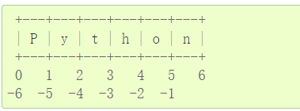

### pre

下载配置python3.9.0

直接在cmd或者powershell中输入python.exe进去交互模式，输入文件结束符 结束输入，win下:Ctrl +z ,linux 下Ctrl + d。推出状态码为0。

设置编码方式

```python
# -*- coding: utf-8 -*-
```

注释:用#

支持四则等运算，+，-，\*，\*\*,/,//,%

其中 / 返回浮点数，//返回整数

\*\*表示乘方，如2 \*\*3=8

用=表示赋值，同时也会对变量定义类型

#### 字符串

单引号和双引号处理字符串，用\转义字符，单引号可以转义双引号，双引号也可以转义单引号，但引号内的相同引号要用\转义

字符串可以用+连接，用\*重复

字符串支持索引，如

```python
>>>word="Hello"
>>>word[1]
'e'
```

且可以使用负索引从右向左计数,但是word[-0]=word[0]=‘H’，word[-1]='o'。即负索引从-1开始，正索引从0开始

字符串还支持切片,切片提取子字符串。使用[i,j]提取从第i个到第j-1个字符。缺省时表示从头到j，或从i到尾

```python
>>>word[1:3]
'el'
>>>word[2:]
'llo'
>>>word[:3]
'Hel'
```

大致可以这样理解



字符串不能修改子串，字符串是immutable(不可变的)。

不能word[2]='J'

但是可以整个赋值，word="Hi"

内置的len()函数可以返回字符串的长度
