## 算法

算法 (Algorithm) 是为了解决某类问题而规定的一个有限长的操作序列。

 一个算法必须满足以下五个重要特性。 

(1)有穷性。一个算法必须总是在执行有穷步后结束，且每一步都必须在有穷时间内完成。 

(2) 确定性。对千每种情况下所应执行的操作，在算法中都有确切的规定，不会产生二义性， 使算法的执行者或阅读者都能明确其含义及如何执行。 

(3) 可行性。算法中的所有操作都可以通过已经实现的基本操作运算执行有限次来实现。

(4) 输入。一个算法有零个或多个输入。当用函数描述算法时，输入往往是通过形参表示的， 在它们被调用时，从主调函数获得输入值。 (5) 输出。一个算法有一个或多个输出，它们是算法进行信息加工后得到的结果，无输出的 算法没有任何意义。当用函数描述算法时，输出多用返回值或引用类型的形参表示。


一个算法的优劣应该从以下几方面来评价。 

(1)正确性。在合理的数据输入下，能够在有限的运行时间内得到正确的结果。 

(2) 可读性。一个好的算法，首先应便千人们理解和相互交流 ， 其次才是机器可执行性。可 读性强的算法有助于人们对算法的理解，而难懂的算法易千隐藏错误，且难千调试和修改。 

(3) 健壮性。当输入的数据非法时，好的算法能适当地做出正确反应或进行相应处理，而不 会产生一些莫名其妙的输出结果。 

(4) 高效性。高效性包括时间和空间两个方面。时间高效是指算法设计合理，执行效率高， 可以用时间复杂度来度量；空间高效是指算法占用存储容量合理，可以用空间复杂度来度量。时 间复杂度和空间复杂度是衡量算法的两个主要指标。

## 时间复杂度和空间复杂度


### 大O表示法：

T(n)=O(f(n))

f(n)是程序运行次数和的函数，一般和循环结构次数n相关

O(),取级数，取函数的数量级：去掉常数和系数,取最大的级数

​	eg：4n²+2n+5取级数：

​	O(f(n))=O(n²)

### 常见的时间复杂度量级：

- 常数阶O(1)：无循环结构

- 对数阶O(logN)：执行的次数N和log₂n相关

  ​	

  ```c
  int i = 1;
  while(i<n)
  {
      i = i * 2;
  }
  ```

  

- 线性阶O(n)：一阶循环

- 线性对数阶O(nlogN)：将O(logN)循环n遍

  ```c
  for(m=1; m<n; m++)
  {
      i = 1;
      while(i<n)
      {
          i = i * 2;
      }
  }
  ```

  

- 平方阶O(n²)：二次循环

- 立方阶O(n³)：三次循环

- K次方阶O(n^k)：k次循环

- 指数阶(2^n)

  从上而下时间复杂度越来越大，程序的执行效率也越来越低

### 空间复杂度

S(n)=O(f(n))

O(1):算法执行所需要的临时空间不随着变量n的大小变化

```c
int i = 1;
int j = 2;
++i;
j++;
int m = i + j;
```

O(n):空间和变量n相关

```c
int[] m = new int[n]
```

## 线性表


### 顺序表

**基本操作**

InitList (&L)  ：构造一个空的线性表L。 

DestroyList(&L) ：销毁线性表L。 

ClearList (&L)：将L重置为空表。 

ListEmpty(L)  ：若L为空表， 则返回true, 否则返回false。 

ListLength(L)  ：返回L中数据元素个数。 

GetElem(L,i,&e)  ：若，1≤i≤ListLength(L),则用e返回L中第i个数据元素的值。 

LocateElem(L,e)  ：返回L中第1个 值与e相同的元素在 L中的位置 。若这样的数据元素不存在 ， 则返回值为0。

PriorElem(r,,cur_e,&pre_e)  ：若cur_e是L的数据元素，且不是第一个，则用pre_e返回其前驱，否则操作失败，pre_e无定义。

NextElem(L,cur_e,&next_e)  ：若cur_e是L的数据元素，且不是最后一个，则用next_e返回其后继，否则操作失败，next_e无定义。 

Listinsert(&L,i,e)  ：若1≤i≤ListLength(L)+1，在 L中第1个位置之前插入新的数据元素 e, L的长度加1。

 ListDelete(&L,i)  ：若1≤i≤ListLength(L),删除L的第1个数据元素，L的长度减1。 

TraverseList(L)  ：对线性表L进行遍历，在遍历过程中对 L的每个结点访问一次。

**各操作时间复杂度：**

按序查找：O(1):直接取用

按值查找：O（n）（最坏情况，具体看算法）

插入或删除：O(n):每次插入或删除元素都要对后面的所有元素后移或前移，若操作的元素在开头或末尾，则需要操作n次

#### 静态顺序表

长度固定，一旦初始化后不再改变

```c++
//静态顺序表
#include<iostream>
using namespace std;
#define maxSize 5//定义最大长度
class StaticOrderList//==静态顺序表存储结构==
{
public:
    int * elem;//首地址
    int length;//已存入的元素的长度
    StaticOrderList();
    ~StaticOrderList();
};
StaticOrderList::StaticOrderList()
{
}
StaticOrderList::~StaticOrderList()
{
}

bool initList(StaticOrderList &L){//==初始化==
    L.elem=new int[maxSize];//静态分配空间
    if(!L.elem){
        cout<<"存储空间分配失败"<<endl;
        return false;
    }
    L.length=0;
    return true;
}

bool getElem(StaticOrderList &L,int i,int &e){//==取值==
    if(i<1||i>L.length){
        cout<<"取值范围无效"<<endl;
        return false;
    }
    e=L.elem[i-1];
    return true;
}

int locateElem(StaticOrderList &L,int e){//==查找==
    for (int i = 0; i < L.length; i++)
    {
        if(L.elem[i]==e){
            return i+1;
        }
    }
    cout<<"未查到该元素"<<endl;
    return 0;
}

bool listInsert(StaticOrderList &L,int i,int e){//==插入==
    if(i<1||i>L.length+1){
        cout<<"插入范围无效"<<endl;
        return false;
    }
    if(L.length==maxSize){
        cout<<"空间已满"<<endl;
        return false;
    }
    for(int j=L.length-1;j>=i-1;j--){
        L.elem[j+1]=L.elem[j];
    }
    L.elem[i-1]=e;
    L.length++;
    return true;
}

bool listDelete(StaticOrderList &L,int i){//==删除==
    if(i<1||i>L.length){
        cout<<"删除范围无效"<<endl;
        return false;
    }
    for(int j=i;j<=L.length-1;j++){
        L.elem[j-1]=L.elem[j];
    }
    L.length--;
    return true;
}

void printList(StaticOrderList &L){
    cout<<"输出表:";
    for(int i=0;i<=L.length-1;i++){
        cout<<L.elem[i]<<" ";
    }
    cout<<endl;
}
int main(){
    StaticOrderList L;
    initList(L);
    listInsert(L,1,2);
    listInsert(L,1,4);
    listInsert(L,1,6);
    listInsert(L,1,3);
    listInsert(L,2,7);
    printList(L);
    listDelete(L,2);
    printList(L);
    cout<<L.length;
}
```


#### 动态顺序表

长度不定，可根据需求申请新的空间

```c++
//动态顺序表
#include<iostream>
using namespace std;
#define initSize 3
class DynamicOrderList
{
public:
    int *elem;
    int length;
    int maxSize;
    DynamicOrderList(){};
    ~DynamicOrderList(){};
};

bool initList(DynamicOrderList &L){//==初始化==
    L.elem=(int *)malloc(initSize * sizeof(int));
    if(!L.elem){
        cout<<"存储空间分配失败"<<endl;
        return false;
    }
    L.length=0;
    L.maxSize=initSize;
    return true;
}

void increaseSize(DynamicOrderList &L,int len){//动态增加长度
    int *p=L.elem;
    L.elem=new int[L.maxSize + len];
    for(int i=0;i<L.length;i++){
        L.elem[i]=p[i];
    }
    L.maxSize+=len;
    delete p;
}

bool getElem(DynamicOrderList &L,int i,int &e){//==取值==
    if(i<1||i>L.length){
        cout<<"取值范围无效"<<endl;
        return false;
    }
    e=L.elem[i-1];
    return true;
}

int locateElem(DynamicOrderList &L,int e){//==查找==
    for (int i = 0; i < L.length; i++)
    {
        if(L.elem[i]==e){
            return i+1;
        }
    }
    cout<<"未查到该元素"<<endl;
    return 0;
}

bool listInsert(DynamicOrderList &L,int i,int e){//==插入==
    if(i<1||i>L.length+1){
        cout<<"插入范围无效"<<endl;
        return false;
    }
    if(L.length==L.maxSize){
        increaseSize(L,2);//空间满了之后再申请
    }
    for(int j=L.length-1;j>=i-1;j--){
        L.elem[j+1]=L.elem[j];
    }
    L.elem[i-1]=e;
    L.length++;
    return true;
}

bool listDelete(DynamicOrderList &L,int i){//==删除==
    if(i<1||i>L.length){
        cout<<"删除范围无效"<<endl;
        return false;
    }
    for(int j=i;j<=L.length-1;j++){
        L.elem[j-1]=L.elem[j];
    }
    L.length--;
    return true;
}

void printList(DynamicOrderList &L){
    cout<<"输出表:";
    for(int i=0;i<=L.length-1;i++){
        cout<<L.elem[i]<<" ";
    }
    cout<<endl;
}
int main(){
    DynamicOrderList L;
    initList(L);
    listInsert(L,1,2);
    listInsert(L,1,3);
    listInsert(L,2,7);
    printList(L);
    cout<<L.maxSize;
    listInsert(L,2,5);
    printList(L);
    cout<<L.maxSize;
}
```

### 链表

  在物理存储单元上非连续，非顺序的存储结构

  根据链表结点所含指针个数、指针指向和指针连接方式，可将链表分为单链表、循环链表、 双向链表、二叉链表、十字链表、邻接表、邻接多重表等。

  其中单链表、循环链表和双向链表用 千实现线性表的链式存储结构，其他形式多用于实现树和图等非线性结构。

#### 单链表

##### 分类

普通单链表

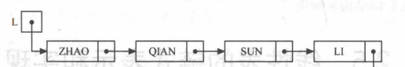

带头节点的单链表

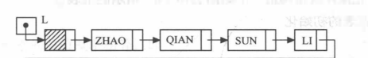


##### 几个概念：

首元节点：链表中第一个数据的节点，普通单链表的第一个，带头结点的单链表的第二个

头节点：首元节点前设置的节点，其指针域指向首元节点，数据域可以不存储任何信息，也可以存储单链表的附加信息

头指针：链表的首地址，若无头节点，指向第一个数据，若有，指向第一个元素

##### 增加头节点

1.增加头节点，对链表的第一个元素的操作与其他元素相同，无需特殊处理

2.无头节点的链表判空条件：L==NULL；有头节点的链表判空条件：L->next==NULL

##### 带头节点的单链表的实现

```c++
//有头节点的单链表
/*ps:开始用的对象和指针，后来发现函数中实例化的对象是局部变量，返回出来的L
只能记录相邻的数据，之后的数据随函数释放而消失，所以改用malloc分配空间，对
地址的操作是可以记录的*/

#include<iostream>
using namespace std;
class SingleLinkedList{//==单链表的存储结构==
public:
    int data;
    SingleLinkedList *nextp;
    SingleLinkedList(){};
    ~SingleLinkedList(){};
};
typedef SingleLinkedList * Linkpoint;

void initList(Linkpoint &L){//==初始化==
    L=(Linkpoint)malloc(sizeof(SingleLinkedList));
    L->data=0;//头节点的data域存单链表的长度
    L->nextp=NULL;//nextp域存下一个节点地址
}

void listInsert(Linkpoint &L,int i,int e){//插入
    Linkpoint p=L;//在函数内对L操作都用新的指针，不要直接对L操作
    Linkpoint s=(Linkpoint)malloc(sizeof(SingleLinkedList));
    int j=1;
    while(p&&(j<i)){
        p=p->nextp;
        j++;
    }
    if(!p||j>i){
        cout<<"插入范围无效"<<endl;
        return;
    }
    s->data=e;
    s->nextp=p->nextp;
    p->nextp=s;
    L->data++;
}

void printList(Linkpoint &L){//==输出==
    Linkpoint p=L->nextp;
    cout<<"输出单链表"<<endl;
    while(p){//因为头节点最初指向NULL，每次插入后，尾节点都指向NULL
        cout<<p->data<<"->";
        p=p->nextp;
    }
    cout<<"NULL"<<endl;
    cout<<"单链表的长度为:"<<L->data<<endl;
}

void getElem(Linkpoint &L,int i){//==取值==
    Linkpoint p=L->nextp;
    int j=1;
    while (p&&(j<i)){
        p=p->nextp;
        j++;
    }
    if(!p||j>i){
        cout<<"取值范围无效"<<endl;
        return;
    }
    cout<<"第"<<i<<"个元素为:"<<p->data<<endl;
}

void locateElem(Linkpoint &L,int e){//==查找==
    Linkpoint p=L->nextp;
    int j=1;
    while(p){
        if(p->data==e){
            cout<<"元素"<<e<<"在第"<<j<<"位"<<endl;
            return;
        }
        p=p->nextp;
        j++;
    }
    cout<<"待查找元素不存在"<<endl;
}

void deleteElem(Linkpoint &L,int i){//==删除==
    Linkpoint p=L;
    Linkpoint s=(Linkpoint)malloc(sizeof(SingleLinkedList));
    int j=1;
    while(p&&(j<i)){
        p=p->nextp;
        j++;
    }
    if(!p||j>i){
        cout<<"删除范围无效"<<endl;
        return;
    } 
    Linkpoint q;
    q=p->nextp;
    p->nextp=q->nextp;//令p-next指向p-next-next就把p-next删除了
    delete q;
    L->data--;
}

//建立单链表-头插法和尾插法
void createList_H(Linkpoint &L,int n){//==输入n个字符插入单链表==
    L=(Linkpoint)malloc(sizeof(SingleLinkedList));
    L->nextp=NULL;
    L->data=0;//L.data存长度
    cout<<"输入数据按回车继续:";
    for(int i=0;i<n;i++){
        Linkpoint p=(Linkpoint)malloc(sizeof(SingleLinkedList));
        cin>>p->data;
        p->nextp=L->nextp;
        L->nextp=p;
        L->data++;
    }
}

void createList_R(Linkpoint &L,int n){//==尾插法==
    L=(Linkpoint)malloc(sizeof(SingleLinkedList));
    L->nextp=NULL;
    L->data=0;
    Linkpoint r=L;
    for(int i=0;i<n;i++){
        Linkpoint p=(Linkpoint)malloc(sizeof(SingleLinkedList));
        cin>>p->data;
        p->nextp=NULL;
        r->nextp=p;
        r=p;
        L->data++;
    }
}
int main(){
    Linkpoint L;
    createList_R(L,5);
    printList(L);
}
```

#### 循环链表

循环链表就是一种特殊的单链表，其尾节点的指针指向了头节点，使节点首尾相连

循环链表和单链表的主要区别就是遍历链表时，判断当前指针是否指向尾节点的条件不同

单链表：p=NULL或p->next=NULL

循环链表:p=L或p->next=NULL

#### 双向链表

循环单链表中查找后继节点的执行时间为O(1),而查找其前驱节点的时间为O(n),因为只能顺指针方向像狗查询，双向链表加上前驱指针后解决了这个问题

双向链表和单链表的区别就是双链表有前后两个指针，分别指向其前驱和后继

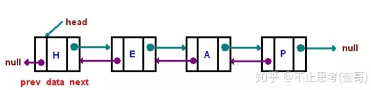

对于双链表，有d->next->prior=d->prior->next=d

##### 实现

因为初始化的节点也可以存数据，所以加入flag标志是否初始节点

此双链表的结构是可以随意插入删除，L始终是首节点的地址，输出是从L开始向后输出的

且首节点的len记录链表长度，当L地址发生变化时，确保新L的len还能记录长度

L地址变化的情况：首节点前插入，删除首节点

```c++
//双链表
//本程序的初始节点不是头节点，只是初始化后的第一个点
//开始用p.next==NULL&&p.prior==NULL来判断初始节点，然后对其data域操作，
//但是操作后，L的next和prior还是null的，所以增加flag来标志初始节点
#include<iostream>
using namespace std;

class DoubleLinkedList{//==双链表存储结构==
public:
    int data;
    int flag=0;//flag标志节点是否初始节点,默认不是初始节点
    int len;
    DoubleLinkedList * prior;
    DoubleLinkedList * next;
    DoubleLinkedList(){};
    ~DoubleLinkedList(){};
};

typedef DoubleLinkedList * DuLinkList;

void initList(DuLinkList &L){//==初始化==
    L=(DuLinkList)malloc(sizeof(DoubleLinkedList));
    L->prior=NULL;
    L->next=NULL;
    L->flag=1;//初始化
    L->len=0;//len记录链表长度
}

void listInsert_H(DuLinkList &L,int i,int e){//==前插==
    if(L->flag){//如果是初始节点，把第一个数据插在其data域
        L->data=e;
        L->flag=0;//之后标志位置零
        L->len++;//长度+1
        return;
    }
    int j=1;
    int len=L->len;//记录旧长度
    DuLinkList p=L;
    while(p&&(j<i)){//p移动到待插位置
        p=p->next;
        j++;
    }
    if(!p||j>i){
        cout<<"插入范围无效"<<endl;
        return;
    }
    DuLinkList s=(DuLinkList)malloc(sizeof(DoubleLinkedList));
    s->data=e;
    s->prior=p->prior;
    if(p->prior){
        p->prior->next=s;//p的前驱的后继本来是p，现在是前插的s;(这里，
    }                    //若p是初始节点，则其没有前驱和后继节点)
    s->next=p;           //严蔚敏的教材上没有这一步的判断，导致NULL无
    p->prior=s;          //指针程序错误
    if(i==1){//如果，插在第一个元素前面，则更新L，使L始终为开头
        L=s;
    }
    L->len=len+1;//记录新长度
}

void listInsert_R(DuLinkList &L,int i,int e){//==后插==
    if(L->flag){
        L->data=e;
        L->flag=0;
        L->len++;
        return;
    }
    int j=1;
    int len=L->len;//记录旧长度
    DuLinkList p=L;
    while(p&&(j<i)){
        p=p->next;
        j++;
    }
    if(!p||j>i){
        cout<<"插入范围无效"<<endl;
        return;
    }
    DuLinkList s=(DuLinkList)malloc(sizeof(DoubleLinkedList));
    s->data=e;
    s->next=p->next;
    if(p->next){//同前插，若后继为NULL，则跳过，否则更新
        p->next->prior=s;
    }
    s->prior=p;
    p->next=s;
    L->len=len+1;
}

void printList(DuLinkList &L){//==输出==
    if(L->flag){
        cout<<"NULL<->NULL"<<endl;
        cout<<"链表长度为:0"<<endl;
        return;
    }
    DuLinkList p=L;
    cout<<"输出双链表"<<endl;
    cout<<"NULL<->";
    while(p){//因为头节点最初指向NULL，每次插入后，尾节点都指向NULL
        cout<<p->data<<"<->";
        p=p->next;
    }
    cout<<"NULL"<<endl;
    cout<<"链表长度为:"<<L->len<<endl;
}

void deleteElem(DuLinkList &L,int i){//==删除==
    int j=1;
    int len=L->len;//记录旧长度
    DuLinkList p=L;
    while(p&&(j<i)){
        p=p->next;
        j++;
    }
    if(!p||j>i){
        cout<<"删除范围无效"<<endl;
        return;
    }
    if(!(p->prior||p->next)){//分情况：初始节点
        L->flag=1;//初始节点，flag置1
    }else if(!p->prior){//首节点,此时需要更新L
        p->next->prior=NULL;
        L=p->next;
    }else if(!p->next){//尾节点
        p->prior->next=NULL;
    }else{//中间节点
        p->prior->next=p->next;
        p->next->prior=p->prior;
    }
    L->len=len-1;
}
int main(){
    DuLinkList L;
    initList(L);
    listInsert_H(L,1,23);
    listInsert_H(L,1,45);
    listInsert_H(L,2,12);
    deleteElem(L,2);
    deleteElem(L,1);
    deleteElem(L,1);
    printList(L);
}
```


### 顺序表和链表的比较

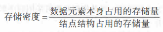

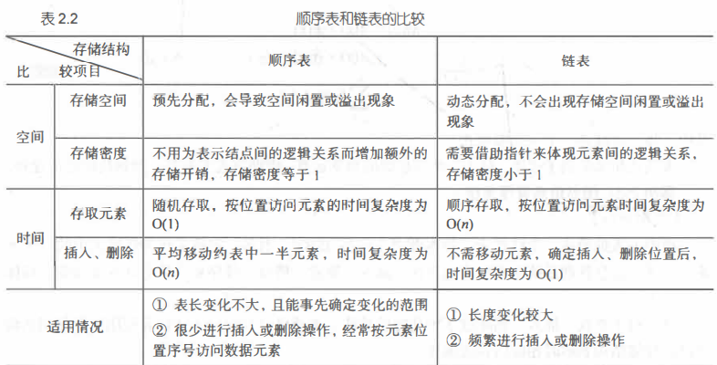

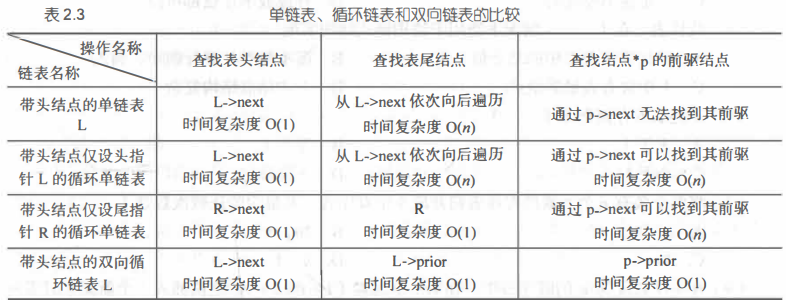


## 栈和队列

栈和队列都是受限的线性表，栈只能从一端进出，队列只能一端进一端出

### 栈

栈有两个端，表尾端称为栈顶(top),表头端称为栈底(bottom),不含元素的空表称为空栈

原则：后进先出

#### 顺序栈

利用顺序存储结构实现栈，这指针top表示栈顶元素在顺序栈中的位置，设base表示栈底元素的位置

实现：

```c++
//顺序栈
//初始化后，base始终指向栈底，若base==NULL，表明栈结构不存在。top初始
//指向栈底，表明空栈，每当有元素入栈时top++，出栈时top--
#include<iostream>
using namespace std;
#define maxsize 3

class OrderedStack{//==顺序栈存储结构==
public:
    int *base;//栈底
    int *top;//栈顶
    int stacksize;//栈可用容量
    OrderedStack(){};
    ~OrderedStack(){};
};

void initStack(OrderedStack &S){
    S.base=new int[maxsize];
    if(!S.base){
        cout<<"存储空间分配失败"<<endl;
        return;
    }
    S.top=S.base;//top初始化为base，空栈
    S.stacksize=maxsize;
}

void Push(OrderedStack &S,int e){//==入栈==
    if(S.top-S.base==S.stacksize){
        cout<<"栈空间已满"<<endl;
        return;
    }
    *S.top=e;
    S.top++;
}

void Pop(OrderedStack &S,int &e){//==出栈==
    if(S.top==S.base){
        cout<<"栈空"<<endl;
        return;
    }
    S.top--;
    e=*S.top;
}

void getTop(OrderedStack &S){//==获取栈顶元素==
    if(S.top==S.base){
        cout<<"栈空"<<endl;
        return;
    }
    cout<<"栈顶元素为"<<*(S.top-1)<<endl;
}

void isEmpty(OrderedStack &S){//==判空==
    if(S.top==S.base){
        cout<<"栈空"<<endl;
    }else{
        cout<<"栈非空"<<endl;
    }
}

void printStack(OrderedStack &S){//==输出栈==
    int *p=S.top;
    cout<<"输出栈"<<endl;
    while(!(p==S.base)){
        cout<<"|"<<*(p-1)<<"|"<<endl;
        p--;
    }
}

int main(){
  OrderedStack S;
  initStack(S);
  Push(S,12);
  Push(S,13);
  Push(S,9);
  printStack(S);
}
```

#### 链式栈

定义链式栈的存储结构，包括数据data和指针next；当有新元素入栈时，将新元素的next指针指向前一个元素的地址，首元素的data域不存信息

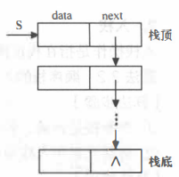


实现

```c++
//链式栈
#include<iostream>
using namespace std;

class LinkedStack{//==链式栈存储结构==
public:
    int data;
    LinkedStack *next;
    LinkedStack(){};
    ~LinkedStack(){};
};
typedef LinkedStack * Linkpoint;

void initStack(Linkpoint &S){//==初始化==
    S=NULL;
}

void Push(Linkpoint &S,int e){//==入栈==
    Linkpoint p=(Linkpoint)malloc(sizeof(LinkedStack));
    p->data=e;
    p->next=S;
    S=p;
}

void Pop(Linkpoint &S,int &e){
    if(S==NULL){
        cout<<"栈空"<<endl;
        return;
    }
    e=S->data;
    Linkpoint p=S;//用p临时保存栈顶元素空间
    S=S->next;
    delete p;//修改完后释放空间，提高空间利用率
}

void getElem(Linkpoint &S){
    if(S==NULL){
        cout<<"栈空"<<endl;
        return;
    }
    cout<<"栈顶元素为:"<<S->data<<endl;
}

void printStack(Linkpoint &S){
    Linkpoint p=S;
    while (p){
        cout<<p->data<<endl;
        p=p->next;
    }
    delete p;
}

int main(){
    Linkpoint S;
    initStack(S);
    Push(S,12);
    Push(S,43);
    Push(S,123);
    printStack(S);
}
```

#### 栈的应用

经典算法：计算表达式的值

1.初始化两个栈，操作数栈和运算符栈

2.若扫描到操作数，压入操作数栈

3.若扫描到运算符或界限符(主要是"()")，则比对运算符栈顶与扫描到的运算符或界限符的优先级，如果栈顶符号的优先级大于扫描的，则弹出运算符栈，操作数栈弹出两个值，按照弹出的运算符进行运算后自此压入操作数栈。

4.扫描到字符结尾，将操作数栈顶元素弹出就是结果

工具：c++stack库

stack<T> sx;  	T为数据类型，sx为变量名，创建栈

函数:

s.empty();         //如果栈为空则返回true, 否则返回false;
s.size();          //返回栈中元素的个数
s.top();           //返回栈顶元素, 但不删除该元素
s.pop();           //弹出栈顶元素, 但不返回其值
s.push(x);          //将元素压入栈顶

实现

```c++
//表达式求值
#include<iostream>
#include<stack>
using namespace std;

stack<char> Schar;//运算符栈
stack<double> Sdouble;//操作数栈

int getIndex(char operat){//==获取运算符对应的索引==
    int index=-1;
    switch(operat){
        case '+':
            index=0;
            break;
        case '-':
            index=1;
            break;
        case '*':
            index=2;
            break;
        case '/':
            index=3;
            break;
        case '(':
            index=4;
            break;
        case ')':
            index=5;
            break;
        case '#':
            index=6;
            break;
        default:
            cout<<"error:非法符号";
            break;
    }
    return index;
}

char getPriority(char operat1,char operat2){
    const char priority[][7]={
        {'>', '>', '<', '<', '<', '>', '>'},
        {'>', '>', '<', '<', '<', '>', '>'},
        {'>', '>', '>', '>', '<', '>', '>'},
        {'>', '>', '>', '>', '<', '>', '>'},
        {'<', '<', '<', '<', '<', '=', '0'},
        {'>', '>', '>', '>', '0', '>', '>'},
        {'<', '<', '<', '<', '<', '0', '='},
    };
    int index1=getIndex(operat1);
    int index2=getIndex(operat2);
    return priority[index1][index2];//这里没有异常处理,当index=-1
}

double calculate(double a,char operat,double b){//==计算a operat b==
    switch(operat){
        case '+':
            return a+b;
        case '-':
            return a-b;
        case '*':
            return a*b;
        case '/':
            return a/b;
        default:
            cout<<"error:非法符号";
            return -1;
    }
}

double getAnswer(){//==求表达式值==
    Schar.push('#');
    int counter=0;
    char c=getchar();
    while(c!='#'||Schar.top()!='#'){//当读完c，两个字符都是#时退出循环，计算完毕
        if(isdigit(c)){//isdiget()判断c是字符还是数字
            if(counter==1){//如果counter为1，表示多位数
                double t=Sdouble.top();//取一位数
                Sdouble.pop();//一位数出栈
                Sdouble.push(t*10+(c-'0'));//入栈多位数
                counter=1;//再置一
            }else{
                Sdouble.push(c-'0');//将一位数入栈
                counter++;
            }
            c=getchar();
        }else{
            counter=0;//counter置零
            switch(getPriority(Schar.top(),c)){
                case '<'://优先级不符合，符号入栈
                    Schar.push(c);
                    c=getchar();
                    break;
                case '='://如果两个符号分别时'('和')'则弹出),先计算括号里优先级低的算式
                    Schar.pop();
                    c=getchar();
                    break;
                case '>'://优先级符合时运算
                    char operat=Schar.top();
                    Schar.pop();//取运算符
                    double a=Sdouble.top();
                    Sdouble.pop();//取操作数1
                    double b=Sdouble.top();
                    Sdouble.pop();//取操作数2
                    Sdouble.push(calculate(b,operat,a));//计算，并入栈
            }
        }
    }
    return Sdouble.top();
}
int main(){
    cout<<"输入表达式(以#结尾)"<<endl;
    while(!Schar.empty())
        Schar.pop();
    while(!Sdouble.empty())//若两个栈初始非空,则将其所有元素出栈
        Sdouble.pop();
    double ans=getAnswer();
    cout<<ans<<endl;
}

```


### 队列

#### 顺序队列

##### 普通顺序队列

和顺序栈类似，顺序队列中用front和rear分别指示队列头元素及队列尾元素

初始化队列时令front=rear=0,每当插入新元素时，尾指针rear增1；每当删除队列头元素时，头指针front增1

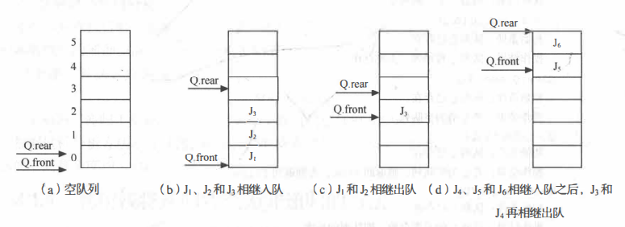

顺序队列在尾指针移动到队尾时，再前进的话会发生溢出错误，但是这时顺序队列并未完全占满如图d，所以引入循环队列，解决此问题

##### 循环队列

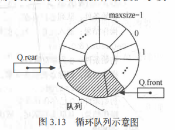

实现

```c++
//循环队列
/*队列的存储本质还是数组，用base指针存储其首地址，用front,rear计数器来做队
首和队尾指示*/
//通过front=(fornt+1)%maxsize来实现循环
#include<iostream>
using namespace std;
#define maxSize 10
class CircularQueue{//==循环队列存储结构==
    public:
    int *base;//存储空间基址
    int front;//头指针
    int rear;//尾指针
};

void initQueue(CircularQueue &Q){//==初始化==
    Q.base=new int[maxSize];
    if(!Q.base){
        cout<<"空间分配失败"<<endl;
        return;
    }
    Q.front=Q.rear=0;
}

void getLength(CircularQueue &Q){//==求长度==
    cout<<"队列长度为:"<<(Q.rear-Q.front+maxSize)%maxSize<<endl;
}

void Enqueue(CircularQueue &Q,int e){//==入队==
    if((Q.rear+1)%maxSize==Q.front){
        cout<<"队满"<<endl;
        return;
    }
    Q.base[Q.rear]=e;
    Q.rear=(Q.rear+1)%maxSize;
}

void Dequeue(CircularQueue &Q,int &e){//==出队==
    if(Q.front==Q.rear){
        cout<<"队空"<<endl;
        return;
    }
    e=Q.base[Q.front];
    Q.front=(Q.front+1)%maxSize;
}

void getHead(CircularQueue Q){//==取队头元素==
    if(Q.front==Q.rear)
        cout<<"队空"<<endl;
    else
        cout<<"队头元素为"<<Q.base[Q.front]<<endl;
}

void printQueue(CircularQueue Q){//==输出队列==
    if(Q.front==Q.rear){
        cout<<"队空"<<endl;
        return;
    }
    int p=Q.front;
    while (p<Q.rear){
        cout<<Q.base[p]<<endl;
        p++;
    }
}
int main(){
    CircularQueue Q;
    initQueue(Q);
    Enqueue(Q,12);
    Enqueue(Q,32);
    Enqueue(Q,78);
    int e;
    printQueue(Q);
    Dequeue(Q,e);
    getLength(Q);
    printQueue(Q);
    getHead(Q);
}
```

####  链式队列

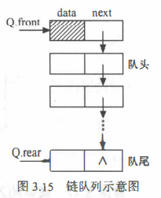 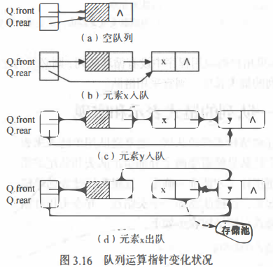

实现

```c++
//链式队列
//链式队列的首节点不存数据，用它的指针来指第一个元素
#include<iostream>
using namespace std;

class LinkedQueue{//==节点的存储结构==
    public:
    int data;
    LinkedQueue *next;
};
typedef LinkedQueue * Queueptr;
class LinkQueue{//==指针存储结构==
    public:
    Queueptr front;
    Queueptr rear;
};

void initQueue(LinkQueue &Q){//==初始化==
    Q.front=Q.rear=(Queueptr)malloc(sizeof(LinkedQueue));
    Q.front->next=NULL;
}

void Enqueue(LinkQueue &Q,int e){//==入队==
    Queueptr p=(Queueptr)malloc(sizeof(LinkedQueue));
    p->data=e;
    p->next=NULL;
    Q.rear->next=p;//插到队尾
    Q.rear=p;//更新队尾
}

void Dequeue(LinkQueue &Q,int &e){
    if(Q.front==Q.rear){
        cout<<"队空"<<endl;
        return;
    }
    Queueptr p=Q.front->next;//主要利用队首节点来出队
    e=p->data;
    Q.front->next=p->next;//更新队首节点，就删除了第一个元素
    if(Q.rear==p)
        Q.rear=Q.front;//当最后一个元素被删，队尾指针重新指向头节点
    delete p;
}

void getHead(LinkQueue Q){
    if(Q.front==Q.rear)
        cout<<"栈空"<<endl;
    else
        cout<<"队头元素为:"<<Q.front->next->data<<endl;
}
void printQueue(LinkQueue Q){//==输出==
    if(Q.front==Q.rear){
        cout<<"队空"<<endl;
        return;
    }
    Queueptr p=Q.front->next;
    while (p){
        cout<<p->data<<endl;
        p=p->next;
    }
    
}
int main(){
    LinkQueue Q;
    initQueue(Q);
    Enqueue(Q,12);
    Enqueue(Q,23);
    Enqueue(Q,357);
    int e;
    Dequeue(Q,e);
    printQueue(Q);
    getHead(Q);
}
```

## 串、数组和广义表

### 串

#### 定义

由零个或多个字符组成的有限序列

串中任意个连续的字符组成的子序列称为该串的子串

由一个或多个空格组成的串称为空格串，空格串不是空串

串也有两种存储结构，顺序存储和链式存储，但考虑到存储效率和算法的方便性，串多采用顺序存储结构

串的存储实现不难，但是串的模式匹配很重要

#### 模式匹配算法

子串的定位运算被称为串的模式匹配或串匹配。设有S和T两个字符串，S称为主串，也叫正文串，T称为子串，也叫模式。模式匹配就是在主串S中查找与模式T相匹配的子串，若成功，则返回字串第一个字符在主串中的位置

##### 1.BF算法 

```c++
//串的顺序存储
//BF算法实现串的模式匹配
//直接使用c++库函数string
#include<iostream>
#include<string>
using namespace std;

void Index_BF(string S,string T){//S主串，T子串
    int i=0,j=0;
    while(i<=S.length()-1&&j<=T.length()-1){
        if(S[i]==T[j]){
            i++;
            j++;
        }else{
            i=i-j+1;//一旦查找不对，i从下一位，j从首位开始重新比较，指针回溯
            j=0;
        }
    }
    if(j>T.length()-1){//退出循环时，如果j达到条件，则匹配到了，i达到条件，则匹配失败
        cout<<"匹配成功"<<endl;
        cout<<"子串在主串的位置是:"<<i-T.length()+1<<endl;
    }else{
        cout<<"匹配失败"<<endl;
    }
}
int main(){
    string str="aaaabcd";
    string ttr="aabcd";
    Index_BF(str,ttr);
}
```

最坏情况时的时间复杂度O(n*m):主串长度n，子串长度m，相当于两层for循环

##### 2.KMP算法

"KMP"算法相比于"BF"算法，优势在于：

- 在保证指针 i 不回溯的前提下，当匹配失败时，让模式串向右移动最大的距离；
- 并且可以在`O(n+m)`的时间数量级上完成对串的模式匹配操作；
  故，"KMP"算法称为“快速模式匹配算法”。

保证 i 指针不回溯的前提下，如果想实现功能，就只能让 j 指针回溯

j 指针回溯的距离，就相当于模式串向右移动的距离。 j 指针回溯的越多，说明模式串向右移动的距离越长。

对于一个给定的模式串，其中每个字符都有可能会遇到匹配失败，这时对应的 j 指针都需要回溯，具体回溯的位置其实还是由模式串本身来决定的，和主串没有关系


###### 计算next数组:


计算方法是：对于模式串中的某一字符来说，提取它前面的字符串，分别从字符串的两端查看连续相同的字符串的个数，在其基础上 +1 ，结果就是该字符对应的值。

每个模式串的第一个字符对应的值为 0 ，第二个字符对应的值为 1 。

例如：求模式串 “abcabac” 的 next 。前两个字符对应的 0 和 1 是固定的。

对于字符 ‘c’ 来说，提取字符串 “ab” ，‘a’ 和 ‘b’ 不相等，相同的字符串的个数为 0 ，0 + 1 = 1 ，所以 ‘c’ 对应的 next 值为 1 ；

第四个字符 ‘a’ ，提取 “abc” ，从首先 ‘a’ 和 ‘c’ 就不相等，相同的个数为 0 ，0 + 1 = 1 ，所以，‘a’ 对应的 next 值为 1 ；

第五个字符 ‘b’ ，提取 “abca” ，第一个 ‘a’ 和最后一个 ‘a’ 相同，相同个数为 1 ，1 + 1 = 2 ，所以，‘b’ 对应的 next 值为 2 ；

第六个字符 ‘a’ ，提取 “abcab” ，前两个字符 “ab” 和最后两个 “ab” 相同，相同个数为 2 ，2 + 1 = 3 ，所以，‘a’ 对应的 next 值为 3 ；

最后一个字符 ‘c’ ，提取 “abcaba” ，第一个字符 ‘a’ 和最后一个 ‘a’ 相同，相同个数为 1 ，1 + 1 = 2 ，所以 ‘c’ 对应的 next 值为 2 ；

所以，字符串 “abcabac” 对应的 next 数组中的值为（0,1,1,1,2,3,2）。

###### 具体的算法如下：

模式串T为(下标从1开始)：“abcabac”
next数组(下标从1开始)：   01

第三个字符 ‘c’ ：由于前一个字符 ‘b’ 的 next 值为 1 ，取 T[1] = ‘a’ 和 ‘b’ 相比较，不相等，继续；由于 next[1] = 0，结束。 ‘c’ 对应的 next 值为1；（只要循环到 next[1] = 0 ,该字符的 next 值都为 1 ）

模式串T为：          “abcabac”
next数组(下标从1开始)：011

第四个字符 ’a‘ ：由于前一个字符 ‘c’ 的 next 值为 1 ，取 T[1] = ‘a’ 和 ‘c’ 相比较，不相等，继续；由于 next[1] = 0 ，结束。‘a’ 对应的 next 值为 1 ；

模式串T为：          “abcabac”
next数组(下标从1开始)：0111

第五个字符 ’b’ ：由于前一个字符 ‘a’ 的 next 值为 1 ，取 T[1] = ‘a’ 和 ‘a’ 相比较，相等，结束。 ‘b’ 对应的 next 值为：1(前一个字符 ‘a’ 的 next 值) + 1 = 2 ；

模式串T为：          “abcabac”
next数组(下标从1开始)：01112

第六个字符 ‘a’ ：由于前一个字符 ‘b’ 的 next 值为 2，取 T[2] = ‘b’ 和 ‘b’ 相比较，相等，所以结束。‘a’ 对应的 next 值为：2 (前一个字符 ‘b’ 的 next 值) + 1 = 3 ；

模式串T为：          “abcabac”
next数组(下标从1开始)：011123

第七个字符 ‘c’ ：由于前一个字符 ‘a’ 的 next 值为 3 ，取 T[3] = ‘c’ 和 ‘a’ 相比较，不相等，继续；由于 next[3] = 1 ，所以取 T[1] = ‘a’ 和 ‘a’ 比较，相等，结束。‘a’ 对应的 next 值为：1 ( next[3] 的值) + 1 = 2 ；

模式串T为：          “abcabac”
next数组(下标从1开始)：0111232

###### 基于next的KMP算法的实现

先看一下 KMP 算法运行流程（假设主串：ababcabcacbab，模式串：abcac）。

第一次匹配：

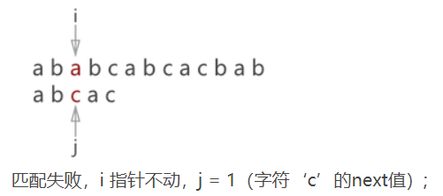

第二次匹配:
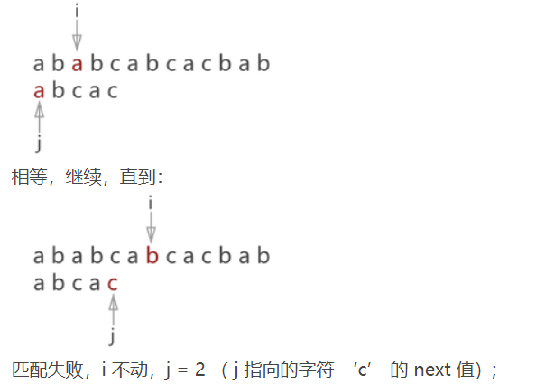

第三次匹配:

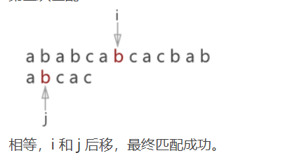

###### 原理理解:

i指针一直前进，当有子串中的相同元素时，比较其前的元素和子串中相同元素前的元素是否相同，若相同则继续匹配后面的元素，不相同则检查下面一位，所以i不需要回溯，一直向后移动就行，j根据情况需要，前移或后移比较元素是否相同

而next存储的就是相同的元素序列的位置

###### 实现

```c++
//串的模式匹配
//KMP算法
#include<iostream>
#include<string>
using namespace std;

void getNext(string T,int next[]){//求next数组
    int i=1,j=0;
    next[1]=0;
    while(i<T.length()){
        if(j==0||T[i-1]==T[j-1]){//下标从0开始
            i++;
            j++;
            next[i]=j;
        }else{
            j=next[j];
        }
    }
}
void Index_KMP(string S,string T,int next[]){
    int i=1,j=1;
    while(i<=S.length()&&j<=T.length()){
        if(j==0||S[i-1]==T[j-1]){
            i++;
            j++;
        }else{
            j=next[j];
        }
    }
    if(j>T.length()){
            cout<<"匹配成功"<<endl;
            cout<<"T在S中的起始位置是:"<<i-T.length()<<endl;
        }else{
            cout<<"匹配失败"<<endl;
        }
}

int main(){
    string str="aaaabcd";
    string ttr="aabc";
    int next[100];
    getNext(ttr,next);
    Index_KMP(str,ttr,next);
}
```

### 数组

数组数据结构可以直接利用自带的数组结构实现

#### 特殊矩阵的压缩存储

对称矩阵：可以用一维数组存储


