## 第一章概论

### 1.1 计算机系统的层次结构

计算机系统层次结构中，“机器”被定义为是能存储和执行相应语言程序的算法和数据结构的集合体。

各级机器级的实现采用翻译技术或解释技术，或是这两种技术的结合。

### 1.2 计算机系统结构、计算机组成和计算机实现

#### 1.2.1 计算机系统结构的定义和内涵

系统结构是对计算机系统中各级界面的定义及其上下的功能分配。

透明性概念：客观存在的事物或属性从某个角度看不到，称这些事物和属性对它是透明的。

对于计算机系统结构透明的有：数据总线宽度，阵列运算部件，通道是采用结合型还是独立型，Cache 存储器，存储器的模 M 交叉存取，串行、重叠还是流水控制方式。 

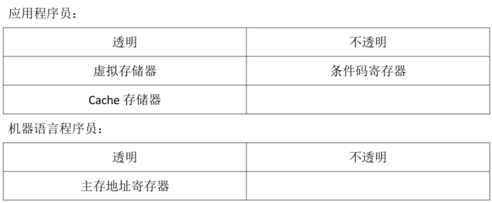

1.计算机组成

2.计算机实现

计算机实现的设计着眼于器件技术和微组装技术，其中，器件技术起着主导作用。

### 1.3 计算机系统的软、硬件取舍及定量设计原理

#### 1.3.1 软、硬件的基本原则

软、硬件功能分配比例对计算机系统性能的影响：

(1)    提高硬件功能的比例可提高解题速度，减少程序所需的存储空间，但会增加硬件成本，降低硬件利用率和计算机系统的灵活性及适应性。

(2)    提高软件功能的比例可降低硬件成本，提高系统的灵活性、适应性，但解题速度会

下降，软件设计费用和所需的存储量将增加。

### 1.4 软件、应用、器件的发展对系统结构的影响

#### 1.4.1 软件发展对系统结构的影响

实现软件移植的技术：1、统一高级语言；2、采用系列机；3、模拟和仿真。

仿真和模拟的区别：仿真是用微程序解释，其解释程序存储于控制存储器中；而模拟是用机器语言解释，其解释程序存储于主存中。

软件移植采用统一高级语言途径的方法和存在的问题：高级语言面向题目和算法，与机器具体结构关系不大。统一出一种通用的高级语言就可以编写出可移植与不同机器的软件。

存在的问题：

(1)    不同的用途要求的语法语义结构不同。

(2)    人们对语言的基本结构看法不一。

(3)    同一种高级语言在不同厂商的机器上页不能完全通用。

(4)    受习惯势力阻挠，人们不愿抛弃惯用的已验证的软件。

软件兼容的定义及系列机对软件兼容的要求：

(1)    机器语言程序及编译程序都不加修改地适用于系列内各档机器，则称各档机器是软件兼容。

(2)    软件兼容包括向上（下）兼容和向前（后）兼容。

(3)    同一系列内的机器一般应做到向上兼容。

(4)    系列机软件必须保证向后兼容，力争向前兼容。

### 1.5 系统结构中的并行性开发及计算机系统的分离

#### 1.5.1 并行性的概念与开发

1.     并行性的含义与级别

从计算机执行的角度来看，并行性等级由高到低可分为指令内部、指令之间、任务或进程间

和作业或程序间。

2.     并行性开发的途径

并行性开发的途径有时间重叠、资源重复和资源共享。时间重叠：在并行性概念中引入时间因素，让多个处理过程在时间上相互错开，轮流重叠地使用同一套硬件设备的各个部分，以加快硬件周转时间而赢得速度。

资源重复：在并行性概念中引入空间因素，通过重复设置硬件资源来提高可靠性或性能。

资源共享：是用软件方法让多个用户按一定时间顺序轮流使用同一套资源来提高其利用率，相应也就提高系统的性能。

#### 1.5.2 计算机系统的分类

弗林分类法(弗林 Flynn)

单指令单数据流(SISD)：传统的单处理器计算机单指令多数据流(SIMD)：阵列处理剂、相联处理机多指令单数据流(MISD)：宏流水及脉动阵列流水机多指令多数据流(MIMD)：多处理机

冯氏分类法(冯泽云 Tse-yun Feng)：并行性从计算机系统处理数据的角度划分

字串位串(WSBS)：每次只处理一个字中的一位，无并行性，如早期的位串行机字串位并(WSBP)：每次处理一个字中的 n 位，如传统的位并行机字并位串(WPBS)：一次处理 m 个字中的 1 位，如某些阵列处理剂、相联处理机

字并位并(WPBP)：一次处理 m 个字，每个字为 n 位，如某些相联处理机、大多数阵列

处理机、多处理机

## 第二章 数据表示、寻址方式与指令系统

### 2.1数据表示

#### 2.1.1 数据表示与数据结构

数据结构要通过软件映像变换成机器所具有的各种数据表示实现，数据表示是数据结构的实现。

数据表示和数据结构之间的关系及引入高级数据表示的基本原则：

(1)    数据表示反映了各种数据元素或信息单元之间的结构关系，数据结构要通过软件映像变换成机器所具有的各种数据表示来实现。不同的数据表示可为数据结构的实现提供不同的支持，表现在实现效率和方便性上不同。数据结构和数据表示是软件和硬件的交界面。

(2)    引人高级数据表示的基本原则:一是看系统效率是否有显著提高，包括实现时间和存

储空间是否有显著减少;二是看引入这种数据表示的通用性和利用率是否提高。

#### 2.1.2 高级数据表示

1. 自定义数据表示

自定义数据表示包括标识符数据表示和数据描述符两类。

数据描述符和标志符的差别：

(1)    描述符是与数据分开存放，用于描述所要访问的数据是整块的还是单个的，访问该数据块或数据元素所要的地址以及其他信息等。

(2)    标志符则是和每个数据相连，合存于同一存储单元，用于描述单个数据的类型特性。

2.   向量、数组数据表示

3.   堆栈数据表示

#### 2.1.3 引入数据的表示原则

#### 2.1.4 浮点尾数基值大小和下溢处理方法的选择

1. 浮点尾数基值的选择

（1） 当阶位 p 一定时，尾数采取什么进制都会影响到数的可表示范围、精度及数轴上分布的离散程度。

（2） 采用尾基为 rm 的浮点数表示的特性

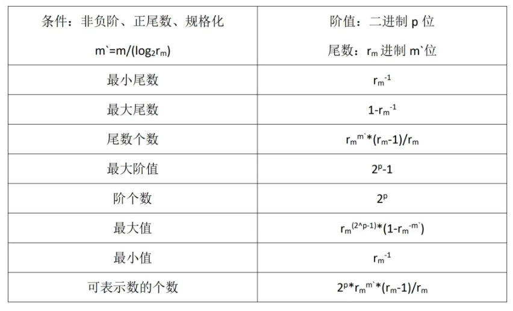

（3） 数轴上的分布

在相同的机器字长和尾数位数的情况下，浮点尾数基值取小，可使浮点数在数轴上

的分布变密。

（3） 可表示的精度

浮点尾数基值增大，可表示的精度下降。

（4） 运算中的精度损失

浮点尾数基值增大，运算中的精度损失减小。

### 2.2 寻址方式

#### 2.2.1 寻址方式的三种面向

计算机面向主存、寄存器、堆栈寻址。

#### 2.2.3 程序在主存中的定位技术

程序的静态再定位和动态再定位的含义及实现方法：

静态再定位是指程序在执行时物理地址不再改变的定位技术。它是利用 Von Neumann 型机器指令可修改的特点，在目的程序装入主存时，由装入程序用软件方法把目的程序的逻辑地址变换成物理地址，程序在执行时物理地址不再改变。

动态再定位是指在执行每条指令时才形成物理地址的定位技术。该方法利用硬件上增加基址寄存器和地址加法器，程序执行时，通过地址加法器将逻辑地址加上基址寄存器的程序基址形成物理(有效)地址后去访问主存。

### 2.3 指令系统的设计和优化

计算机的运算类指令和运算器结构主要是按机器有什么样的数据表示来确定的。

#### 2.3.2 指令操作码的优化

指令是由操作码和地址码两部分组成。

哈夫曼树例题： 假设某机器共有 8 条指令(I1-I8)，使用频度如表所示，要求：

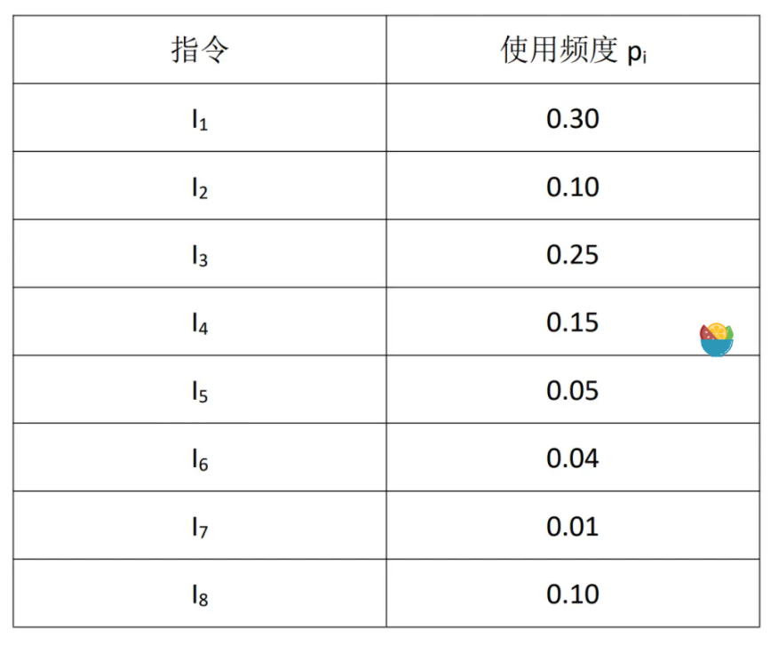

(1)构造哈夫曼(Huffman)树；

(2)列表写出操作码的哈夫曼编码和只有两种码长的扩展操作码； 

(3)分别计算使用哈夫曼编码和只有两种码长的扩展操作码的平均码长。 构造哈夫曼树的方法：将所有指令按使用频度升序排列，每次选择最小的两个频度节 点合并为一个频度作为新节点。哈夫曼树节点左侧线标记 1，右侧标记 0。

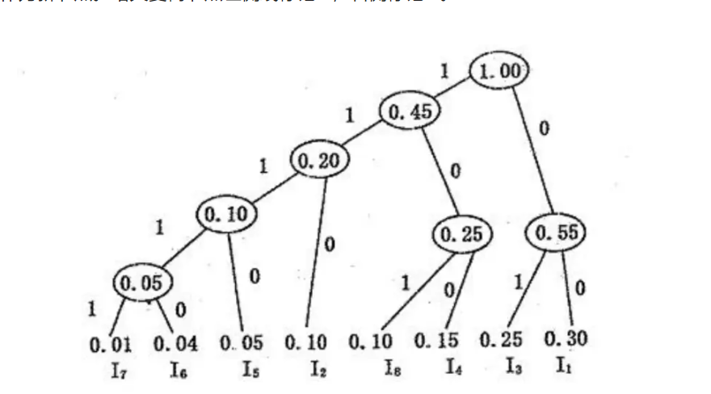

哈夫曼编码求法：求某一指令的哈夫曼编码，则从哈夫曼树对应的指令出发，一直连 接到 1.00 节点，将连线上标记的数字按照节点的顺序收集起来，比如指令 I4 得到的数 字为 001，再将结果倒排，则这里变为 100，此时所得编码即为该指令的哈夫曼编码。 扩展操作码：将所有指令按使用频度降序排列，前三个指令的扩展操作码为 00、01、 10。后续的扩展操作码前一律加 11，然后按照 00、01、10、11、...(即二进制数+1)顺 序往下排列。作为二进制的 00、01、10、11 可表示的扩展操作码有限，因此扩展操作 码可变为 000、001、010、011、111 等形式（注：本题要求两种码长），具体长度为 log2N 的(N 为指令个数)的向下取整，比如本题共有 8 个指令，因此 11 后的编码长度为 3，所以从 000 往下编码，如果长度为 7，则 11 后的编码长度为 2，则从 00 往下编码。

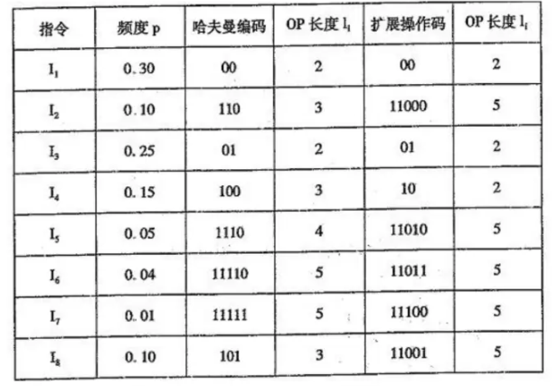

### 2.4 指令系统的发展和改进

#### 2.4.2 按 CISC 方向发展和改进指令系统

设计 CISC 系统时，可以从面向目标程序、面向高级语言、面向操作系统三个方面的优化实现来考虑。

#### 2.4.3 按 RISC 方向发展和改进指令系统

1.CISC 的问题

(1)    指令系统庞大，一般指令在 200 条以上；

(2)    许多指令的操作复杂，执行速度很低，甚至不如用几条简单、基本的指令组合实现；

(3)    难以优化生成高效机器语言程序，编译程序也太长、太杂；

(4)    指令使用频率不太高，且差别很大，增加机器设计人员负担，降低性能价格比。

2.设计 RISC 的基本原则

(1)    只使用频度高的指令

(2)    减少指令系统的寻址方式

(3)    让所有指令都在一个机器周期内完成

(4)    扩大通用寄存器数量

(5)    提高指令执行速度，多用硬联控制实现

(6)    精简指令和优化编译程序，简单有效的支持高级语言实现

3.设计 RISC 结构采用的基本技术

1)       按设计 RISC 的一般原则来设计

2)       逻辑实现用硬联和微程序结合

3)       用重叠寄存器窗口

4)       指令用流水和延迟转移

5)       优化设计编译系统

## 第三章 存储、中断、总线与 I/O 系统

### 3.1 存储系统的基本要求和并行主存系统

#### 3.1.1 存储系统的基本要求

存储系统的基本要求包括大容量、高速度和低价格。

例题1：设主存每个分体的存取周期为2μs，宽度为4个字节。采用模m多分体交叉存取，但实际频宽只能达到最大频宽的0．6倍。现要求主存实际频宽为4MB／s，问主存模数m 应取多少方能使两者速度基本适配?(其中，m取2的幂)

最大频宽公式：Bm=W*m/TM

则实际频宽：4MB／s=0.68*Bm=m*4B/2us≈4B/us 所以有：0.6*m*4/2≥4

解得 m≥2/0.6≈3.33

因为题目要求m取2的幂，所以取：m=4

例题2：程序存放在单字交叉存储器中，设访存申请队的转移概率λ=25％，分别求出模m=16 和m=32时每个存储周期能访问到的平均字数。由此可得到什么结论?

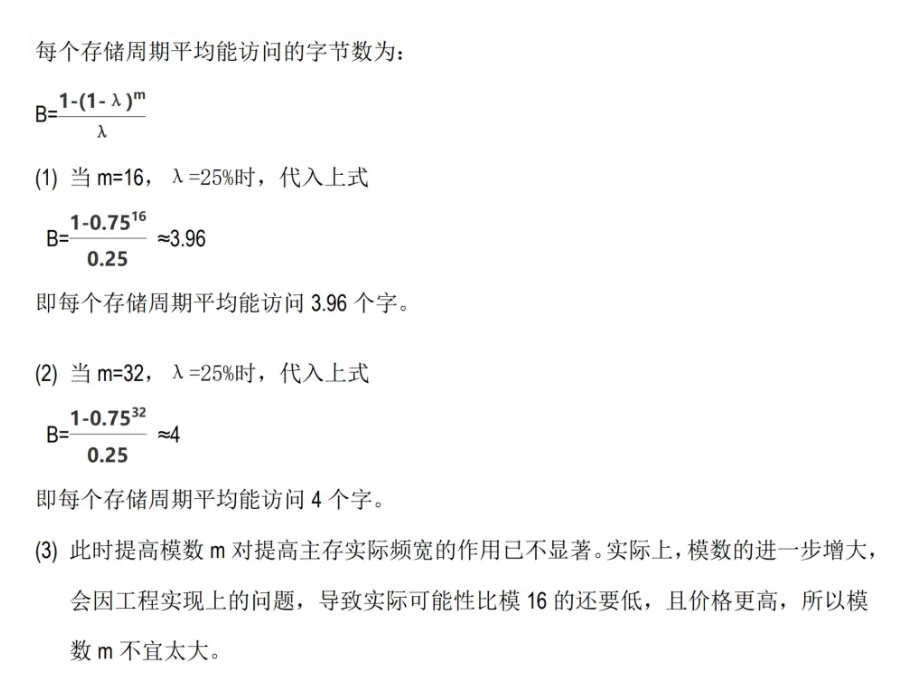

#### 3.1.2 并行主存系统

要想提高主存频宽 Bm，使之与 CPU 速度相匹配，在同样的机器条件（即同样的 TM）下，只有设法提高存储器的字长 W。

### 3.2 中断系统

#### 3.2.1 中断系统的分类和分级

1.中断的分类

IBM370 系统将中断分成机器校验、管理程序调用、程序性、外部、输入/输出和重新启

动六类。

外部中断包括：定时器中断、外部信号中断及中断键中断。

机器校验中断：紧急中断和可抑制中断。

中断分类的根据和分类的目的：

(1)    分类根据：把中断源性质相近、中断处理过程类似的归为一类。

(2)    分类目的：减少中断服务程序的入口，每一类给一个中断服务程序总入口，再由软件分支转入相应的中断处理部分，可以减少中断服务程序入口地址形成的硬件数量。

#### 3.2.2 中断响应的次序与处理次序

中断响应的次序与中断处理次序区别：中断响应次序是用中断响应的硬件排队器实现，次序是由高到低固定好的，中断处理次序是中断处理程序处理完中断的次序。为了能根据需要，由操作系统灵活改变中断处理次序，设置中断级屏蔽寄存器，以决定某级中断能否进入中断响应排队器，只要能进入的总是让高级别的优先得到响应。

#### 3.2.3 中断系统的软硬件功能分配

中断系统的性能主要是要有高的中断响应速度和中断处理的灵活性。

中断系统的软硬件功能分配实质上是中断处理程序软件和中断响应硬件的功能分配。

### 3.3 总线系统

#### 3.3.1 总线的分类

多处理机互联使用纵横交叉开关。

总线按允许信息传送的方向有单向传输和双向传输两种。双向传输总线可分为半双向和全双向两种。

总线按用法分为专用和非专用两类。

#### 3.3.2 总线的控制方式

优先次序的确定可以有串行链接、定时查询和独立请求 3 种不同方式。集中式定时查询方式的总线分配过程：总线上每个部件通过“总线请求线”发出请求，若总线处于空闲，则“总线忙”信号未建立，计数器开始计数，定时查询各部件确定是谁发请求，确定后建立“总线忙” 信号，计数器停止计数，定时器终止查询，让该部件获得总线使用权，直到数据传送完成，再去除“总线忙”信号。

#### 3.3.4 数据宽度与总线线数

1.     数据宽度

数据宽度是指 I/O 设备取得 I/O 总线后所传送数据的总量；数据通路宽度是数据总线的物理宽度。

2.     总线线数

在满足性能前提下，可以通过用线的组合、编码及并／串—串／并转换减少总线数量。

总线标准一般包括：机械、功能、电气及过程（同步）。

### 3.4 I/O 系统

#### 3.4.1 I/O 系统概述

输入／输出系统的 3 种控制方式是程序控制 I/O、直接存储器访问及 I/O 处理机方式。

#### 3.4.2 通道处理机的工作原理和流量设计

1.通道处理机的工作原理

通道数据传送期中信息的传送方式：字节多路通道（大量低速设备）、数组多路通道（连接多台磁盘等高速设备）、选择通道（优先级高的磁盘等高速设备）。

各种类型通道适合连接的设备类型，在满负荷时的实际流量与所连接设备的关系

(1)    字节多路通道适合于连接大量的字符类低速设备。满负荷时，设备对通道要求的实际流世应是所在各设备的流量之和。

(2)    数组多路通道适合于连接高速设备。满负荷时，设备对通道要求的实际流量应是所在各设备中流量最大的那个。

(3)    选择通道适合于连接高优先级的高速设备。满负荷时，设备对通道要求的实际流量

应是所在各设备中流量最大的那个。

2. 通道流量的设计

在满足通道设计流信息。可以加设数据缓冲器或动态改变设备响应的优先级来弥补。

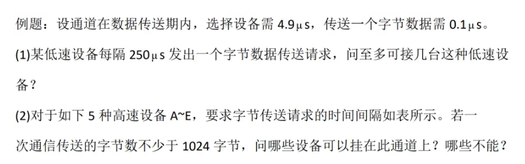

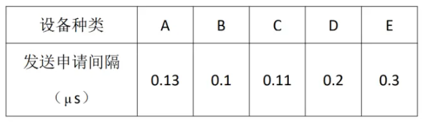

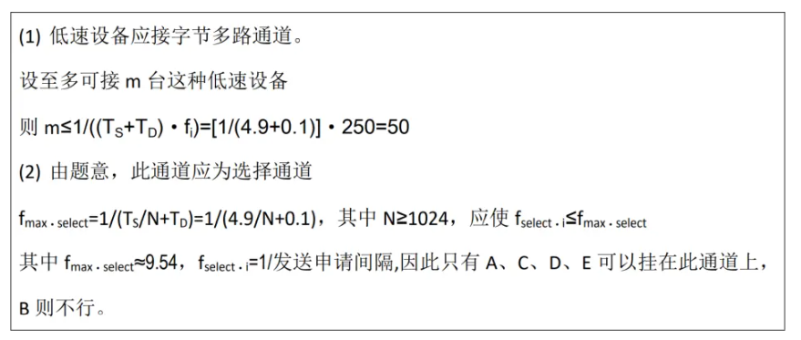

## 第四章 存储体系

### 4.1 基本概念

#### 4.1.2 存储体系的构成依据

CPU 能预知未来被访问信息的地址的可能性是基于计算机具有局部性。

### 4.2 虚拟存储器

#### 4.2.1 虚拟存储器的管理方式

虚拟存储器根据不同存储映像算法，存储管理方式主要有段式、页式和段页式。

#### 4.2.2 页式虚拟存储器的构成

1.地址的映像和变换

主存中的每一个页面位置应可对应多个虚页，能对应多少个虚页与采用的映像方式有关。

2.页面替换算法

随机算法(RAND)

先进先出(FIFO)

近期最少使用(LRU)：堆栈型替换算法

优化(OPT)：堆栈型替换算法页面失效频率(PFF)：由于堆栈型替换算法具有分配给该道程序的实页数 n 增加，命中率 H 会单调上升这一特点，可对 LRU 算法加以改进。即根据各道程序运行中的主存页面失效率，将内存实页面由操作系统动态调节分配给各道程序，从而使整个系统总的主存命中率和主存利用率得到提升。

### 4.3 高速缓冲储存器

#### 4.3.1 工作原理和基本结构

在 Cache 存储器中，CPU 每次写 Cache 的同时，页写入主存，称这种更新主存内容的方法为写直达法。

#### 4.3.2 地址的映像与变换

全相联映像（冲突概率低、Cache 利用率高、查表速度慢）【页式虚拟存储器常用】直接映像（冲突概率高、查表速度快）组相联映像（冲突概率低、查表速度快）【常用】段相联（组相联的特例。组间全相联，组内直接映像）

例题： 采用组相联映像、LRU 替换算法的 Cache 存储器，分别采用以下措施后，等效访问速度 可能会有的变化与变化趋势

(1) 增大主存容量，对命中率 Hc 基本无影响．虽然增大主存容量可能会使主存周期 tm 有所增大，如果 Hc 已很高，则 tm 的增大对等效存储周期 ta 的增大不会有明显的影 响。

(2) 增大 Cache 中的块数，而块的大小不变，则 Cache 的容量增大；由于 LRU 替换算法 是堆栈型的替换算法，所以，将使 Hc上升，而使 ta缩短。ta缩短的情况跟 Hc有关， Hc如果迅速提高，ta则显著缩短；如果 Hc提高不多，则 ta缩短不明显。

(3) 增大组相联组的大小，块的大小不变，则组内的块数增加，它会使块冲突概率下降， 这也会使 Cache 块替换次数减少．而当 Cache 各组组内的位置已全部装满了主存的 块之后，块替换次数的减少也就意味着 Hc的提高。所以，增大组的大小能使 Hc 提 高，从而可提高等效访问速度。不过，Cache 存贮器的等效访问速度改进是否明显 还要看目前的 Hc处于什么水平。如果原先组内的块数太少，增大组的大小，会明显 缩短 ta；如果原先组内块数已较多，则 ta的缩短就不明显了。

(4) 组的大小和 Cache 总容量不变，增大 Cache 块的大小，其对 ta影响的分析大致与(3) 相同，会使 ta缩短，但耍视目前的 Hc水平而定。如果 Hc已经很高了，则增大 Cache 块 的大小对 ta的改进也就不明显了。

 (5) 提高 Cache 本身器件的访问速度 tc，即减小 ta，只有当 Hc命中率已很高时，才会显 著缩短 ta。如果 Hc命中率较低时，则对减小 ta的作用不明显。

#### 4.3.4 Cache 存储器的透明性及性能分析

1. Cache 存储器的透明性分析及解决办法

2. Cache 的取算法

为了提高 Cache 的命中率，Cache 的预取算法有恒预取法和不命中时预取法两种。

3.  Cache 存储器的性能分析

## 第五章 标量处理机

包括：Amdahl 470V/6

### 5.1 重叠方式

#### 5.1.1 重叠原理与一次重叠

解释一条机器指令的微操作可归并成取指令、分析和执行三部分。

指令解释方式中，指令分析部件和指令执行部件任何时候都只有相邻两条指令在重叠的解释方式称为“一次重叠。”

指令重叠解释的概念：

指令的重叠解释是在解释第 k 条指令的操作完成前，就可以开始解释第 k+1 条指令。

实现指令的重叠解释必须在计算机组成上满足的要求：

(1)    要解决访存的冲突。解决取指和分析中取操作数的访存冲突。

(2)    要解决“分析”与“执行”操作的并行。硬件上应有独立的指令分析部件和指令执行部件。

(3)    要解决“分析”与“执行”操作控制上的同步，在硬件上解决控制上的上同步。

(4)    要解决指令间各种相关的处理。

#### 5.1.2 相关处理

数相关不只是会发生在主存空间，还会发生在通用寄存器空间。

1.转移指令的处理

2.指令相关的处理

3.主存空间数据相关的处理

解决主存空间数据相关的方法是推后“分析 k+1”的读。

4.通用寄存器组相关的处理

解决重叠相关处理的两种基本方法是推后分析 k+1 和设置相关专用通路。

### 5.2 流水方式

#### 5.2.1 基本概念

1.流水的分类

流水按处理的级别可分为：部件级、处理机级和系统级。

流水按功能的多少可分为：单功能流水线和多功能流水线。其中多功能流水线按各段时间能否允许同时用于多种不同功能连接流水，分为静态流水线和动态流水线。

#### 5.2.2 标量流水线的主要性能

标量流水处理机的性能主要是吞吐率、加速比、和效率。

1.   吞吐率 Tp 和加速比 Sp

流水线消除速度瓶颈的方法有瓶颈子过程再细分和瓶颈子过程多套并联两种。

2.   效率

#### 5.2.3 标量流水机的相关处理和控制机构

1.局部相关性的处理

2.全局相关性的处理

全局性相关指的是已进入流水线的转移指令（尤其是条件转移指令）和其后续指令之间相关。

全局相关处理方法：猜测法、加快和提前形成条件码、采取延迟转移和加快短循环程序的处理。

4. 非线性流水线的调度 

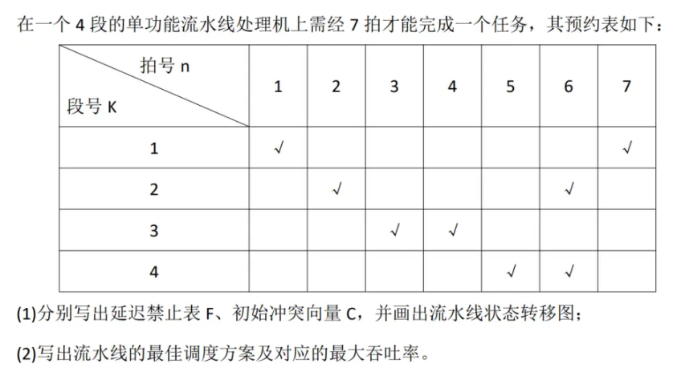

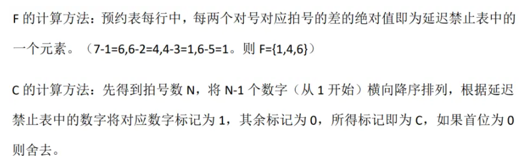

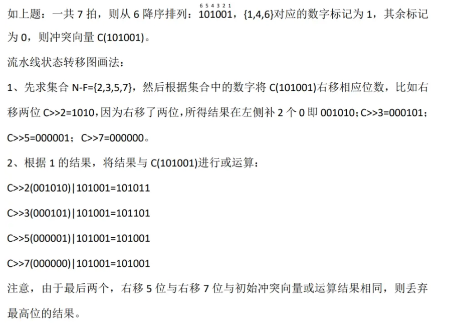

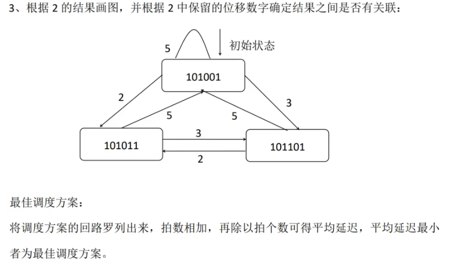

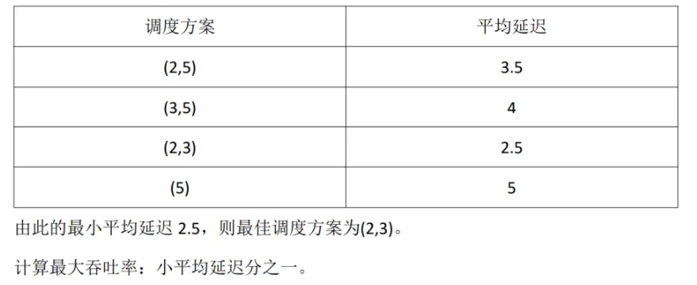

#### 5.3.3 超流水线处理机

超流水线处理机提高指令级并行的方法和特点：方法：注重时间开发并行性，在公共的硬件上采用较短时钟周期，深化流水来提高速度。

特点：并行度高；充分利用公共的硬件；但是需要高速时钟机制。

## 第六章 向量处理机

向量流水处理机的开发途径是时间重叠。

### 6.1 向量的流水处理与向量流水处理机

#### 6.1.1 向量的处理和向量的流水处理

向量纵向处理和分组纵横处理既是向量的处理方式，也是向量的流水处理方式。

 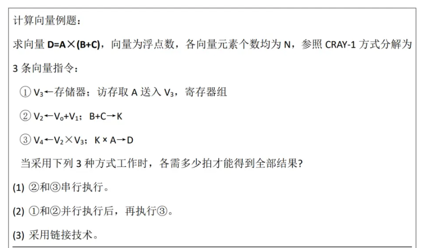

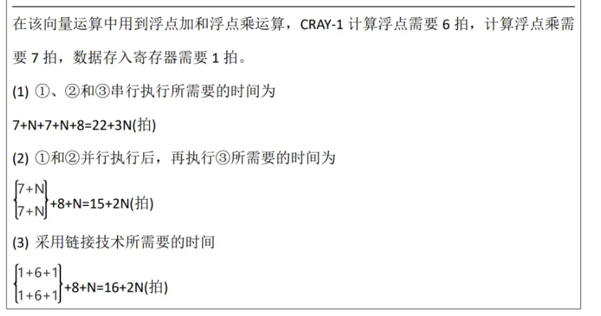

### 6.2 阵列处理机的原理

#### 6.2.1 阵列处理剂的构形和特点

阵列机属于 SIMD 系统。阵列处理机

### 6.3 SIMD 计算机的互联网络

#### 6.3.1 互联网络的设计目标与互联函数

SIMD 系统互联网络的设计目标：

(1)    结构要简单以降低成本；

(2)    互联要灵活，以满足算法和应用需要；

(3)    处理单元间信息交换所需传送的步数要少，以提高速度性能；

(4)    规整性、模块性要好，以便可以采用基本构件来组合、增强系统的可扩充性，也便

于超大规模集成电路实现。

#### 6.3.2 互联网络应抉择的几个问题

互联网络操作方式有：同步、异步和同步与异步的组合 3 种。

#### 6.3.3 基本的单级互联网络

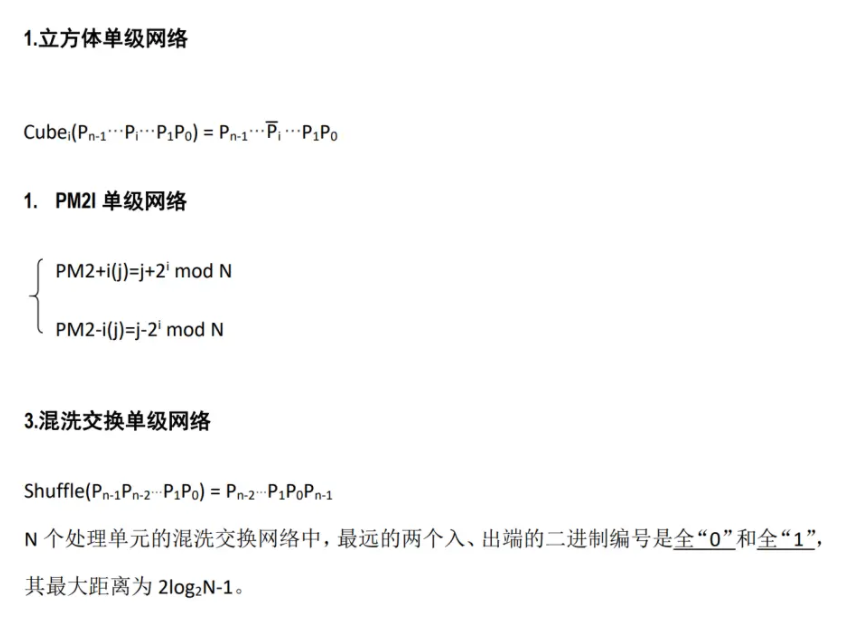

#### 6.3.4 基本的多级互联网络

不同的多级互联网络反应在所用的交换开关的功能多少、拓扑结构和控制方式上各有不同。

### 6.5 脉动阵列流水处理机

#### 6.5.1 脉动阵列结构的原理

脉动阵列结构是由一组处理单元 PE 构成的阵列，阵列中的输入数据流和结果数据流可各自沿多个方向同步地向前推进。

脉动阵列结构的特点：

(1)结构简单、规整，模块化强，可扩充性好。

(2)PE间数据通信距离短、规则，使数据流和控制流的设计、同步控制等均简单规整。

(3)具有极高的计算并行性，可通过流水获得很高的运算效率。

(4)阵列与外界I/O通信量少，降低了对系统主存和I/O系统频宽的要求。

(5)脉动阵列结构的构形与特定计算任务和算法密切相关， 具有专用性。

1. 多级立方体网络

级控制多级立方体网络能实现交换函数的功能。

2. 多级混洗交换网络

3. 多级 PM2I 网络

4. 基准网络

5. 多级交叉开关网络

## 第七章 多处理机

 多处理机属于 MIMD 系统。

### 7.1 多处理机的概念、问题和硬件结构

#### 7.1.1 多处理机的基本概念和要解决的技术问题

多处理机实现的是作业或任务间的并行。

阵列处理机和多处理机在程序并行性方面的差别：阵列处理机是指令操作级并行，是开发的并行性中的同时性。多处理机是作业、任务级并行，是开发的并行性中的并发性。

多处理系统中，要较好地解决动态的资源分配和任务调度，让各处理机的负荷尽可能均衡，并要防止死锁。

#### 7.1.2 多处理机的硬件结构

1.紧耦合和松耦合

(1)    紧耦合多处理机紧耦合多处理机是通过共享主存实现处理机间通信的，其通信速率受限于主存频宽。

(2)    松耦合多处理机松耦合多处理机可以有非层次型和层次型两种构形。

2.机间互联形式

多处理机的机间互联一般采用总线、环形互联、交叉开关、多端口存储器或蠕虫穿洞寻径网络(开关枢纽结构)等几种形式。

### 7.3 多处理机的并行性和性能

#### 7.3.2 程序并行性的分析

#### 7.3.4 多处理机的性能

任务粒度的大小对多处理机性能和效率的影响：

(1)    任务粒度过小，辅助开销大，系统效率低；

(2)    任务粒度过大，并行度低，性能不会很高；

(3)    要合理选择任务粒度的大小，并使其尽可能均匀，还要采取措施减少辅助开销，以

保证系统性能随处理机数目的增大能有较大的提高。

2.数据反相关

为了保证运行的结果正确，要控制局部存储器（或 Cache 存储器）向共享主存的写入同步。

### 7.4 多处理机的操作系统

#### 7.4.2 各自独立型操作系统

各自独立型操作系统的优缺点：优点：将控制功能分散给多台处理机，很适应分布处理的模块化结构特点，减少对大型控制专用处理机的需求；系统可靠性高；可取得较高的系统效率。

缺点：进程调度复杂，开销加大；各处理机负荷的平衡比较困难；降低存储器的利用率。

## 第八章数据流计算机和归纳机

### 8.1 数据流计算机

#### 8.1.1 数据驱动的概念

Von Neumann 型计算机是以控制流方式工作的。

从语义上讲，数据驱动计算的数据流是基于异步性和函数性的一种计算模型。

#### 8.1.4 数据流计算机存在的问题

(1)    当题目本身并行性成分不多时，效率低

(2)    花费的辅助开销和存储空间多

(3)    不保存数组

(4)    数据流语言使程序员无法控制存储分配存储单元，增大编译的难度

(5)    互连网络设计困难，输入输出系统不够完善

(6)    没有程序计数器，给诊断维护带来了困难

### 8.2 归约机

归约机与数据流计算机基于数据流的计算模型。数据流计算机采用数据驱动，归约机是需求驱动。
